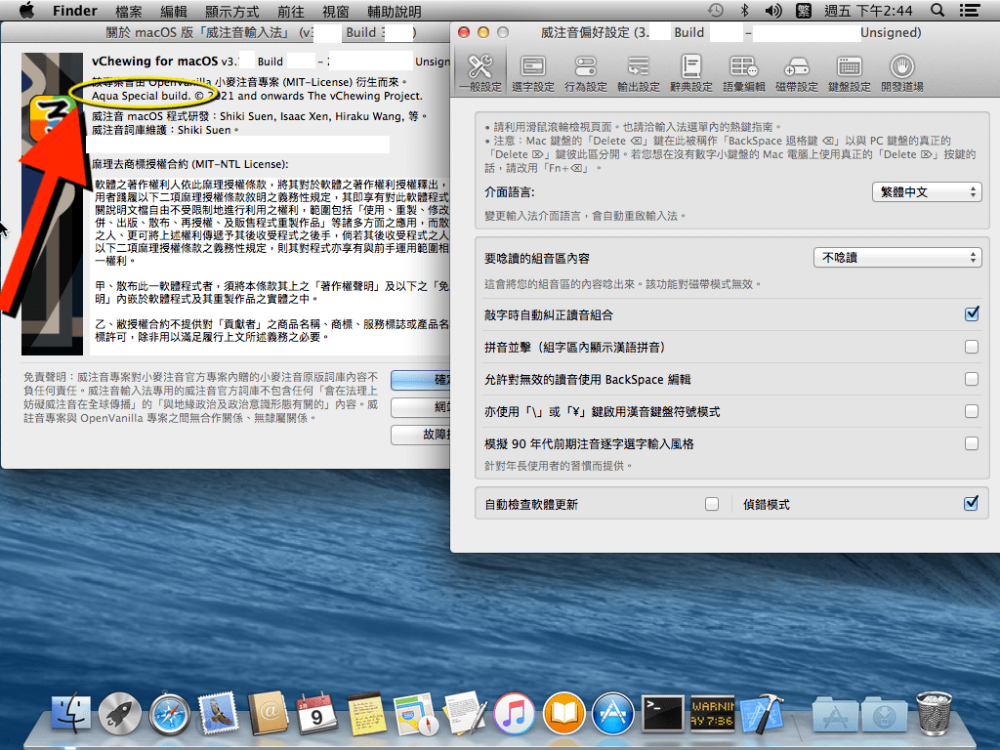

## 如何區別主流發行版與 Aqua 紀念版

唯音輸入法有兩個分支（以 3.7.3 版的情況來講）：

- 主流發行版：
  - 支援最新的三版正式版的 macOS（這也是 Homebrew 的支援範圍）。
  - 採最新 Xcode 與最新的 macOS SDK 建置（除非最新版 SDK 有 Bug）。
  - 部分軟體功能會利用到最新版系統的特性（比如 SwiftUI 等）。
  - 有同時提供 pkg 與 app 版安裝程式。
  - 輸入法選單圖示是圓角長方形「简ㄋ」「繁ㄋ」、符合 macOS 13 Ventura 開始的設計風格。
- Aqua 紀念版：
  - 支援 macOS 10.9 Mavericks 以來的所有 macOS。
  - 採盡可能最新版 Xcode 建置，但有做過 libArcLite 修補（相關檔案取自 Xcode 14.2.0）。
  - 以 macOS 13.1 SDK 建置，這是最後一版對 macOS 10.9 有實質支援的 SDK。
  - 可能會因為今後的 Xcode 對舊版系統的建置困難程度、而出現更新進度落後於主流發行版的情況。
  - 僅提供 app 版安裝程式，且安裝程式介面會有提醒說安裝的是 Aqua Special 紀念版。
  - 從唯音 3.7.4 版開始，軟體的關於視窗也會有 Aqua Special 字樣。
  - 輸入法選單圖示是圓角正方形「繁」「简」字樣、符合 macOS 10.9 ~ 12.x 的設計風格。

Aqua 紀念版選擇從 macOS 10.9 開始支援的原因：
  - 奇摩輸入法的最終系統支援版本是 macOS 10.8，且從 10.9 開始就出現了各種功能上的故障（至少，辭典編輯器是徹底罷工了的）。
  - macOS 10.9 是最後一代有支援「Steve Jobs & Scott Forstall 美術哲學的 Aqua 介面」的系統版本。這種讓你想舔一口的介面美術設計風格不會再有了。
  - 這個系統被 OpenVanilla 和小麥注音拋棄支援。這兩款輸入法能在 macOS 10.9 系統下使用的版本都過早過舊、功能極為羸弱。（唯音有支援 CIN 表格。）
  - 實質上支援「以 Swift 語言建置而成的應用」的第一版 macOS……雖然目前只測試過 Swift 5.9 就是了。
    - 不過，macOS 10.9 的 AppKit 很多預設行為都與之後的系統有不同，導致 Xcode 15 的 AppKit 所見即所得編輯模式所能預覽到的樣子與在 macOS 10.9 的實機測試表現不是始終完全一致的。這帶來了不少額外的善後成本。
      - 特別是 NSStackView，不給 subview 全部上 constraint 的話就會全塌掉，最傷腦筋。
  - 興趣。沒錯，這不是出於抻手黨們所謂的「良心」，只是興趣而已。
  - 潛在的需求：很多老錄音室的電腦的音樂製作軟硬體（比如舊版的買斷版本的 Pro Tools HD 等）都不支援新系統，這些軟硬體對系統的跨版本 ABI / API 相容性比較羸弱、稍微升級一下系統就會妨害到軟硬體的工作穩定性與可用性、導致這些環境的工作者們無法承受更新系統版本所帶來的的業務代價。這些老系統版本當中，macOS 10.9 算是比較常見的了。

除了安裝程式介面的文字描述以外，這兩個發行版的全新區分方式如圖：

$ EOF.
