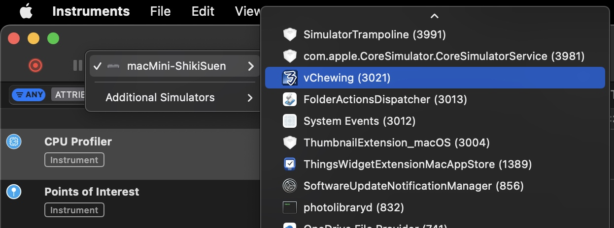

## 故障提報與用儀器捉蟲

無論是對產品功能有反饋，還是要提報產品故障、或是遇到某些爛詞干擾輸入的情況，都歡迎電郵至 shikisuen◉yeah●net。請在電郵內包含下述資訊：

- 問題發生的步驟（包括你正在往什麼軟體的介面內敲字）。
- 當前作業系統版本與輸入法版本。
- 當前電腦的機種特徵資訊：是 MacBook Pro / Air / Mac mini 還是……？具體哪一年哪一月開賣的機種？等。
- 當前在用的注音排列或者拼音種類。
- 在用的鍵盤特徵（佈局語種、是否有小鍵盤、還比如說是否是 ThinkPad USB Keyboard，等）。
- 系統的 `~/Library/Logs/DiagnosticReports/` 目錄及子目錄下有沒有事發時產生的以「vChewing」開頭的 ips 檔案？有的話也請打包電郵過來。

### 用儀器捉蟲

用儀器捉蟲的話，可以更方便地幫助研發方快速鎖定問題的所在之處。該方法得麻煩您安裝一套 Xcode（真的很肥）。

> 除非 Instruments 儀器工具有單獨發行，這需要跟 Apple 集體靠北才有可能。

你會在 Xcode 選單內找到「Xcode -> Open Developer Tool -> Instruments」，藉此開啟 Xcode 隨贈的 Instruments 儀器工具。

在開啟儀器工具之後，它會讓你選一個側寫範本（Profiling Template），此時請選擇 CPU Profiler 側寫器。之後會出現主視窗，請將主視窗左上角在你電腦名稱右側的「All Processes」用滑鼠點一下，再在 Running Applications 清單末端點 More，找到「vChewing」，點一下即可（這樣可以確保錄製範圍僅限該輸入法）：

之後就是點左邊的錄音按鈕即可。最大錄製時長會是十二小時。然後你就在該儀器工具保持錄製的狀態下繼續使用輸入法。如果輸入法閃退的話，錄製過程會自動停止，這時儀器會捕捉到該輸入法在閃退前的最終運行階段。此時可以將錄製結果打包成壓縮檔之後、用該手冊主頁當中提到的電郵寄過來供偵錯所用。理論上而言，只有截至輸入法閃退為止的三秒的錄製內容會被用到。要是有辦法將錄製結果剪裁得只剩下最後三秒，那就再好不過了。
