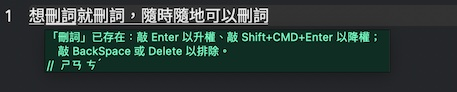
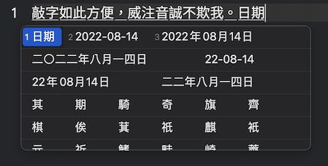

# vChewing 威注音輸入法

| 作業系統 (至少) | 下載及發行說明 | 更新履歷 | 程式碼倉庫 | 版本＆日期 |
|-------|----|----|----|----|
| macOS (10.11.5) | [GitHub](https://github.com/vChewing/vChewing-macOS/releases), [Gitee](https://gitee.com/vChewing/vChewing-macOS/releases) | [GitHub](https://github.com/vChewing/vChewing-macOS/wiki/%E6%9B%B4%E6%96%B0%E5%B1%A5%E6%AD%B7), [Gitee](https://gitee.com/vChewing/vChewing-macOS/wikis/sort_id=5401886) | [GitHub](https://github.com/vChewing/vChewing-macOS/), [Gitee](https://gitee.com/vChewing/vChewing-macOS/) | 1.9.4 (Aug 17, 2022) |

- 歡迎關注威注音輸入法的 SNS 專頁： [Twitter](https://twitter.com/vChewingIME) § [Plurk](https://www.plurk.com/vChewingIME) 。
- 請參閱[《鍵盤熱鍵使用手冊》](./manual/shortcuts.md)以提升該輸入法的使用效率。
- 另有[熱心網友製作的 Homebrew-Cask 安裝方式](https://github.com/windwords/homebrew-vchewing)可用。

部分近期更新內容：

- [1.9.4] 在選字窗內選字之後，被選的字周圍的字不會再亂變了（也就是與 macOS 內建注音輸入法行為一致）。

本文的 FAQ 會不定期更新來自 PTT 的提問。

註：本文所提到的任何 Option 鍵都等價於 PC 電腦鍵盤上的 Alt 鍵。

## 產品介紹 (Intro)

該輸入法恐怕是截至目前為止**在功能多樣性方面**最強的第三方免費 macOS 系統專用輸入法，採純 Swift 語言寫就。威注音的著力點不是去想著怎麼用指針，而是盡可能在力所能及的範圍內將整個產品的功能做得更好用。





威注音的幾個產品目標：

1. 在力所能及的範圍內，將自有功能做得盡可能豐富、讓輸入法使用更便利。
2. 利用 Swift 降低二次開發時的技術門檻、使得來自第三方的功能擴充更加容易。
3. 專案本身不會遇到傳播上的難題。
4. 讓注音符號在其故鄉展現其全新的價值。

## 主要特色功能 (Feat.)

幾乎都是在做上游缺失的功能、修上游不修的 Bug：

1. 支援最多種類的拼音輸入（得帶有12345數字聲調）：漢語拼音、國音二式、耶魯拼音、華羅拼音、通用拼音。
2. 支援最多種類的注音輸入排列：大千傳統排列（零壹/微軟）、酷音大千 26 鍵、倚天傳統、倚天忘形、許氏鍵盤、星光、IBM、神通、（偽）精業。
3. 逐字選字模式的聯想詞功能的辭典內容可自訂，也可以直接讀取（UTF-8 格式的）從 Windows XP 的ㄅ半輸入法關聯詞編輯器匯出的辭典檔案。
4. 支援 macOS 螢幕模擬鍵盤（僅傳統大千與傳統倚天佈局）。
5. 數字鍵盤區域不會敲出注音來，而是會直接放行＋不作處理（除非有選字窗出現，此時可以作為選字鍵）。
6. 可以將自己打的繁體中文自動轉成日本 JIS 新字體來輸出（包括基礎的字詞轉換）、也可以轉成康熙繁體來輸出。
7. 簡繁體中文語料庫彼此分離，徹底杜絕任何繁簡轉換過程可能造成的失誤。
8. 支持近年的全字庫漢字輸入（計畫每年更新一次，也偶爾會有例外）。
9. 會自行整理使用者辭典的內容的格式。
10. 可以在敲字時用 Option+前後方向鍵 來以詞組節點為單位迅速移動游標、以 Option+「與前後方向鍵呈 90 度的方向鍵」 來就地輪替候選字（而不用叫出選字窗）、以  Ctrl+Option+前後方向鍵 迅速將游標挪到最後或者最前。
11. 支援最多十個字的長度的自訂語彙。
12. 在用「Shift+前後方向鍵」選中組字區內的詞語範圍時，你除了可以就地加詞以外，還可以就地刪詞（會放入語彙排除表內）。
13. 允許使用者辭典內的讀音以「漢語拼音+數字標調」的方式記錄（會被自動辨識）。
14. 不會有「當組字區內有繪文字時，選字長度上限與下限判斷會失誤」的問題。
15. 可用 Ctrl+Option+Command+Enter 輸出符合教科書書寫規範的網頁 ruby 文字標記（注音/漢語拼音）的 HTML 內容。如果是 Ctrl+Command+Enter 的話，只會輸出非教科書標準的注音/漢語拼音。
16. 選字窗內有當前頁數提示。
17. 在選字窗內選字之後，被選的字周圍的字不會亂變。

## 安裝方式 (Install)

因為沒有條件完成 Apple Developer 數位簽名，所以安裝會麻煩些：請在**首次雙擊執行失敗之後**摁 Ctrl 的同時使用滑鼠右鍵點開安裝程式來安裝，如此方可被 macOS 允許跳過系統內建的門衛檢查。

如對未簽名的 pkg 安裝包有安全疑慮的話，請自行下載 30 多 GB 的 Xcode 選「vChewingInstaller」這個 target scheme 自行編譯安裝。（也可以用 make 來編譯、接著用 make install 來安裝）。

本次以 pkg 的形式發行安裝程式，方便資安管理業者們藉由終端機進行部署。由於仍舊只會安裝至使用者目錄內，所以同一台電腦不同使用者需要分別安裝一遍。下述終端命令亦可使下載來的程式從 macOS 門衛檢查隔離區內取出來：

```bash
xattr -dr com.apple.quarantine ~/Downloads/vChewing-macOS-?.?.?-unsigned.pkg
xattr -dr com.apple.quarantine ~/Downloads/vChewingInstaller.app
```

另**請注意 macOS 10 & 11 的所有系統版本均有一處行為故障**：pkg 安裝包指定僅裝在使用者目錄下的話，在 macOS 10 & 11
 內執行時，仍舊會往總根目錄下安裝，除非你**手動點「更改安裝位置」再將那唯一的「安裝只供我使用」再點一遍才可以**。終端部署可以用這道指令：

```bash
installer -pkg ~/Downloads/vChewing-macOS-?.?.?-unsigned.pkg -target CurrentUserHomeDirectory
```

強烈建議在安裝完畢之後重新登入或重新開機（均可）。

## 系統需求 (Sys. Req.)

Mac OS X 10.11.5 以上版本（因為要求至少 Unicode 8.0）。

## 軟體授權 (License)

本專案採用 MIT-NTL License 釋出，使用者可自由使用、散播本軟體，惟散播時必須保持軟體完整、不得修改版權文字。如若在此基礎上做出修改版軟體的話，除非威注音專案書面允許，否則請勿使用威注音（vChewing）的產品名稱。詳細資料請洽程式碼倉庫內的各種 Markdown 說明檔案（包含部分不在本頁面列出的 FAQ 常見問題解答）。

## 卸載方式 (Uninstall)

要反安裝威注音，請在確保當前安裝為完整安裝之後、摁 Option 鍵的同時點擊輸入法選單圖示，此時會在選單內看到「卸除威注音…」。

如果這樣還不行的話，請用終端機執行該卸除腳本：[Github](https://github.com/vChewing/vChewing-macOS/blob/main/uninstall.sh) § [Gitee](https://Gitee.com/vChewing/vChewing-macOS/blob/main/uninstall.sh)。

## 部分常見問題 (FAQ)

更進階的常見問題解答可參見： [GitHub](https://github.com/vChewing/vChewing-macOS/blob/main/FAQ.md) § [Gitee](https://gitee.com/vChewing/vChewing-macOS/blob/main/FAQ.md)。

### 問：為什麼威注音專案裡面的產品名稱喜歡用「權」「威」「恨」之類的字？

這裡分別解答一下：

- 威注音專案的「威」取自 Zonble 在 GitHub 個人資料頁公開的羅馬音姓名「Weizhong Yang」的「Wei」的諧音，藉此彰其對中文輸入法業界的固有貢獻。
- 至於「天權星」其實是「Megrez」星宿的中文名之一。該星宿另外有一個名字是「文曲星」，但這個名字太過於臭屁、就沒打算用。
- 至於「鐵恨」則是源自「齊鐵恨」這位人物的名字。

### 問：威注音輸入法的圖示當中的「ㄋ」是？

威注音的圖示「ㄋ」取自 Komica 糟糕島流行的與劉寶傑有關的梗「[貼ㄋㄟㄋㄟ救寶傑](https://disp.cc/b/Joke/2sZ0)」。


### 問：選字窗可以改成 macOS 內建注音那種橫版陣列型選字窗嗎？

您可能想說的是 IMK 選字窗。IMK 選字窗是 macOS 內建的 InputMethodKit 輸入法開發套裝模組當中的 IMKCandidates 子模組所實現的東西。但是，Zonble 十幾年前證明過了、且威注音這邊最近也再次證明了：IMKCandidates 在這十幾年以來一直都是爛貨、是能將賈伯斯氣得從棺材裡爬出來的殘次品。如果這個模組的研發團隊有設計過單元測試的話，他們自己明明就可以發現這些低級智障問題。但他們選擇了裝鴕鳥，給系統內建的輸入法用了一個 IMKCandidates 的克隆版本、僅供 Apple 內部使用（感興趣的話可以自行對 InputMethodKit 逆向工程）。至於給副廠輸入法開發者使用的 IMKCandidates 再怎樣殘障，他們這十幾年來一直都沒有在管。

由於 IMK 橫版陣列型選字窗的功能特性獨此一家，使得第三方輸入法開發者想在功能方面「複製體驗」簡直難比登天。迄今為止對此操作體驗複製得最接近的是搜狗拼音輸入法，但在使用體驗角度來看仍舊遠遠落後於 IMK 橫版陣列選字窗。

威注音輸入法自 v1.9.2 版開始，在偏好設定內引入了專門用來提供「出了錯誤不負責」的名為「開發道場」的實驗田，且在其中集成了威注音的 IMK 選字窗模式的開關、允許使用者在 IMK 選字窗與迄今為止的 Voltaire MK3 選字窗之間來回切換。之後，威注音輸入法在 v1.9.3 版當中將這個選字窗做得幾乎接近於能用的狀態。可以[點此閱讀使用說明](./manual/shortcuts.md)。然而，該選字窗仍舊有下述功能無法實現：

- 選字鍵不起作用。IMK 選字窗的 setSelectionKeys() 與 setSelectionKeysKeylayout() 函數都不會起任何正面作用（前者用了反而會讓選字窗連選字鍵標記都不顯示）。不知道 Apple 的相關單元測試工程師閒了多少年（至少也得有十幾年了），都沒想過要去寫單元測試來檢查這種低級缺陷的存無。
- 選字窗字號大小無法調整。
- IMK 選字窗本身會被 Spotlight 視窗蓋住，且目前尚無手段強制修改其視窗顯示優先層級。偏偏 macOS 系統內建輸入法用的是 IMK 的非公開變種、就沒有這種問題。氣不氣人？

此外，IMKCandidates 還有一個缺陷：當候選字詞陣列內出現了「候選字詞相同（往往是 Emoji）、但讀音數（幅位長度）不同」的多個候選字詞時，只有讀音數最多的那個候選字會生效：你選其它更短的讀音數的同名候選字，也只會被認為是選了讀音數最多的那個候選字。該問題的原因在於 IMK 選字窗不允許你獲取「被選取的候選字詞在候選字詞陣列當中的排序編號」這個極為重要的資訊、也不允許你藉由 candidates() 生成的 NSAttributedString 往 candidateSelected() 攜帶候選字詞的讀音資料（.attachment 也好，.tooltip 也好，這些資料都會被 IMK 濾除掉），自然無法在 candidateSelected() 函數內將 fixNode() 的行為用讀音來精準化。威注音輸入法在 v1.9.3 版當中引入了一個保守治療方法，代價就是會讓某些候選字在選字窗內顯示時變得又臭又長。

結論：很多使用者都希望能在自己喜歡的副廠輸入法內用上 IMK 的矩陣選字窗（就是 macOS 系統內建的注音輸入法的橫版矩陣選字窗）。然而，經過這些天的研究，威注音輸入法團隊不得不認清（目前能推斷出來的）唯一可能事實：IMK 選字窗充其量也只是 Apple 用來滿足自家輸入法需求的產品部件、一開始就沒有讓副廠輸入法廠商用得爽的打算。

### 問：怎樣才能繞過組字區直接輸入大寫或小寫英文字母？

偏好設定內有相關設定，要求威注音版本至少 v1.9.0 SP1。

威注音鼓勵使用鍵盤右側的 Shift 直接切換至英數輸入模式。

如果您在用的基礎鍵盤佈局是「Apple 倚天傳統」或者「Apple 大千傳統」的話，還可以這樣：

- 摁住 Option+字母鍵 可以「在組字區沒有字的情況下」直接輸出小寫字母。
- 摁住 Option+Shift+字母鍵 可以「在組字區沒有字的情況下」直接輸出大寫字母。

### 問：輸入法選字時會閃退、或者出現重複的選字窗。

請更新至至少 1.8.7 版。如果還有問題的話，請用下述的捕捉故障重現的方法抓取儀器資料、再用電郵提報過來，這邊會據此檢查故障原因。

### 問：怎樣抓到輸入法的閃退故障的重現場合？

每次輸入法閃退的時候，應該都會在系統內留下錯誤報告。請檢查下述目錄（包含子目錄）是否包含以「vChewing-案發日期年-月-日-案發時間戳.ips」命名的檔案：

```
/Users/你的使用者名稱/Library/Logs/DiagnosticReports
```

如果有的話，請將這些 ips 檔案打包電郵寄過來供偵錯所用，雖然用這個途徑抓到的資料（相比[用儀器捉蟲](./BUGREPORT.md)而言）並不太便於偵錯就是了。

### 幹：我是拼音派的/簡拼注音派的，這個的拼音/注音好像強制要完整輸入＋打聲調，用不慣。

分這幾種情況：

- 習慣台澎金馬審音用字的話，請任選：
  - 購買[超注音](http://www.superkbd.com/)。超注音同時支援大千聲韻並擊，但不預設啟用該功能、而是預設啟用簡拼注音模式。
  - 沒錢又愛折騰的話，出門左轉去 RIME-TW 那邊用[鼠鬚管 TW 版](https://rimetw.gitbooks.io/rime/content/installSquirrelTW.html)，就是配置起來非常麻煩。
- 習慣陸規審音與康熙繁體中文的話，請使用[由 RIME 官方發行的鼠鬚管](https://github.com/rime/squirrel/releases/tag/0.15.2)，就是配置起來非常麻煩。
- 習慣陸規審音且只想用拼音的話，你還可以用[落格輸入法](https://im.logcg.com/)。

### 問：使用者自訂辭典檔案頭部那串奇怪的 Pragma Header 是？砍掉又會冒出來，是病毒嗎？

那是威注音輸入法的自動格式整理標記，正常情況下可以不用理會。如果遇到辭典檔案內容無法正常生效的情況的話，請砍掉這一行 Pragma Header 且存檔，此時輸入法會自動重新整理格式、且會在此之後補回這一行。

### 問：要怎麼輸入符號、特別是全形空格？有標點符號小鍵盤嗎？還有沒有別的可以隨選符號輸入的方法？

當且僅當組字區內沒有內容的情況下，摁 Shift+Space 可以連續輸入全形空格。該功能要求威注音版本至少 v1.8.4。

標點符號小鍵盤的功能沒有製作，因為製作成本與功能易用性回報相比實在不值得。請善用波浪符號選單，能提供與新酷音輸入法的波浪符號鍵選單近乎一致的體驗。如果將新酷音的 symbols.dat 放入使用者辭典目錄的話，則波浪鍵選單的內容會與新酷音完全一致。如果想用類似於小麥注音的符號選單的話，請摁「Option+波浪符號鍵」。如果您用的是 JIS 鍵盤的話，因為 JIS 鍵盤沒有波浪鍵，所以威注音會改認位於右手 SHIFT 鍵左側的「_」鍵作為符號鍵、以取代波浪符號鍵。

### 問：我想延續自己在 Windows 平台習慣了的「用 Shift 切換中英文」的習慣，該怎辦？需要額外開放 macOS 系統的進階輔助使用權限嗎？

威注音 v1.8.8 版開始支援使用鍵盤右側的 Shift 鍵切換中英文，但僅支援 macOS 10.15 Catalina 及之後的 macOS 版本。至於左側 Shift 鍵其實也可以，前提是你在偏好設定內有啟用（預設啟用）。

威注音的「Shift 按鍵切換功能」承襲自 Qwertyyb 的[業火五筆輸入法](https://github.com/qwertyyb/Fire/)（MIT 授權），不依賴任何 macOS 系統進階權限，也就不會有對系統全局鍵盤事件的監聽行為與需求，請各大公司的資安主管們放心：反正你們也可以自己拿威注音的原始碼倉庫自行 build 自己的 binary 給自己公司員工的電腦使用。

### 問：用 CapsLock 在英數輸入法（US / ABC, etc.）與威注音來回切換的場合，切換回威注音立刻敲字的話，第一個對威注音的按鍵行為偶爾會不組字。

有些 macOS 使用者的系統可能會有 CapsLock 反應遲鈍的問題，哪怕他們並沒有在系統偏好設定內的輔助選項當中啟用慢速按鍵。此時有兩個選擇：

- 如果您想保留 macOS 系統用 CapsLock 切換輸入法的特性的話，請考慮安裝使用「[CapsLockNoDelay](https://github.com/gkpln3/CapsLockNoDelay)」這款開源小軟體。
- 如果您不介意犧牲上述系統特性的話，請在系統偏好設定內停用「鍵盤->輸入方式->使用大寫鎖定鍵或中英鍵來切換「ABC/英文(美國)」及目前的輸入方式」這個勾選。這樣的話，威注音會在 CapsLock 亮燈時使用自身的半形英數模式。

### 問：在使用 JetBrains 家的 Rider / PHPStorm 等 IDE 的時候，如果關掉了系統內建的「CapsLock / 中英鍵切換輸入法」的功能的話，威注音會變得跟小麥注音一樣、在程式碼編輯器內敲不了小寫字母。請問這是何故？

根本原因是 JetBrains 的眾多 IDE 的設計使然（可能與他們對 JDK 的使用有關，我不懂 Java 就是了）。

至於為什麼 macOS 系統內建的注音輸入法不會誘發該問題，則是因為他們用了 Apple 自家的基礎鍵盤佈局（有著對應的螢幕鍵盤注音顯示支援）。與小麥注音不同的是，**威注音可以藉由將輸入法偏好設定內的基礎鍵盤佈局改為「Apple 大千注音」「Apple 倚天傳統」來規避這個問題**。

如果您在用許氏鍵盤等動態注音排列、導致您不得不使用 ABC 鍵盤佈局的話，唯有啟用系統偏好設定內「CapsLock / 中英鍵切換輸入法」的功能。如果你的電腦在使用「CapsLock / 中英鍵切換輸入法」的功能時出現時效延遲的話，請考慮安裝使用「[CapsLockNoDelay](https://github.com/gkpln3/CapsLockNoDelay)」這款開源小軟體。

### 問：Rayon 這款終端應用內，如果關掉了系統內建的「CapsLock / 中英鍵切換輸入法」的功能的話，威注音敲小寫字母完全沒反應。

這與 Rayon 終端機應用內所用的終端機功能模組 xtermjs 有關、波及多款中文輸入法。該問題無解，唯有啟用系統偏好設定內「CapsLock / 中英鍵切換輸入法」的功能。如果你的電腦在使用「CapsLock / 中英鍵切換輸入法」的功能時出現時效延遲的話，請考慮安裝使用「[CapsLockNoDelay](https://github.com/gkpln3/CapsLockNoDelay)」這款開源小軟體。

### 問：為什麼我在藉由選字窗選字之後、選了的字詞前後方的字會亂動？macOS 內建輸入法沒這個問題欸。

此乃上游的設計缺陷、被威注音繼承了下來（至 v1.9.3 版為止）。該設計缺陷波及市面上多款輸入法，詳見 [GitHub 工單 #100](https://github.com/vChewing/vChewing-macOS/issues/100)。

威注音輸入法已於 v1.9.4 版修正了這個問題，請放心使用。然需注意：為了解決這個問題而引入的「先鞏固上下文、再覆寫節點」這種**事前鞏固措施**僅對「藉由選字窗的選字」有效。你用鍵盤熱鍵在組字區內就地輪替候選字時，不會有這種事前鞏固措施，因為有了的話會影響使用體驗。

### 問：請問有學習常用詞彙的功能嗎？

預設的半衰記憶模組只有不到六天的有效記憶，且會有個別記憶觀測失效導致的「記不住」的情形。想要持久記憶的話，可以隨時用 SHIFT+前後方向鍵 來選中您想要手動記憶的詞彙、再摁 Enter 添入使用者辭典。

### 幹：不要有莫名其妙的自動選字邏輯，再來說強。

人家奇摩輸入法花大錢買 SinicaCorpus 的原始材料分析複元圖（ngram）詞頻資料來用，選字體驗當然比威注音目前只用單元圖（unigram）這樣要好了。

### 幹：安裝卸載太麻煩。

安裝的話，是沒辦法的事情，誰教 macOS 10-11 全版本的 pkg 安裝程式體系都有那種 bug。如果您在用 macOS 12 Monterey 及在此之後的系統的話，反而是最輕鬆的。至於 OpenVanilla 小麥注音那種安裝程式，自身還會再嵌入一份 Swift Runtime Library，會肥得很誇張。

卸載的話，只要你安裝過程沒問題，那麼卸載就不該有問題：摁住 Option 鍵的同時，點開輸入法選單圖示，就能看到卸除選項。有問題的話，輸入法 app bundle 內贈了可以在終端機內使用的卸載腳本，請參見上文。

### 問：選字鍵可以改 ASDF 之類的嗎？

威注音輸入法預設的選字窗可以修改選字鍵：在偏好設定的第二頁或者第四頁可以改（取決於你在用的 macOS 系統版本），輸入的選字鍵序列會被自動去重複、再做合規性判定。

偏好設定介面內的開發道場裡面的 IMK 選字窗是無法修改選字鍵的、且根本連預設的選字鍵都失效。因為 macOS 內建的 IMK 選字窗模組十幾年來都沒被修正的缺陷的存在，威注音的 IMK 選字窗無法實現這些功能。

### 問：請問可以自己增加字庫嗎？

請善用輸入法選單內的使用者語彙自訂功能。

### 問：我用習慣了小麥注音的「傳統注音」模式的候選字順序。請問我該怎麼辦？

可以點此下載 [data-plain-bpmf-cht.plist](./valueadd/data-plain-bpmf-cht.plist) [data-plain-bpmf-chs.plist](./valueadd/data-plain-bpmf-chs.plist) 檔案、覆蓋掉使用者語彙目錄下的同名檔案。因為某些字音審音方面的潔癖，威注音不打算預設收錄上游的語料資料，畢竟這些都是基於本身就被錯誤塞得千瘡百孔的 LibTabe 生成的資料。

至於 Plist 檔案該如何編輯？可以用這些軟體：
- 藉由 Mac App Store 下載免費的 [PLIST Editor](https://apps.apple.com/cn/app/plist-editor/id1157491961?mt=12)。
- 安裝免費的 Xcode 可以直接編輯 Plist，就是 Xcode 實在太肥。
- 使用付費的 [Plist Edit Pro](https://www.fatcatsoftware.com/plisteditpro/)。
- 懂 XML 的話，你還可以用 [BBEdit](https://apps.apple.com/cn/app/bbedit/id404009241?mt=12)，免費模式就可以編輯。

### 問：要如何提升資料品質？我發現有用不到的爛詞出來干擾選字欸。產品 bug 該怎麼提報？

請參照**[這篇文章的指引](./BUGREPORT.md)**用電郵聯絡研發方。至於 GitHub 倉庫工單，則可能無法得到第一時間的受理。至於爛詞，雖然可以使用就地刪詞的功能屏蔽掉，但也歡迎提報。

### 問：威注音更新如此頻繁，是不是軟體發佈策略出了什麼問題？

拋去 MIT 軟體授權的免責特性先不談，其實軟體複雜了就容易鬼打牆。這個輸入法都是自家人每天都在用的，敢拿出來發佈的版本一定是在發佈的時候自己還沒親自測試出問題的。但這就像是整天面對一堆鬼、整天都在通靈、口唸「鬼門開是殺小啦」，Dev 這邊也是超無奈。這也就是為什麼每次看到有人吐槽說輸入法崩潰的時候 Dev 都會超想問當事人要 ips 格式的軟體崩潰錯誤報告檔案。

### 問：為什麼只支援 Mac？

因為 Swift 語言在其他平台上的研發維護成本太大。目前威注音專案有在將輸入法本身的非系統特性依賴的部分用 C# 寫成一個「LibvChewingNT」的總成專案，但尚未完工。一旦完工，則或許可以拿來做 Windows 版本。

### 問：哪裡可以取得原始碼？

請洽本文開頭。

### 問：選字的原理是什麼？

請參考 Megrez 原始碼： [GitHub](https://github.com/vChewing/Megrez/) § [Gitee](https://gitee.com/vChewing/Megrez/)。

### 問：資料是從哪邊來的？
    
請參考 libvChewing-data 倉庫內的說明檔案： [GitHub](https://github.com/vChewing/libvchewing-data/) § [Gitee](https://gitee.com/vChewing/libvchewing-data/)。

### 問：亂搞授權是怎麼回事？剽竊論又是怎麼回事？

有人對威注音在用的 MIT-NTL 協議有疑問。其實就是 MIT 的基礎上新增了一條同時保護 OpenVanilla 與威注音這兩方的某些權益的內容而已：就是怕有人往威注音裡面摻了違法的內容之後、打著威注音（或者 OpenVanilla）的旗號二次分發。換言之，這條規定就是：你 Fork 可以，但 Fork 成單獨發行的產品名稱時就必須修改產品名稱。

其實現在某些簡體中文線上商城網站內販賣的威注音下載版也都違反了這條規定。首先是拿威注音的源碼（裡面有 Zonble 的心血、也有威注音專案的心血）賺這種錢，其次是誰也不知道他們分發的 binary 是否有病毒。

這條新增的禁止項目，其實也是有利於 OpenVanilla 的。畢竟 OpenVanilla 也不希望有第三方打著 OpenVanilla 的旗號做壞事。其實，OpenVanilla 早期專案使用 3-Clause BSD 協議的時候，也有規定過類似的條款就是了。

關於所謂「剽竊論」，乃 BrLi 對威注音的欲加之罪。請閱讀《[威注音著作權聲明](https://github.com/vChewing/vChewing-macOS/discussions/92)》。

### 幹：Fork 小麥然後說自己唯一……

你最好自己比對一下小麥與威注音各自的版本更新履歷記錄。威注音的很多特有的功能，你去請求小麥去做的話，只會被關票或者無視。這邊講多了又會涉嫌人身攻擊，你還不如去問小麥為什麼不做這些功能、為什麼不用純 Swift。

> 沒錯，這個專案一開始是 Fork 小麥的，但所有涉及 C++ 的部分已經全都用 Swift 重寫了。威注音就是要做一些其它輸入法不會想到要去做功能，比如「摁 Option+前後方向鍵 來以詞語節點為單位移動游標」、「就地刪詞」、「macOS 螢幕模擬鍵盤支援」、「同時照顧兩岸的審音習慣」，等。這些功能都是得益於 Swift 易於製作功能拓展的特性、才可以輕鬆製作完成的。用 C++ 實現同樣的功能的話，需要付出多幾倍的技術成本（以及 C++ 本身的高技術門檻）。這就是為什麼威注音一定要用 Swift 重寫且淘汰掉所有 C++ 內容。**在開始講幹話之前，請先沉住氣，仔細比對一下兩者的功能多樣性方面的差異，再考慮要不要張嘴開幹：畢竟你這麼偽善、肯定不會為你心愛的小麥注音推送 Bug 修正與功能改良。**謝謝合作。

> 另外澄清一下：威注音專案在剛立案的時候，也有從小麥注音繼承過一些由 Zonble 完成的 Swift 內容（詳見[研發參與者清單](./AUTHORS.md)）。當時小麥注音沒有被 Swift 化的有「注拼引擎」「組字引擎」「任何與語言模組有關的部分」「按鍵調度模組」。威注音將後三者徹底用 Swift 重寫，且將注拼引擎重新設計、以支援更多的漢語拼音輸入種類與注音排列種類。威注音專案分離設立的時間比較早，但一開始很長一段時間都在同步來自上游的改動。如果你分不清專案內哪些是 Zonble 的貢獻內容的話，請洽小麥注音的倉庫歷史記錄。另有《[威注音著作權聲明](https://github.com/vChewing/vChewing-macOS/discussions/92)》供參閱。

---

Copyright (c) 2021 and onwards The vChewing Project (MIT-NTL License).

Authors (macOS 版): [GitHub](https://github.com/vChewing/vChewing-macOS/blob/main/AUTHORS) § [Gitee](https://gitee.com/vChewing/vChewing-macOS/blob/main/AUTHORS) § [中文](./AUTHORS.md)。
