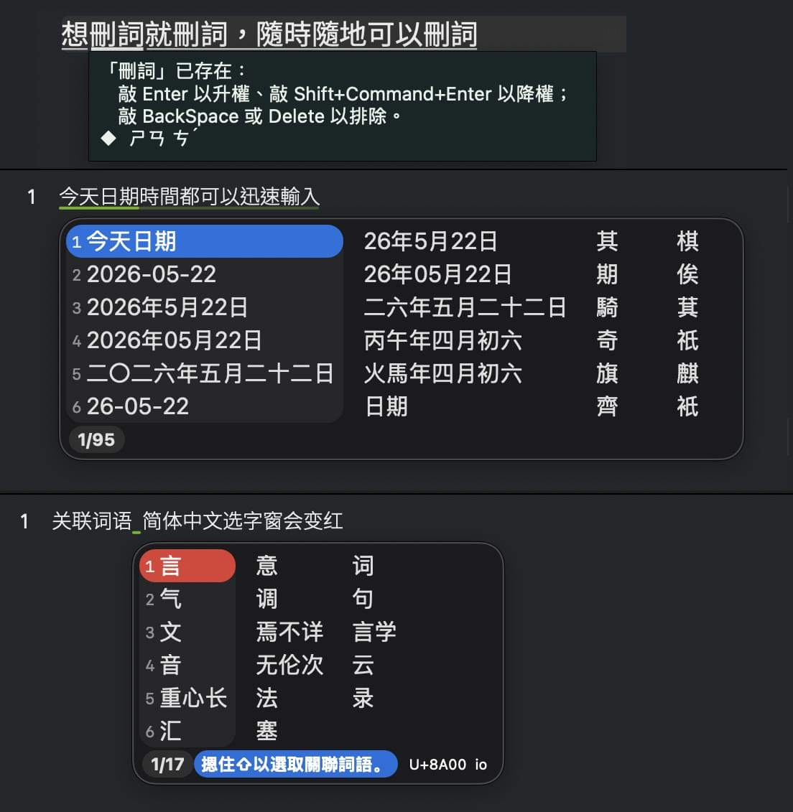

# vChewing 唯音輸入法

> ☕️ **唯音輸入法專案目前[正在接收贊助](./SPONSOR_ME.md)**，將用於年度維護更新、Apple 開發者年費等開銷。

| 發行版與作業系統 (至少) | 下載及發行說明 | 更新履歷 | 程式碼倉庫 | 版本＆日期 |
|-------|----|----|----|----|
| 主流發行版 (macOS 13 Ventura - 至今) | [GitHub](https://github.com/vChewing/vChewing-macOS/releases), [Gitee](https://gitee.com/vChewing/vChewing-macOS/releases) | [GitHub](https://github.com/vChewing/vChewing-macOS/wiki/%E6%9B%B4%E6%96%B0%E5%B1%A5%E6%AD%B7), [敝站](./ReleaseNotes.md) | [GitHub](https://github.com/vChewing/vChewing-macOS/), [Gitee](https://gitee.com/vChewing/vChewing-macOS/), [Homebrew Cask](https://github.com/windwords/homebrew-vchewing) | 4.7.4 GM (Sep 8, 2026) |
| [Aqua 紀念版](./techdocs/AQUASPECIAL.md) (macOS 10.9 Mavericks - 12 Monterey) | [GitHub](https://github.com/vChewing/vChewing-OSX-Legacy/releases), [Gitee](https://gitee.com/vChewing/vChewing-OSX-Legacy/releases) | 參見下載頁面 | [GitHub](https://github.com/vChewing/vChewing-OSX-Legacy/), [Gitee](https://gitee.com/vChewing/vChewing-OSX-Legacy/) | 4.7.4-Legacy GM (Sep 8, 2026) |

## 產品介紹 (Intro)

該輸入法恐怕是截至目前為止**在功能多樣性方面**最強的第三方免費 macOS 系統專用輸入法，採純 Swift 語言寫就。唯音的原廠詞庫同時兼顧兩岸各自的審音和讀音習慣。唯音的著力點不是去想著怎麼用指針，而是盡可能在力所能及的範圍內將整個產品的功能做得更好用。

唯音的幾個產品目標：

1. 在力所能及的範圍內，將自有功能做得盡可能豐富、讓輸入法使用更便利。
2. 利用 Swift 降低二次開發時的技術門檻、使得來自第三方的功能擴充更加容易。
3. 專案本身不會遇到傳播上的難題。
4. 讓注音符號在其故鄉展現其全新的價值。

## 快速入門 (Quick Start)

剛接觸唯音輸入法的話，建議您按以下順序閱讀使用手冊：

1. [安裝/啟用/切換/停用/卸除](./manual/install_uninstall_enable_disable.md)——如何將唯音安裝進您的 Mac。
2. [輸入文字](./manual/typing.md)——組字模式與逐字選字模式。
3. [鍵盤熱鍵使用手冊](./manual/shortcuts.md)——提升輸入效率的各種熱鍵。
4. [偏好設定](./manual/preferences.md)——逐頁講解偏好設定當中的每個選項。
5. [常見問題](./faq/)——遇到問題時先查這裡。

部分近期主打更新內容概要：

- [4.7.4] 盲文點字輸出現支援 ASCII 點字（SimBraille）；新增「對接輸入客體時顯示當前打字模式」的內文提示（預設關閉）；修復原廠辭典目錄未設定時被誤判為無效路徑而反覆彈窗的故障、以及第一聲讀音被跨聲調漸退記憶誤套用的故障；例行語彙資料更新。
- [4.7.3 SP1] 緊急修正了漸退記憶模組「可能把與所打讀音不符的記憶（如同音異調、或字詞與讀音錯位的紀錄）誤套用於組句與選字」的故障。
- [4.7.3] 半形標點模式行為設計缺陷修正；狂拼模式副駕選字窗排版調整；使用者打字學習資料複用方法有所改良；舊系統相容性改良；支援部分 GBEX 字集。
- [4.7.2] 狂拼模式體驗精修（未完成讀音敲標點不再蜂鳴、簡拼容錯查詢按詞值去重、重切候選拒絕過大建議）；選字窗讀音消歧義支援漢語拼音顯示。
- [4.7.1] 狂拼模式副駕選字窗不再響應 Emacs 熱鍵；修復了狂拼模式下與打字學習記憶內容套用有關的行為故障；Intel Mac 效能改良。
- [4.7.0] 狂拼模式全面進化（簡拼整詞、替代切分候選、臨時記憶融入語言模型統計）；漢字轉換整合為「當代繁體／康熙／JIS」三態輪替並支援熱鍵；組字引擎的笛卡爾積防禦機制精化。
- [4.6.3] 拼音打字現可使用狂拼模式（類似於搜狗拼音的體驗）；對修飾鍵變更事件改採放行策略；修補康熙轉換模式惡例。

## 主要特色功能 (Feat.)

唯音的主要特色功能如下：

1. 對於諸如「[ChatGPT macOS 客戶端](https://www.threads.net/@darrell_tw_/post/DDryNY2JFW2)」這樣的對內文組字不友好的軟體 / 網頁，唯音輸入法擁有客體管理功能、允許您對這些接收文字輸入的客體軟體強制啟用浮動組字窗。如果您嫌麻煩的話，更可以直接在唯音偏好設定的「開發道場」直接啟用「強化型組字區安全防護」來強制對所有場合啟用浮動組字窗。
2. 「強化型組字區安全防護」可以阻止那些接收文字輸入的軟體提前獲取您的內文組字區的私隱內容。Spotlight 以及有些網頁會獲取這些內容來提前胡亂檢索東西。
3. 有些密碼管理軟體對系統安全 API 的不正確使用（用完之後忘記通過這些 API 關掉系統鍵盤安全模式）會導致所有第三方輸入法全部罷工。**唯音會主動檢查這種情況並知會使用者「是哪一款軟體搞出這種問題」**。
4. 可以直接從當前電腦的奇摩輸入法匯入來自奇摩輸入法的使用者自訂語彙（前提條件：奇摩輸入法在當前電腦可以正常用來打字）。
5. 支援多種拼音輸入（得帶有12345數字聲調）：漢語拼音、國音二式、耶魯拼音、華羅拼音、通用拼音、韋氏拼音。
6. 支援多種注音輸入排列：大千傳統排列（零壹/微軟）、酷音大千 26 鍵、倚天傳統、倚天忘形、許氏鍵盤、星光、IBM、神通、（偽）精業。
7. 逐字選字模式的關聯詞語功能的辭典內容可自訂，也可以直接讀取（UTF-8 格式的）從 Windows XP 的ㄅ半輸入法關聯詞編輯器匯出的辭典檔案。
8. 支援 macOS 螢幕模擬鍵盤（僅傳統大千與傳統倚天佈局）。
9. 數字鍵盤區域不會敲出注音來，而是會直接放行＋不作處理（除非有選字窗出現，此時可以作為選字鍵）。
10. 可以用熱鍵在「當代繁體／康熙正體／日本 JIS 新字體」之間循環輪替繁體中文輸出的字形轉換（僅對繁體中文輸出模式有效）。
11. 簡繁體中文語料庫彼此分離，徹底杜絕任何繁簡轉換過程可能造成的失誤。
12. 支持近年的全字庫漢字輸入（自 v4.7.3 版起亦含 GB18030-2022 擴充 C/D/E/F 生僻字；CNS 資料大概每年更新一次，偶爾會有例外）。
13. 會自行整理使用者片語辭典的內容的格式。
14. 可以在敲字時用 Option+前後方向鍵 來以詞組節點為單位迅速移動游標、以 Option+「與前後方向鍵呈 90 度的方向鍵」 來就地輪替候選字（而不用叫出選字窗）、以  Ctrl+Option+前後方向鍵 迅速將游標挪到最後或者最前。
15. 支援最多十個字的長度的自訂語彙。
16. 在用「Shift+前後方向鍵」選中組字區內的詞語範圍時，你除了可以就地加詞以外，還可以就地刪詞（會放入語彙排除表內）。
17. 允許使用者片語辭典內的讀音以「漢語拼音+數字標調」的方式記錄（會被自動辨識）。
18. 繪文字不會干擾到選字長度上限與下限的判斷。
19. 可用 Ctrl+Option+Command+Enter 輸出符合教科書書寫規範的網頁 ruby 文字標記（注音/漢語拼音）的 HTML 內容。如果是 Ctrl+Command+Enter 的話，只會輸出非教科書標準的注音/漢語拼音。
20. 選字窗內有當前頁數提示，且選字窗佈局風格更豐富，更允許微軟新注音使用者們將選字窗設定得符合自己的使用習慣。
21. 在選字窗內選字之後，被選的字周圍的字不會亂變。
22. 唯音的 Aqua 紀念版分支從 macOS 10.9 系統開始的系統都可以用。

## 系統需求 (Sys. Req.)

- 主流發行版：要求至少 Mac OS X 12 以上版本（Xcode 27 所支援的最低建置目標）。詳細步驟請洽《[安裝/啟用/切換/停用/卸除](./manual/install_uninstall_enable_disable.md)》一文。
  - 主流發行版的系統支援範圍在原則上與 Homebrew 的系統支援範圍保持一致。
- Aqua 紀念版：針對 macOS 10.9 Mavericks 系統建置。
  - 理論上可以在 macOS 10.10 - 10.13.3 系統下正常運作，但這幾版 macOS 不太成熟、不建議使用。

## 軟體授權 (License)

本專案採用 MIT-NTL License 釋出，使用者可自由使用、散播本軟體，惟散播時必須保持軟體完整、不得修改版權文字。如若在此基礎上做出修改版軟體的話，除非唯音專案書面允許，否則請勿使用唯音（vChewing）的產品名稱（包括《唯音輸入法》的前身《威注音》產品名稱）。詳細資料請洽程式碼倉庫內的各種 Markdown 說明檔案（包含部分不在本頁面列出的 FAQ 常見問題解答）。

## 卸載方式 (Uninstall)

請參見《[如何卸除唯音輸入法](./UNINSTALL.md)》一文。必要情況下，你可以持該文章向 Apple Support 求助。

## 常見問題 (FAQ)

唯音的常見問題解答已按主題分類整理：

- [輸入與設定問題](./faq/basics.md)——ㄅ半模式、簡體輸入、符號輸入、備份偏好設定、拼音免打聲調等。
- [故障排除](./faq/troubleshooting.md)——CapsLock 切換延遲、特定軟體相容性、閃退故障等。
- [技術問答](./faq/technical.md)——沙箱機制、選字原理、資料來源等。

如果這裡沒有您想要的答案，歡迎查閱《[故障提報與用儀器捉蟲](./BUGREPORT.md)》一文。

---

Copyright (c) 2021 and onwards The vChewing Project (MIT-NTL License).

Authors (macOS 版): [GitHub](https://github.com/vChewing/vChewing-macOS/blob/main/AUTHORS) § [Gitee](https://gitee.com/vChewing/vChewing-macOS/blob/main/AUTHORS) § [中文](./techdocs/AUTHORS.md)。

- [Twitter](https://twitter.com/vChewingIME) § [Patreon 贊助](https://www.patreon.com/c/ShikiSuen) 。
