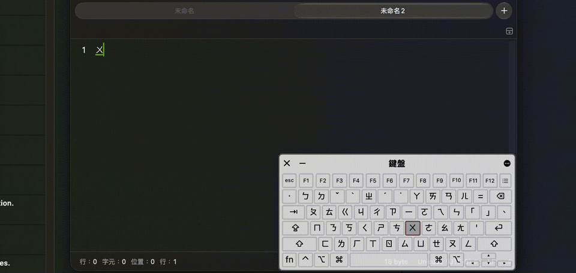
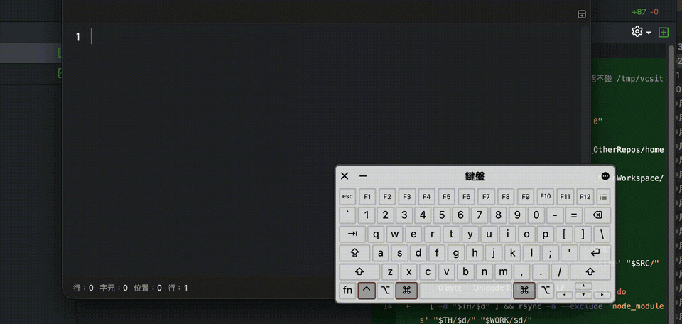
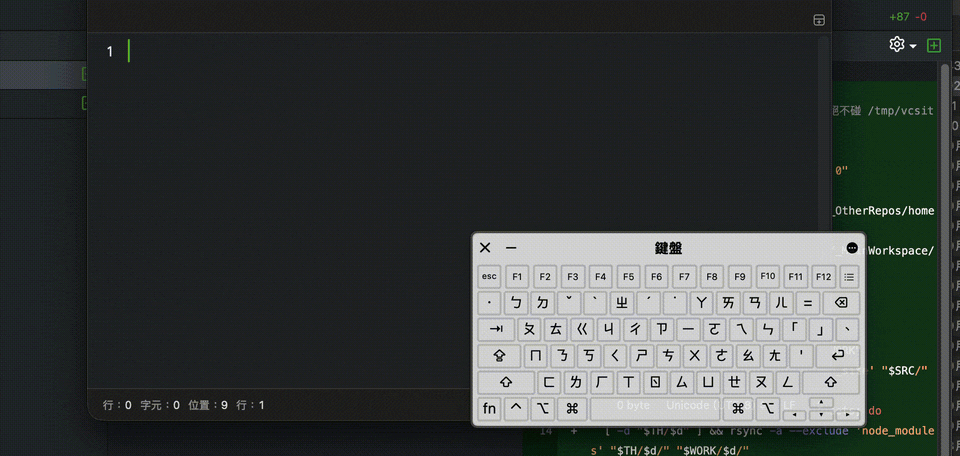
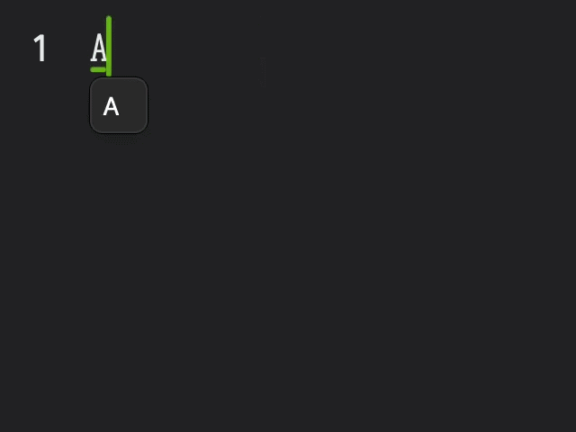
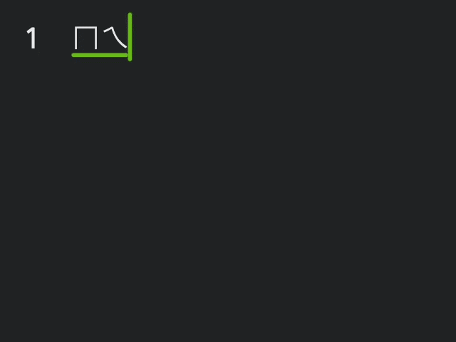
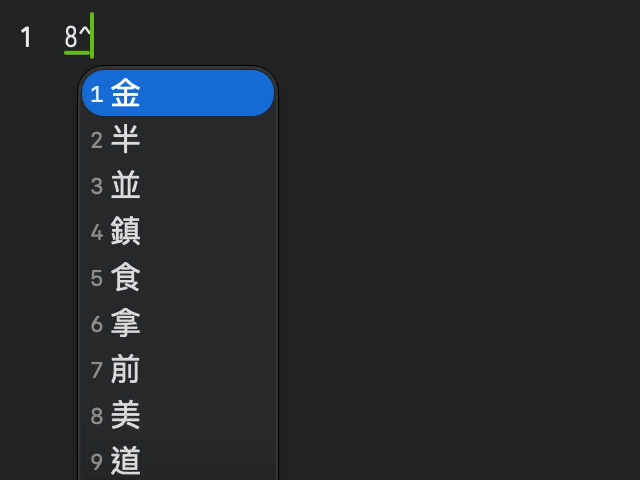
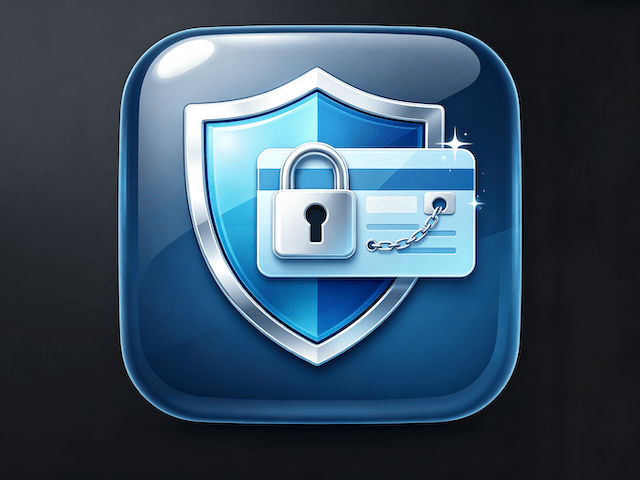
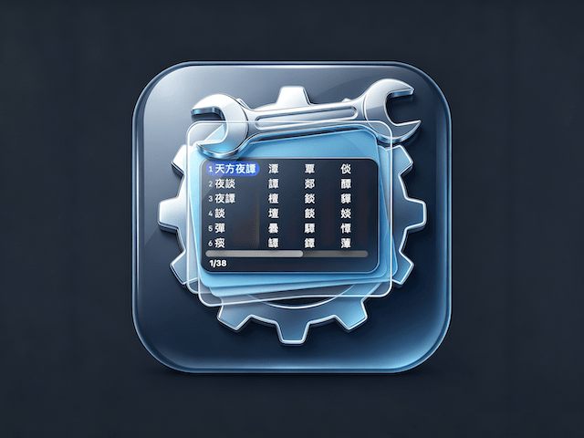

<centerbox>
<carousel timesec=9>
<carousel_title>唯音輸入法 for macOS</carousel_title>
<carousel_subtitle>唯音輸入法是 macOS 最安全、功能最完整的中文注音/拼音輸入法。</carousel_subtitle>

</carousel>
</centerbox>
<cardset markdown="block">

<centerbox>
<cardset_title>您的打字習慣 照樣承襲</cardset_title>

<cardset_subtitle>唯音輸入法可應對不同的打字習慣，只需您做出對應的配置。 這遠遠不止大千聲韻並擊組句注音打字。</cardset_subtitle>
</centerbox>

<card markdown="block">

<card_title>注音中英文混打</card_title>

如果您想在中英文混打時免於切換中英模式的話，在「唯音輸入法偏好設定->行為設定」啟用「中英文輸入回退」即可。詳見《[寫給華碩輸入法的使用者](./manual/onboarding_asus.html)》。

</card>
<card markdown="block">

<card_title>拼音狂拼快打</card_title>

唯音輸入法的拼音狂拼模式支援多種拼音方案，允許免聲調快速連打。詳見《[寫給搜狗拼音的使用者](./manual/onboarding_pinyinsimp.html)》。

</card>
<card markdown="block">

<card_title>ㄅ半注音</card_title>

從 DOS 倚天中文系統與 Windows 3.x 年代活到現在的ㄅ半戰士們，只需要在「唯音輸入法偏好設定->一般設定」點按「我姓ㄅ」按鈕，就可以找回自己熟悉的ㄅ半輸入體驗啦！

</card>
<card markdown="block">

<card_title>行列輸入法</card_title>

將 Gontera 提供的 [CIN2 格式的行列輸入法表格](https://github.com/gontera/array30/tree/master/cin2) 載入唯音輸入法的磁帶模式，就可以使用行列輸入法。詳見《[寫給行列三十輸入法的使用者](./manual/onboarding_array30.html)》。

</card>
<card markdown="block">

<card_title>其他 CIN 表格輸入法</card_title>

唯音輸入法的 CIN 磁帶模式也支援 CIN1 格式的輸入法表格，可以用來打倉頡、行列、嘸蝦米。詳見《[寫給 OpenVanilla 的使用者](./manual/onboarding_ov.html)》。

</card>
</cardset>

<centerbox markdown="block">

[⬇️ 點此下載唯音輸入法](./Downloads.md){: .cta-button}

> ☕️ **唯音輸入法專案目前[正在接收贊助](./SPONSOR_ME.md)**，將用於年度維護更新、Apple 開發者年費等開銷。

</centerbox>

<cardset markdown="block">

<centerbox>
<cardset_title>為什麼唯音值得您選擇</cardset_title>

<cardset_subtitle>市面上注音輸入法那麼多，但您或許會有一條理由選擇唯音輸入法。</cardset_subtitle>
</centerbox>

<card markdown="block">

<card_title>資訊安全</card_title>

唯音敢於開啟 App Sandbox，拒絕引入「加詞之後執行 shell 腳本」等危險設計，不會主動聯網，更容易符合大公司對第三方輸入法的資安審查要求。唯音更允許使用者啟用強化型組字區安全防護，防止網頁提前讀取您的內文組字區的內容來做擅自的互動，保護您的打字節奏與私隱。您打過的完整長句子也不會被唯音擅自整個記下來推薦給您，讓您在直播或簡報時不會因此被迫社會性死亡。

</card>
<card markdown="block">

<card_title>更聰明強大的獨家引擎</card_title>

護摩組字引擎原生支援游標跳轉、候選字詞輪替。漸退記憶模組基於野獸曲線記錄學習您的打字行為，直接將多元圖資料提供給護摩引擎來利用，在您的電腦上原湯化原食。齊鐵恨注拼引擎使得唯音的打字體驗同時支援六種拼音方案、至少五種靜態注音鍵盤佈局、五種動態注音鍵盤佈局。這些均有縝密的單元測試來檢證。

</card>
<card markdown="block">

<card_title>更豐富細膩的偏好設定配置</card_title>

唯音獨家的田所選字窗可重現微軟新注音那樣的多欄選字窗佈局，更遑論 macOS 內建注音的多列選字窗佈局。唯音亦有更多細膩的產品體驗細節供您探索。不同的輸入法使用者們的習慣眾口難調。唯音輸入法提供上百條偏好設定選項，允許您深度客製化您的打字體驗。

</card>
<card markdown="block">

<card_title>我用小麥/香草/奇摩就很好用</card_title>

每個人的取捨各異。但如果您對唯音不了解的話，GitHub 原始碼倉庫都是公開的，用 Claude Fable 都翻一遍，交叉比對便知。另：mac 上其實沒有「香草注音」。香草框架本身不提供注音引擎；桌面端被叫做「香草注音」的，是新酷音引擎接上香草框架的產物（OVIMChewing，2010 年前已停止維護）。您習慣的那種「香草注音」打字體驗，來自新酷音團隊。

</card>
</cardset>

<cardset markdown="block">

<centerbox>
<cardset_title>您的資料，直接繼承</cardset_title>

<cardset_subtitle>之前的輸入法用了快二十多年，攢了成千上萬條使用者片語，可遷移至唯音輸入法。</cardset_subtitle>
</centerbox>

<card markdown="block">

<card_title>奇摩輸入法（本體）</card_title>

奇摩輸入法的使用者片語的加密採用的是公開的密鑰，目前已有[公開的解讀工具](https://github.com/vChewing/KeyKeyUserDBKit)可以解出其中的單元圖 (unigram) 與雙元圖 (bigram)。唯音輸入法亦可直接從奇摩輸入法的使用者片語資料庫繼承單元圖資料，且[操作步驟](./onboarding/onboarding_kimo.md)非常簡單。無論是奇摩輸入法 Windows 版匯出的 TXT 格式的使用者片語資料，還是奇摩輸入法自身的 SQLite 格式的 `SmartMandarinUserData.db` 使用者片語資料庫，都可被唯音輸入法直接解讀。

</card>
<card markdown="block">

<card_title>任何基於菸草注音引擎的輸入法</card_title>

有一些輸入法（比如自然輸入法 v10 至 v13）是使用姜天戩的「OVIMTobacco 菸草注音引擎」開發的，其使用者片語資料庫擁有[通用的資料解讀工具](https://github.com/vChewing/NCIUserDBKit)。使用者可使用該工具自行解出自己的使用者片語資產。

唯音輸入法現階段不內建對該格式的直接讀取功能。重要的是，使用者自己知道怎樣把資料取出來、使自己得以行使對自己資料的自決權。尤其是這種可能會攢上二十多年的資料。

</card>
<card markdown="block">

<card_title>小麥注音</card_title>

唯音輸入法與小麥注音的使用者片語格式都是 TSV 格式，且前兩個 Column 都是通用的：第一個 Column 是詞，第二個 Column 是以 ASCII 減號相連的讀音、且讀音須為「聲介韻調」順序書寫的注音（包括輕聲也得依此順序書寫）。第三個 Column 是權重，需落在 `[-9.5, 0]` 區間內。

至於小麥注音怎樣定義第三個 Column 的作用，請研讀他們的軟體倉庫裡面的實作方法。

</card>
<card markdown="block">

<card_title>奇摩的各種分支</card_title>

如果是諸如 `ChiaKey` 或 `Yahoo KeyKey 2` 或 `快打注音(SuperKeyin)` 等源自奇摩輸入法原始碼倉庫的分支的話，請洽相關分支維護者獲取「如何匯出 TXT 格式的使用者片語資料」的方法、亦或可嘗試直接載入他們輸入法的 `SmartMandarinUserData.db` 資料庫（不一定能成功，得看他們改了哪些內容）。這些分支只是為了在功能上希望 1:1 繼承奇摩輸入法的打字體驗的人群準備的，缺乏功能全面性，並不是當代注音輸入法的最優解。

</card>
</cardset>

## 產品介紹 (Intro)

該輸入法是截至目前為止**在功能多樣性方面**最強的第三方免費 macOS 系統專用輸入法，採純 Swift 語言寫就。唯音的原廠詞庫同時兼顧兩岸各自的審音和讀音習慣。唯音輸入法盡可能在力所能及的範圍內將整個產品的功能做得更好用。

唯音的幾個產品目標：

1. 在力所能及的範圍內，將自有功能做得盡可能豐富、讓輸入法使用更便利。
2. 利用 Swift 降低二次開發時的技術門檻、使得來自第三方的功能擴充更加容易。
3. 專案本身不會遇到傳播上的難題。
4. 讓注音符號在其故鄉展現其全新的價值。

## 快速入門 (Quick Start)

第一次使用唯音輸入法嗎？建議先讀《[新手上路](./onboarding/)》一文——從系統需求、安裝啟用，到「從您原本使用的輸入法轉換過來」的指引，都整理在該文內。

嫌偏好設定的選項太多嗎？唯音自 v4.8.5 版起同捆「[唯音輸入法配置助手](./assistant/)」：填完最少四個步驟的問卷，就能產生一份現成的配置包、直接匯入唯音的偏好設定。「唯音輸入法偏好設定」的「一般設定」頁面有專門的按鈕可以直接開啟它。

剛接觸唯音輸入法的話，建議您按以下順序閱讀使用手冊：

1. [安裝/啟用/切換/停用/卸除](./manual/install_uninstall_enable_disable.md)——如何將唯音安裝進您的 Mac。
2. [輸入文字](./manual/typing.md)——組字模式與逐字選字模式。
3. [鍵盤熱鍵使用手冊](./manual/shortcuts.md)——提升輸入效率的各種熱鍵。
4. [偏好設定](./manual/preferences.md)——逐頁講解偏好設定當中的每個選項。
5. [常見問題](./faq/)——遇到問題時先查這裡。

## 主要特色功能 (Feat.)

唯音的主要特色功能如下：

1. 對於諸如「[ChatGPT macOS 客戶端](https://www.threads.net/@darrell_tw_/post/DDryNY2JFW2)」這樣的對內文組字不友好的軟體 / 網頁，唯音輸入法擁有客體管理功能、允許您對這些接收文字輸入的客體軟體強制啟用浮動組字窗。如果您嫌麻煩的話，更可以直接在唯音偏好設定的「開發道場」直接啟用「強化型組字區安全防護」來強制對所有場合啟用浮動組字窗。
2. 「強化型組字區安全防護」可以阻止那些接收文字輸入的軟體提前獲取您的內文組字區的私隱內容。Spotlight 以及有些網頁會獲取這些內容來提前胡亂檢索東西。
3. 有些密碼管理軟體對系統安全 API 的不正確使用（用完之後忘記通過這些 API 關掉系統鍵盤安全模式）會導致所有第三方輸入法全部罷工。**唯音會主動檢查這種情況並知會使用者「是哪一款軟體搞出這種問題」**。
4. 可以直接從當前電腦的奇摩輸入法匯入來自奇摩輸入法的使用者自訂語彙（前提條件：奇摩輸入法在當前電腦可以正常用來打字）。
5. 支援多種拼音輸入（得帶有12345數字聲調）：漢語拼音、國音二式、耶魯拼音、華羅拼音、通用拼音、韋氏拼音。
6. 支援多種注音輸入排列：大千傳統排列（零壹/微軟）、酷音大千 26 鍵、倚天傳統、倚天忘形、許氏鍵盤、星光、IBM、神通、（偽）精業。
7. 逐字選字模式的關聯詞語功能的辭典內容可自訂，也可以直接讀取（UTF-8 格式的）從 Windows XP 的ㄅ半輸入法關聯詞編輯器匯出的辭典檔案。
8. 支援 macOS 螢幕模擬鍵盤（僅傳統大千與傳統倚天佈局）。
9. 數字鍵盤區域不會敲出注音來，而是會直接放行＋不作處理（除非有選字窗出現，此時可以作為選字鍵）。
10. 可以用熱鍵在「當代繁體／康熙正體／日本 JIS 新字體」之間循環輪替繁體中文輸出的字形轉換（僅對繁體中文輸出模式有效）。
11. 簡繁體中文語料庫彼此分離，徹底杜絕任何繁簡轉換過程可能造成的失誤。
12. 支持近年的全字庫漢字輸入（自 v4.7.3 版起亦含 GB18030-2022 擴充 C/D/E/F 生僻字；CNS 資料大概每年更新一次，偶爾會有例外）。
13. 會自行整理使用者片語辭典的內容的格式。
14. 可以在敲字時用 Option+前後方向鍵 來以詞組節點為單位迅速移動游標、以 Option+「與前後方向鍵呈 90 度的方向鍵」 來就地輪替候選字（而不用叫出選字窗）、以  Ctrl+Option+前後方向鍵 迅速將游標挪到最後或者最前。
15. 支援最多十個字的長度的自訂語彙。
16. 在用「Shift+前後方向鍵」選中組字區內的詞語範圍時，您除了可以就地加詞以外，還可以就地刪詞（會放入語彙排除表內）。
17. 允許使用者片語辭典內的讀音以「漢語拼音+數字標調」的方式記錄（會被自動辨識）。
18. 繪文字不會干擾到選字長度上限與下限的判斷。
19. 可用 Ctrl+Option+Command+Enter 遞交注音標記內容（預設為遞交括弧註解標記；可在偏好設定「行為設定」頁改為遞交 HTML Ruby 註解標記等格式，該選項亦提供國語點字／國通盲文選項）。如果是 Ctrl+Command+Enter 的話，只會輸出非教科書標準的注音/漢語拼音。
20. 選字窗內有當前頁數提示，且選字窗佈局風格更豐富，更允許微軟新注音使用者們將選字窗設定得符合自己的使用習慣。
21. 在選字窗內選字之後，被選的字周圍的字不會亂變。
22. 唯音的 Aqua 紀念版從 macOS 10.9 系統開始的系統都可以用（自 v4.8.0 版起，該發行版已改由主流發行版倉庫直接建置）。

## 系統需求 (Sys. Req.)

- 主流發行版：要求至少 Mac OS X 12 以上版本（Xcode 27 所支援的最低建置目標）。詳細步驟請洽《[安裝/啟用/切換/停用/卸除](./manual/install_uninstall_enable_disable.md)》一文。
  - 主流發行版的系統支援範圍在原則上與 Homebrew 的系統支援範圍保持一致。
- Aqua 紀念版：針對 macOS 10.9 Mavericks 系統建置，適用於 macOS 10.9 至 macOS 12 Monterey 的系統。
  - 其中，理論上可以在 macOS 10.10 - 10.13.3 系統下正常運作，但這幾版 macOS 不太成熟、不建議使用。

## 軟體授權 (License)

本專案採用木蘭寬鬆授權條款第 2 版（MulanPSL-2.0）釋出，全文見 `vChewing-macOS` 倉庫的 `LICENSE.txt`。使用者可自由使用、散播本軟體，惟散播時必須保持軟體完整、不得修改版權文字。木蘭寬鬆授權條款第 2 版第 3 條不提供商標許可，故如若在此基礎上做出修改版軟體的話，除非唯音專案書面允許，否則請勿使用唯音（vChewing）的產品名稱（包括《唯音輸入法》的前身《威注音》產品名稱）。另請注意：唯音的核心引擎模組群（含護摩組字引擎 Homa）以 LGPLv3 授權釋出，且對 Swift 靜態鏈接之情形有額外准許。詳細資料請洽程式碼倉庫內的各種 Markdown 說明檔案（包含部分不在本頁面列出的 FAQ 常見問題解答）。

## 卸載方式 (Uninstall)

請參見《[如何卸除唯音輸入法](./manual/UNINSTALL.md)》一文。必要情況下，您可以持該文章向 Apple Support 求助。

## 常見問題 (FAQ)

唯音的常見問題解答已按主題分類整理：

- [輸入與設定問題](./faq/basics.md)——ㄅ半模式、簡體輸入、符號輸入、備份偏好設定、拼音免打聲調等。
- [故障排除](./faq/troubleshooting.md)——CapsLock 切換延遲、特定軟體相容性、閃退故障等。
- [技術問答](./faq/technical.md)——沙箱機制、選字原理、資料來源等。

如果這裡沒有您想要的答案，歡迎查閱《[故障提報與用儀器捉蟲](./faq/BUGREPORT.md)》一文。

## 著作權與網站 (Copyright and Website)

Copyright (c) 2021 and onwards The vChewing Project (MulanPSL-2.0 License).

Authors (macOS 版): [GitHub](https://github.com/vChewing/vChewing-macOS/blob/main/AUTHORS) § [Gitee](https://gitee.com/vChewing/vChewing-macOS/blob/main/AUTHORS) § [中文](./techdocs/AUTHORS.md)。

- [Twitter](https://twitter.com/vChewingIME) § [Patreon 贊助](https://www.patreon.com/c/ShikiSuen) 。
