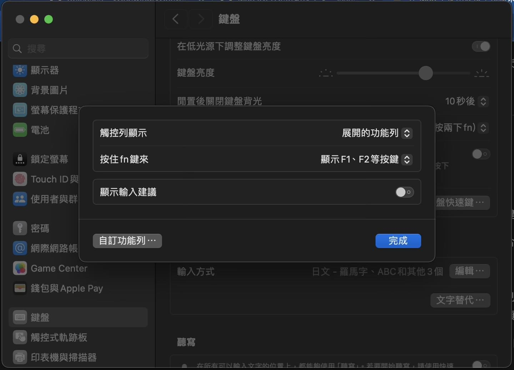

# vChewing 唯音輸入法

> **敝專案目前正式接收捐款**。捐款渠道：[Patreon](https://www.patreon.com/c/shikisuen/membership) ，微信使用者與支付寶使用者可以電郵給開發者以詢問其他可行的渠道。這些費用會用於 Apple 開發者會員年費、以及 Codex 用量等。
> 請注意 **所有的獻金（包括這個獻金檔位）只會被當作餽贈，且不會對在下施加任何義務與合約**。感謝您的理解。
> 如果您有配樂製作或流行歌曲弦樂編曲的需求的話、或者管弦樂錄音樂譜製作需求的話，
> 也歡迎外包給唯音輸入法的開發者，這是他希望能接到的主要業務。
> 開發者目前最需要的主要業務是配樂相關的客戶資源，期待能與您合作。

| 作業系統 (至少) | 下載及發行說明 | 更新履歷 | 程式碼倉庫 | 版本＆日期 |
|-------|----|----|----|----|
| macOS (13 Ventura - 至今) | [GitHub](https://github.com/vChewing/vChewing-macOS/releases), [Gitee](https://gitee.com/vChewing/vChewing-macOS/releases) | [GitHub](https://github.com/vChewing/vChewing-macOS/wiki/%E6%9B%B4%E6%96%B0%E5%B1%A5%E6%AD%B7), [GitCode](https://gitcode.net/vChewing/vChewing-macOS/-/wikis/%E6%9B%B4%E6%96%B0%E5%B1%A5%E6%AD%B7) | [GitHub](https://github.com/vChewing/vChewing-macOS/), [Gitee](https://gitee.com/vChewing/vChewing-macOS/) | 4.1.2 GM (Nov 24, 2025) |
| macOS (10.9 Mavericks - 12 Monterey) | [GitHub](https://github.com/vChewing/vChewing-OSX-Legacy/releases), [Gitee](https://gitee.com/vChewing/vChewing-OSX-Legacy/releases) | 參見下載頁面 | [GitHub](https://github.com/vChewing/vChewing-OSX-Legacy/), [Gitee](https://gitee.com/vChewing/vChewing-OSX-Legacy/) | 4.1.2-Legacy GM (Nov 24, 2025) |

- 敝專案的中文名稱從 4.1.3 版開始更名為《唯音輸入法》，因為《威注音輸入法》這個名稱的 SEO 效果太糟糕、在大多數場合下均無法被正常檢索到：檢索結果往往會將「威注音」這個詞頑固地拆成「威」「注音」，導致檢索結果都變成了漢字讀音查詢。
- 自 3.6.1 版開始，macOS 12 Monterey 為止的 macOS 系統版本的支援將轉交給 Aqua 紀念版。請留意上述表格內的不同發行版本分支對應的作業系統範圍。
- 如欲了解針對主流發行版與 Aqua 紀念版的區分方式，請[點閱此文](./AQUASPECIAL.md)。
- 歡迎關注唯音輸入法的 SNS 專頁： [Twitter](https://twitter.com/vChewingIME) § [Plurk](https://www.plurk.com/vChewingIME) 。
- 請參閱《[鍵盤熱鍵使用手冊](./manual/shortcuts.md)》以提升該輸入法的使用效率。
- 另有[熱心網友製作的 Homebrew-Cask 安裝方式](https://github.com/windwords/homebrew-vchewing)可用。

> **⚠️**：請在升級到 macOS 14 Sonoma 之前**先把唯音輸入法升級到至少 3.5.4 版**，否則可能會在剛升級完系統之後首次使用唯音輸入法時出現整個系統畫面失去響應（長達數十秒）的故障。該故障當且僅當「使用者辭典目錄或磁帶檔案在 iCloud Drive 裡面」這類情形才會發生。該故障乃唯音輸入法的 GCD 設計不慎觸發 macOS 一處設計缺陷所使然。從 3.5.4 版開始，唯音不會再在這種情況下觸發該系統缺陷。如果您發現了其他與輸入法有關的故障，歡迎**[電郵提報](./BUGREPORT.md)**。

部分近期主打更新內容概要：

- [4.1.2] 修復了與候選字詞覆寫行為有關的一些故障；選字窗與浮動組字窗現照顧系統偏好主題色之設定。
- [4.1.1] 繼續精簡記憶體佔用；從打字會話體系徹底移除了 autoreleasepool，理論上應該不會再卡頓了。
- [4.1.0] 新增羅馬數字輸入模式與選字窗候選字唸讀功能。另附多項能耗改良，且為了規避系統層面的 Bug 而停用了 Liquid Glass 介面。
- [4.0.6] 針對輸入法的會話控制體系移除了一些過激的 autoreleasepool 處理，藉此減少輸入法的閒時功耗。
- [4.0.5] 解決了自 4.0.0 版開始至 4.0.4 為止的記憶體效能故障；減少了打字行為學習模組對硬碟的寫入頻次。
- [4.0.4] 修復了就地刪詞功能失靈的故障；選字窗熱鍵刪詞功能現在不再需要摁 Fn 鍵。
- [4.0.3] 修復了打字行為記憶模組（POM）對正常打字行為的劫持故障。修復了在就地加詞、控頻之後沒能正確清理對應的 POM 記憶的故障。
- [4.0.2] 新增了對 CIN2 v2.5 磁帶格式的支援。行列輸入法使用者得向老刀索取新版磁帶、方可使用行列詞彙之功能。
- [4.0.1] 解決了選字窗選字會被使用者打字行為記憶觀測資料綁架而失效等故障。
- [4.0.0] 解決了記憶體洩漏的問題。更新了臨時記憶模組與組字引擎，兩者均有更換算法。後端程式大翻修＆對 macOS 26 提供支援。

<details>
<summary>（點此查看更早的版本的更新記錄概要……）</summary>
- [3.9.2] 修復了與半衰記憶模組有關的一些實作失誤之故障。
- [3.9.1] 大量程式碼重構、以圖更優的效能；針對 ChatGPT 的 mac 版預設啟用相容模式。
- [3.9.0] 更換了效能更優的 Dijkstra 組句算法；在選字窗顯示時，允許以 H / L 鍵移動組字區游標；可關閉蜂鳴音效。
- [3.8.6] 針對以 Electron 構築的客體應用強制啟用浮動組字窗、以規避可能的相容性問題。該特性可手動關閉。
- [3.8.5] 將記憶體使用上限閾值由 384MB 上調至 1024MB；解決了在點滅 CapsLock 鍵時「會有浮動組字窗在螢幕上殘留顯示」的故障，等。
- [3.8.4] 緊急修復了一處與「SecureEventInput 濫用行為偵測模組」有關的記憶體洩漏故障。
- [3.8.3] 重新設計了針對單個漢字的控頻方法；新增選字窗內的服務選單功能、且可自訂；允許將組字區內容遞交為盲文點字陣列。
- [3.8.2] 內部程式維護更新；另有針對原廠辭典內容的一些累積問題修正。
- [3.8.1] 重新設計了「匯入奇摩輸入法自訂詞資料庫」功能的圖形介面交互方式；選字窗支援統一碼字元的碼位資訊顯示。
- [3.8.0] 對偏好設定視窗做了精實案；允許以 J / K 鍵在選字窗內移動組字區內的游標；重構了輸入法的一部分內部模組。
- [3.7.2-3.7.3] 解決了「SecureEventInput 濫用行為偵測模組」的幾處缺陷；允許自訂數字小鍵盤的輸入行為；允許在選字窗內移動組字區內的游標。
- [3.7.0-3.7.1] 新增對 CIN2 v2.4 磁帶格式標準的支援、且新增了代令系統；另有其他雜項問題修正。
- [3.6.3 SP1] 修復了 3.6.3 GM 版不慎引入的一個會讓磁帶系統徹底癱瘓的故障。
- [3.6.2-3.6.3] 輸入法原廠詞庫改用 SQLite 技術，大幅度減少記憶體佔用。
- [3.6.1 SP2] 允許自動匯入處理藉由雅虎奇摩輸入法匯出的 txt 格式的使用者辭典資料，另解決了與 CapsLock 有關的當機故障。
- [3.6.1 GM] 針對「在後檯濫用 SecureEventInput API 的執行緒」引入了主動偵測機制。
- [3.6.0] 引入「強化型組字區安全防護」功能。與此功能有關的詳情請洽「純靠北工程師7ci」。
- [3.5.5] 允許關閉田所選字窗的展頁特性、在剛叫出選字窗時就多行顯示。另有大量故障修正與內容維護更動。
- [3.5.4] 解決了一處與 macOS 14 有關的惡性相容性故障。
- [3.5.3] 針對全系列受支援的 Intel Mac 機種重寫了 Cocoa 版田所選字窗，極大地改善了介面渲染效率、減輕記憶體佔用。
- [3.5.0 - 3.5.2] 支援 CIN v2.1 - v2.2 標準；徹底重構了 IMK 選字窗的按鍵事件處理流程。
- [3.4.9] 改用 JSON 作為原廠辭典格式，節省記憶體佔用與硬碟空間佔用；另修復 SwiftUI 田所選字窗在某些佈局下「無法顯示反查結果」的故障。
- [3.4.7-3.4.8] 引入了一些與注音輸入有關的累積改進；另有引入對劉又銘教授的擬音注音排列的支援。
- [3.4.6] 解決了在藉由 macOS 系統內建 Emoji 視窗輸入表情時會崩掉輸入法的故障；另有其它故障修正。
- [3.4.5] 解決了在某些包含同音異幅的候選字詞的選字窗內來回選字時的崩潰故障；新增韋氏拼音輸入支援。
- [3.4.4] 修復了「單個漢字無法借由標記模式降頻」以及「當游標前後的漢字的讀音相同的時候，在此時叫出的選字窗內會出現橫跨游標的候選字詞」的故障。
- [3.4.3] 允許在標記模式內以節點為單位移動「標記專用游標」；針對「Shift+字母鍵」新增了兩種行為模式。
- [3.4.2] 組字區會實時反應你當前選字窗內的高亮的候選字詞的選字效果，另有程式庫內容維護更新。
- [3.3.8-3.4.1] 第三代田所選字窗，採 Cocoa 技術重新製作；修復了組字引擎在爬軌時會出現的記憶體洩漏故障；另有諸多小修正與功能更新。
- [3.3.6] 新增內碼輸入模式、且允許以此模式連續輸入漢字。另新增漢音符號表與漢音符號鍵盤模式支援。
- [3.3.4-3.3.5] 新增對諸如英雄聯盟等硬體全螢幕電玩的輸入法介面顯示支援，且對田所選字窗的橫向排列模式做了排版調整。
- [3.3.3] 允許以 Alt+Shift+Enter 將當前組字區「先逐字插入空格、再遞交」，方便 Sibelius 使用者整理中文歌詞。
- [3.2.0] 調整了 txt 格式的使用者辭典檔案的載入算法，使其載入耗時減半。
- [3.1.1-3.1.3] 取消了在就地輪替候選字時的使用者半衰記憶模組觀測行為。另附其它軟體故障修正與體驗改善。
- [3.1.0] 新增注音反查功能。
- [3.0.0] 換裝了全新的使用者語彙編輯器。
- [2.9.8] 允許在田所選字窗內使用滑鼠右鍵選單控頻或排除指定的候選字詞、且盡量保持選字窗繼續顯示。
- [2.9.0-2.9.3] 允許在選字窗底部顯示可能的字根反查結果（僅對橫排輸入時的田所選字窗生效）。
- [2.9.0-2.9.1] 新增 CIN2 格式的磁帶檔案支援，允許使用者以 CIN 碼表磁帶檔案給唯音擴充諸如嘸蝦米、五筆、倉頡這樣的筆畫輸入功能。
- [2.8.5 SP1] 針對 macOS 10.15 與 macOS 11 移植了田所浩二橫版矩陣選字窗。
- [2.8.0] 引入全新的田所浩二橫版矩陣選字窗（僅限 macOS 12 開始的系統）；通知飄窗行為優化；CapsLock 英數模式體驗改進。
- [2.3.0] 新增沙箱特性處理。
</details>

本文的 FAQ 會不定期更新來自 PTT 的提問。

註：本文所提到的任何 Option 鍵都等價於 PC 電腦鍵盤上的 Alt 鍵。

## 產品介紹 (Intro)

該輸入法恐怕是截至目前為止**在功能多樣性方面**最強的第三方免費 macOS 系統專用輸入法，採純 Swift 語言寫就。唯音的原廠詞庫同時兼顧兩岸各自的審音和讀音習慣。唯音的著力點不是去想著怎麼用指針，而是盡可能在力所能及的範圍內將整個產品的功能做得更好用。


唯音的幾個產品目標：

1. 在力所能及的範圍內，將自有功能做得盡可能豐富、讓輸入法使用更便利。
2. 利用 Swift 降低二次開發時的技術門檻、使得來自第三方的功能擴充更加容易。
3. 專案本身不會遇到傳播上的難題。
4. 讓注音符號在其故鄉展現其全新的價值。

## 主要特色功能 (Feat.)

首先呢，相比其他的 macOS 副廠輸入法而言，唯音解決了這幾點可用性問題：
- 對於諸如「[ChatGPT macOS 客戶端](https://www.threads.net/@darrell_tw_/post/DDryNY2JFW2)」這樣的對內文組字不友好的軟體 / 網頁，唯音輸入法擁有客體管理功能、允許您對這些接收文字輸入的客體軟體強制啟用浮動組字窗。如果您嫌麻煩的話，更可以直接在唯音偏好設定的「開發道場」直接啟用「強化型組字區安全防護」來強制對所有場合啟用浮動組字窗。
- 「強化型組字區安全防護」可以阻止那些接收文字輸入的軟體提前獲取您的內文組字區的私隱內容。Spotlight 以及有些網頁會獲取這些內容來提前胡亂檢索東西。
- 有些密碼管理軟體對系統安全 API 的不正確使用（用完之後忘記通過這些 API 關掉系統鍵盤安全模式）會導致所有第三方輸入法全部罷工。**目前只有唯音會主動檢查這種情況並知會使用者「是哪一款軟體搞出這種問題」**。
- 可以直接從當前電腦的奇摩輸入法匯入來自奇摩輸入法的使用者自訂語彙（前提條件：奇摩輸入法在當前電腦可以正常用來打字）。

其次呢，唯音幾乎都是在做小麥注音所缺失的功能、修他們不修的 Bug：

1. 可能支援最多種類的拼音輸入（得帶有12345數字聲調）：漢語拼音、國音二式、耶魯拼音、華羅拼音、通用拼音、韋氏拼音。
2. 支援足夠豐富的種類的注音輸入排列：大千傳統排列（零壹/微軟）、酷音大千 26 鍵、倚天傳統、倚天忘形、許氏鍵盤、星光、IBM、神通、（偽）精業。
3. 逐字選字模式的關聯詞語功能的辭典內容可自訂，也可以直接讀取（UTF-8 格式的）從 Windows XP 的ㄅ半輸入法關聯詞編輯器匯出的辭典檔案。
4. 支援 macOS 螢幕模擬鍵盤（僅傳統大千與傳統倚天佈局）。
5. 數字鍵盤區域不會敲出注音來，而是會直接放行＋不作處理（除非有選字窗出現，此時可以作為選字鍵）。
6. 可以將自己打的繁體中文自動轉成日本 JIS 新字體來輸出（包括基礎的字詞轉換）、也可以轉成康熙繁體來輸出。
7. 簡繁體中文語料庫彼此分離，徹底杜絕任何繁簡轉換過程可能造成的失誤。
8. 支持近年的全字庫漢字輸入（計畫每年更新一次，也偶爾會有例外）。
9. 會自行整理使用者辭典的內容的格式。
10. 可以在敲字時用 Option+前後方向鍵 來以詞組節點為單位迅速移動游標、以 Option+「與前後方向鍵呈 90 度的方向鍵」 來就地輪替候選字（而不用叫出選字窗）、以  Ctrl+Option+前後方向鍵 迅速將游標挪到最後或者最前。
11. 支援最多十個字的長度的自訂語彙。
12. 在用「Shift+前後方向鍵」選中組字區內的詞語範圍時，你除了可以就地加詞以外，還可以就地刪詞（會放入語彙排除表內）。
13. 允許使用者辭典內的讀音以「漢語拼音+數字標調」的方式記錄（會被自動辨識）。
14. 不會有「當組字區內有繪文字時，選字長度上限與下限判斷會失誤」的問題。
15. 可用 Ctrl+Option+Command+Enter 輸出符合教科書書寫規範的網頁 ruby 文字標記（注音/漢語拼音）的 HTML 內容。如果是 Ctrl+Command+Enter 的話，只會輸出非教科書標準的注音/漢語拼音。
16. 選字窗內有當前頁數提示（該功能不對 IMK 選字窗提供，因為 IMK 選字窗是 macOS 系統內建的、唯音只做了銜接利用）。
17. 在選字窗內選字之後，被選的字周圍的字不會亂變。
18. 唯音的 Aqua 紀念版分支從 macOS 10.9 系統開始的系統都可以用。

## 系統需求 (Sys. Req.)

- 主流發行版：要求至少 Mac OS X 13 以上版本（Xcode 14 所支援的最低建置目標）。詳細步驟請洽《[安裝/啟用/切換/停用/卸除](./manual/install_uninstall_enable_disable.md)》一文。
  - 對 macOS 12 系統的支持仍保留，但僅僅是因為 Homebrew 有支援而已。主流發行版的系統支援範圍在原則上與 Homebrew 的系統支援範圍保持一致。
- Aqua 紀念版：針對 macOS 10.9 Mavericks 系統建置。
  - 理論上可以在 macOS 10.10 - 10.13.3 系統下正常運作，但這幾版 macOS 不太成熟、不建議使用。


## 軟體授權 (License)

本專案採用 MIT-NTL License 釋出，使用者可自由使用、散播本軟體，惟散播時必須保持軟體完整、不得修改版權文字。如若在此基礎上做出修改版軟體的話，除非唯音專案書面允許，否則請勿使用唯音（vChewing）的產品名稱。詳細資料請洽程式碼倉庫內的各種 Markdown 說明檔案（包含部分不在本頁面列出的 FAQ 常見問題解答）。

## 卸載方式 (Uninstall)

請參見《[如何卸除唯音輸入法](./UNINSTALL.md)》一文。必要情況下，你可以持該文章向 Apple Support 求助。

## 部分常見問題 (FAQ)

更進階的常見問題解答可參見： [GitHub](https://github.com/vChewing/vChewing-macOS/blob/main/FAQ.md) § [Gitee](https://gitee.com/vChewing/vChewing-macOS/blob/main/FAQ.md)。

### 問：為什麼唯音專案裡面的產品名稱喜歡用「權」「威」「恨」之類的字？

這裡分別解答一下：

- 唯音專案的「威」取自「威而鋼」的「威」。
- 至於「天權星」其實是「Megrez」星宿的中文名之一。該星宿乃璃月七星之首。
- 至於「鐵恨」則是源自「齊鐵恨」這位人物的名字。

### 問：唯音輸入法的圖示當中的「ㄋ」是？

唯音的圖示「ㄋ」取自 Komica 糟糕島流行的與劉寶傑有關的梗「[貼ㄋㄟㄋㄟ救寶傑](https://disp.cc/b/Joke/2sZ0)」。

### 問：為什麼 pkg 版安裝包在 Apple Silicon Mac 電腦上會要求安裝 Rosetta？

因為安裝包內的輸入法主程式包含了針對 macOS 10.13 專用的 Swift 5 Runtime，且這套 Runtime 只有 Intel 版本。只要 pkg 安裝包當中有了這種純 Intel 的東西，macOS 就會主動要求使用者安裝 Rosetta。如果系統允許您跳過對 Rosetta 的安裝的話，您不安裝 Rosetta 也無妨，因為 macOS 11 開始的系統根本用不到 Swift 5 Runtime。

### 問：為什麼我用系統內建的 Caps Lock 中英文切換時會有明顯的延遲？

該故障並非發生於所有 mac 機種。兩點原因可導致該故障：

1. 您的 USB 鍵盤藉由劣質 HUB 連到電腦上，產生了硬體處理延遲。
2. 您沒有停用觸控列的「顯示輸入建議」功能（見下圖）：


### 問：為什麼有的軟體內一旦開啟唯音輸入法、則 CMD+Z/X/C/V 等熱鍵就失效？

有個方法可以避開該故障：就是開啟輸入法偏好設定當中的鍵盤設定畫面，將基礎鍵盤佈局改成 ABC。

> 如果您的系統版本不滿 macOS 10.13 的話，系統內沒有 ABC 佈局，此時輸入法會允許您啟用 US 美規鍵盤佈局。

然而，這個故障無解。其背後的原因在於：諸如 SmartGit 這樣用 Java 等第三方方案寫的跨平台軟體，往往無法正確處理藉由 macOS 內建的「非英數類」鍵盤佈局傳入的 CMD+Z/X/C/V 組合熱鍵。打比方說 macOS 內建的大千注音鍵盤佈局，就會被這類軟體認成「CMD+ㄈ/ㄌ/ㄏ/ㄒ」。Apple 又沒有任何官方開發指引明令訓誡第三方軟體研發者「得做出針對這種情況的相容處理」，就很讓人既憤怒又無奈。

### 問：我在用 Shift 鍵或者 JIS 英數鍵切換英文輸入的時候，為什麼會在每次敲兩下空格的時候出現全形中文句號？

對於任何副廠輸入法，在遇到這個問題的時候，都請聯絡 Apple Support。這是「macOS 剛剛安裝完畢之後在 OOBE 開箱階段選擇了（包括中文在內的）某些介面語言之後、會自動開啟的某個特性」所致，但他們沒有想到「應該對第三方輸入法禁用該特性」，所以只能讓 Apple 的服務專員手把手教您怎樣關掉該特性。

唯音鼓勵每一位受此困擾的人向 Apple Support 求助，或者帶著您的電腦去 Apple Store 直營店求助。求助的人越多，Apple 也就越知道：這個預設啟用的選項給使用者帶來的更可能是困擾、而不是他們最開始的良性目的。

更新：唯音輸入法 3.4.8 版開始，找到了方法：將「敲兩下空格」取代成的字符由「一個全形空格」變成「兩個半形空格」，從而讓 macOS 的這一處綁架設計對唯音徒勞。是說 Apple 應該在 Xcode Documentation 當中將一款輸入法的 info.plist 的參數涵義盡數解釋出來、而不是什麼都不寫。如果有其它第三方輸入法也想實作這種對策的話，請將輸入法的 info.plist 當中的 `TISDoubleSpaceSubstitution` 這一項的參數值改為 `  `，也就是兩個西文半形空格。**為什麼不砍掉這一項呢？**因為你可能沒那個成本去測試這一項在每個 macOS 版本下的預設行為。

### 問：有沒有ㄅ半模式？我用習慣了小麥注音或香草的「傳統注音」模式的候選字順序，請問我該怎麼辦？

請摁 Ctrl+Command+Shift+P 來啟用ㄅ半模式。這在唯音當中被稱為「逐字選字模式」。

這裡僅討論唯音輸入法 3.6.1 版開始的情況，且僅建議您盡可能使用新版本的唯音輸入法。

唯音這邊沒有直接集成使用過「小麥注音的」候選字順序，而是使用了對ㄅ半輸入法使用者而言更具肌肉記憶之意義的「倚天中文 DOS 候選字排序」。**該排序僅對逐字選字模式有效**。

因為ㄅ半輸入法的使用者群體不太會再去適應新的排序，所以唯音輸入法從 3.6.1 版開始移除了對ㄅ半輸入法的候選字排序自訂功能。

至於小麥注音與 OpenVanilla 香草輸入法用的排序是不是也是倚天中文 DOS 排序，請自行詢問對應的輸入法團隊（雖然有一些現任成員是重複的）。

### 問：怎麼敲簡體？

請在系統偏好設定內新增「唯音-簡」這個輸入法。只要系統內有安裝了唯音輸入法，就應該能在簡體中文輸入法分類下找到該輸入法。為什麼不像其它有些輸入法那樣直接做熱鍵開關呢？因為他們那樣無法做到在簡體輸出時讓 macOS 聽寫的內容「也是簡體中文」。

唯音不信任繁簡轉換與簡繁轉換，因為必然會有轉換錯誤發生。唯音的簡體中文模式使用單獨的原廠辭典、與繁體中文模式的辭典分隔開。然而，每次在新增使用者辭典時，唯音都會往另一個繁簡模式的使用者辭典內添入轉換過的結果。因轉換過的結果的正確性無法保證，所以任何轉換結果的所在行都會有行尾標記。

自 v3.4.7 版開始，唯音的繁簡切換熱鍵是 Ctrl+Command+Shift+D。更舊版的唯音輸入法沒有專門的繁簡切換熱鍵。

### 問：符號選單很多符號都顯示成被方框框起來的問號，該怎麼辦？

唯音只是允許輸入這些符號而已。至於這些符號怎樣顯示，則可能需要您系統內有安裝對應的字型。

打比方說「音樂」這個符號分類，就需要您安裝 [SMuFL](https://w3c.github.io/smufl/latest/index.html) 標準的樂譜排版字型。如果您有安裝過 Steinberg Dorico 的話，您系統內應該已經有安裝 [Bravura](https://github.com/steinbergmedia/bravura/releases/tag/bravura-1.380) 這款字型。您也可以安裝 MakeMusic 出品的 [Finale Maestro SMuFL](https://makemusic.zendesk.com/hc/en-us/articles/1500013053461-MakeMusic-Fonts-and-Licensing-Information) 字型。

另外，「注音」符號分類下，可能會有至少四個缺字，需要您安裝任何可以支援[粵語注音標準](https://www.unicode.org/L2/L2019/19100-cantonese-bopomofo.pdf)的字型（比如 [NotoUnicode](https://github.com/MY1L/Unicode/releases) 或者 [一點明體 I.Ming](https://github.com/ichitenfont/I.Ming) 都可以）。

此外，macOS 內建的字型對某些統一碼字元的顯示支援也會隨著 macOS 版本的不同而有異動。

### 問：選字窗可以改成 macOS 內建注音那種橫版陣列型選字窗嗎？

田所選字窗現在已經支援這種多行橫版派列了。嚴格來講，這不是陣列排列，因為每一行的候選字數量的多寡取決於這一行的總體的繪製長度。

題外話：唯音輸入法已經自 3.5.4 版開始已經移除 IMK 選字窗。

筆者不推薦使用舊版本唯音輸入法。以下內容是針對 3.5.3 版為止的唯音輸入法的解釋：

```
您可能想說的是 IMK 選字窗，您可以在開發道場內啟用。該功能現階段僅在 macOS 10.14 Mojave 至 macOS 13.x Ventura 系統下測試過可用性。

IMK 選字窗是 macOS 內建的 InputMethodKit 輸入法開發套裝模組當中的 IMKCandidates 子模組所實現的東西。然而，IMKCandidates 在這十幾年以來一直都是沒有經過單元測試考驗過的爛貨、是能將賈伯斯氣得從棺材裡爬出來的殘次品。如果這個模組的研發團隊有設計過單元測試的話，他們自己明明就可以發現這些低級智障問題。但他們選擇了裝鴕鳥，給系統內建的輸入法用了一個 IMKCandidates 的克隆版本、僅供 Apple 內部使用（感興趣的話可以自行對 InputMethodKit 逆向工程）。至於給副廠輸入法開發者使用的 IMKCandidates 再怎樣殘障，他們這十幾年來一直都沒有在管。

由於 IMK 橫版陣列型選字窗的功能特性獨此一家，使得第三方輸入法開發者想在功能方面「複製體驗」簡直難比登天。迄今為止對此操作體驗複製得最接近的是 macOS 版微信鍵盤，但在選字窗內容非常多的時候會出現操作遲鈍的情況；其次是是搜狗拼音輸入法，但在使用體驗角度來看仍舊遠遠落後於 IMK 橫版陣列選字窗。

唯音輸入法自 v1.9.2 版開始，在偏好設定內引入了專門用來提供「出了錯誤不負責」的名為「開發道場」的實驗田，且在其中集成了唯音的 IMK 選字窗模式的開關、允許使用者在 IMK 選字窗與迄今為止的 Voltaire MK3 選字窗之間來回切換。之後，唯音輸入法在 v2.0.0 SP2 版當中將這個選字窗做得幾乎接近於能用的狀態。可以[點此閱讀使用說明](./manual/shortcuts.md)。然而，該選字窗仍舊至少有下述功能無法實現（詳見 v2.0.0 SP2 的發行日誌）：

- Home / End 鍵不起作用。
- 在對應的漢字轉換模式或辭典簡繁模式下，選字窗內的字型無法出現對應的變化（比如給簡體模式使用「蘋方-簡」）等。
- 在縱排書寫模式下敲字時，選字窗會蓋住當前正在輸入的縱行。

結論：很多使用者都希望能在自己喜歡的副廠輸入法內用上 IMK 的矩陣選字窗（就是 macOS 系統內建的注音輸入法的橫版矩陣選字窗）。然而，經過這些天的研究，唯音輸入法團隊不得不認清（目前能推斷出來的）唯一可能事實：IMK 選字窗充其量也只是 Apple 用來滿足自家輸入法需求的產品部件、一開始就沒有讓副廠輸入法廠商用得爽的打算。第三方輸入法開發者們想要將 IMK 選字窗實作到企業級堪用的地步的話，往往需要使用私有 API 等強硬手段、也不見得就一定能做到這個地步。如果你們有誰認識在 Apple 的人的話，請他們關注 Bug Report #FB11300759，這樣 Apple 或許能稍微重視一下這些問題。至少，就 IMK 選字窗的功能實作而言，唯音已竭己所能。

另：從唯音輸入法 v3.3.9 版開始，當在未來某個 macOS 系統下因為執行了「被強制曝露的私有 API」而崩潰的話，會觸發唯音的選字窗安全保護機制，IMK 選字窗會因此自動停用。這樣一來，在作者釐清狀況做出應對之前，不會耽誤使用者正常使用唯音輸入法。
```

### 問：偏好設定內的鍵盤佈局與注音排列設定很亂欸。該怎麼調整？

唯音自 2.8.7 版開始升級了 Apple 動態鍵盤佈局翻譯引擎。從這一版開始，只需要注意：

- 想用大千傳統 / 倚天傳統 / 漢語拼音的話，macOS 10.15 開始專用的唯音輸入法新版偏好設定介面內有對應的快速設定按鈕。
- 對於注音而言，只需要設定「排列」即可：在使用注音排列的情況下，鍵盤佈局設定僅會影響到螢幕小鍵盤的顯示。

### 問：有沒有辦法迅速備份/恢復輸入法的偏好設定？

自唯音輸入法 v3.6.3 版起，唯音允許使用者使用終端機將當前輸入法偏好設定的絕大多數內容傾印成一份備份檔案。該備份檔案的實質是 Shell 腳本、需要在終端機內使用 pipeline 語句來指定寫到哪個新檔案當中（否則只會在終端機螢幕上顯示一遍腳本內容）。只需要將該腳本直接在終端機內運行、就可以將該檔案內的輸入法偏好設定恢復到電腦當中。命令用法參考範例：

```sh
~/Library/Input\ Methods/vChewing.app/Contents/MacOS/vChewing --dump-prefs > ~/Downloads/vChewingPrefBackup.sh
```

需要注意的事項有：
  1. 任何涉及到檔案路徑的偏好設定內容均不在備份範圍內，因為會有 Sandbox 資料位置存取相容問題。因為 Sandbox 機制的存在，唯音輸入法在存取一個手動指定的目錄時必須由使用者藉由圖形介面親自點開這個資料夾/檔案才可以（將檔案拽入到路徑控制項內也可以，因為也是使用者親自在圖形介面操作）。
  2. 該功能的設計交互特性決定了該功能不適合用來製作圖形介面版本。如果您希望將這個備份恢復過程自動化的話，您或許可以借助其他的輔助工具（比如 crontab）搭配您自己寫的其它 Shell 腳本工具來一同使用。
  3. 如果您用的唯音輸入法是您自己組譯建置的版本的話，請簽名，否則該命令可能會用 NSLog 的形式抱怨說簽名資料不存在。這並不影響傾印過程。

### 問：像 Steam 這種應用在敲字時看不到組字區，怎麼辦？

唯音 2.6.0 版開始，對這種不遵守 IMKTextInput 協定的應用，會啟用獨立的浮動組字窗（讀音數量上限 20）。

唯音會預設對 Steam 啟用該措施。如果想對其它應用採取該措施的話，請在輸入法選單當中的「管理客體應用」內添入這些應用（的唯一標幟「bundle identifier」）。

### 問：怎樣才能繞過組字區直接輸入大寫或小寫英文字母？

偏好設定內有相關設定，要求唯音版本至少 v1.9.0 SP1。

唯音鼓勵使用鍵盤右側的 Shift 直接切換至英數輸入模式。

如果您在用的基礎鍵盤佈局是「Apple 倚天傳統」或者「Apple 大千傳統」的話，還可以這樣：

- 摁住 Option+字母鍵 可以「在組字區沒有字的情況下」直接輸出小寫字母。
- 摁住 Option+Shift+字母鍵 可以「在組字區沒有字的情況下」直接輸出大寫字母。

### 問：輸入法選字時會閃退、或者出現重複的選字窗。

請更新至至少 1.8.7 版。如果還有問題的話，請用下述的捕捉故障重現的方法抓取儀器資料、再用電郵提報過來，這邊會據此檢查故障原因。

### 問：怎樣抓到輸入法的閃退故障的重現場合？

每次輸入法閃退的時候，應該都會在系統內留下錯誤報告。請檢查下述目錄（包含子目錄）是否包含以「vChewing-案發日期年-月-日-案發時間戳.ips」命名的檔案：

```
/Users/你的使用者名稱/Library/Logs/DiagnosticReports
```

如果有的話，請將這些 ips 檔案打包電郵寄過來供偵錯所用，雖然用這個途徑抓到的資料（相比[用儀器捉蟲](./BUGREPORT.md)而言）並不太便於偵錯就是了。

### 幹：我是拼音派的/簡拼注音派的，這個的拼音/注音好像強制要完整輸入＋打聲調，用不慣。

分這幾種情況：

- 習慣台澎金馬審音用字的話，請任選：
  - 購買[超注音](http://www.superkbd.com/)。超注音同時支援大千聲韻並擊，但不預設啟用該功能、而是預設啟用簡拼注音模式。
  - 沒錢又愛折騰的話，出門左轉去 RIME-TW 那邊用[鼠鬚管 TW 版](https://rimetw.gitbooks.io/rime/content/installSquirrelTW.html)，就是配置起來非常麻煩。
- 習慣陸規審音與康熙繁體中文的話，請使用[由 RIME 官方發行的鼠鬚管](https://github.com/rime/squirrel/releases/tag/0.15.2)，就是配置起來非常麻煩。
- 習慣陸規審音且只想用拼音的話，你還可以用[落格輸入法](https://im.logcg.com/)。

### 問：我想使用三列注音，不想重複擊鍵，只是（比起通用拼音跟韋氏拼音）我更熟悉漢語拼音，該怎麼辦？

如果您在用唯音 v3.4.8 開始的版本的話，您可以嘗試使用[劉氏注音排列](./manual/arranges.html#劉氏擬音注音排列-alvin-liu---imitative)。

### 問：使用者自訂辭典檔案頭部那串奇怪的 Pragma Header 是？砍掉又會冒出來，是病毒嗎？

那是唯音輸入法的自動格式整理標記，正常情況下可以不用理會。如果遇到辭典檔案內容無法正常生效的情況的話，請砍掉這一行 Pragma Header 且存檔，此時輸入法會自動重新整理格式、且會在此之後補回這一行。

### 問：要怎麼輸入符號、特別是全形空格？有標點符號小鍵盤嗎？還有沒有別的可以隨選符號輸入的方法？

當且僅當組字區內沒有內容的情況下，摁 Shift+Space 可以連續輸入全形空格。該功能要求唯音版本至少 v1.8.4。

標點符號小鍵盤的功能沒有製作，因為製作成本與功能易用性回報相比實在不值得。請善用波浪符號選單，能提供與新酷音輸入法的波浪符號鍵選單近乎一致的體驗。如果將新酷音的 symbols.dat 放入使用者辭典目錄的話，則波浪鍵選單的內容會與新酷音完全一致。如果想用類似於小麥注音的符號選單的話，請摁「Option+波浪符號鍵」。如果您用的是 JIS 鍵盤的話，因為 JIS 鍵盤沒有波浪鍵，所以唯音會改認位於右手 SHIFT 鍵左側的「_」鍵作為符號鍵、以取代波浪符號鍵。

### 問：我想延續自己在 Windows 平台習慣了的「用 Shift 切換中英文」的習慣，該怎辦？需要額外開放 macOS 系統的進階輔助使用權限嗎？

唯音 v1.8.8 版開始支援使用鍵盤右側的 Shift 鍵切換中英文，但僅支援 macOS 10.15 Catalina 及之後的 macOS 版本。至於左側 Shift 鍵其實也可以，前提是你在偏好設定內有啟用（預設啟用）。

唯音的「Shift 按鍵切換功能」承襲自 Qwertyyb 的[業火五筆輸入法](https://github.com/qwertyyb/Fire/)（MIT 授權），不依賴任何 macOS 系統進階權限，也就不會有對系統全局鍵盤事件的監聽行為與需求，請各大公司的資安主管們放心：反正你們也可以自己拿唯音的原始碼倉庫自行 build 自己的 binary 給自己公司員工的電腦使用。

### 問：用 CapsLock 在英數輸入法（US / ABC, etc.）與唯音來回切換的場合，切換回唯音立刻敲字的話，第一個對唯音的按鍵行為偶爾會不組字。

有些 macOS 使用者的系統可能會有 CapsLock 反應遲鈍的問題，哪怕他們並沒有在系統偏好設定內的輔助選項當中啟用慢速按鍵。此時有兩個選擇：

- 如果您想保留 macOS 系統用 CapsLock 切換輸入法的特性的話，請考慮安裝使用「[CapsLockNoDelay](https://github.com/gkpln3/CapsLockNoDelay)」這款開源小軟體。
- 如果您不介意犧牲上述系統特性的話，請在系統偏好設定內停用「鍵盤->輸入方式->使用大寫鎖定鍵或中英鍵來切換「ABC/英文(美國)」及目前的輸入方式」這個勾選。這樣的話，唯音會在 CapsLock 亮燈時使用自身的半形英數模式。

### 問：在使用 JetBrains 家的 Rider / PHPStorm 等 IDE 的時候，如果關掉了系統內建的「CapsLock / 中英鍵切換輸入法」的功能的話，唯音會變得跟小麥注音一樣、在程式碼編輯器內敲不了小寫字母。請問這是何故？

根本原因是 JetBrains 的眾多 IDE 的設計使然（可能與他們對 JDK 的使用有關，我不懂 Java 就是了）。

至於為什麼 macOS 系統內建的注音輸入法不會誘發該問題，則是因為他們用了 Apple 自家的基礎鍵盤佈局（有著對應的螢幕鍵盤注音顯示支援）。與小麥注音不同的是，**唯音可以藉由將輸入法偏好設定內的基礎鍵盤佈局改為「Apple 大千注音」「Apple 倚天傳統」來規避這個問題**。

如果您在用許氏鍵盤等動態注音排列、導致您不得不使用 ABC 鍵盤佈局的話，唯有啟用系統偏好設定內「CapsLock / 中英鍵切換輸入法」的功能。如果你的電腦在使用「CapsLock / 中英鍵切換輸入法」的功能時出現時效延遲的話，請考慮安裝使用「[CapsLockNoDelay](https://github.com/gkpln3/CapsLockNoDelay)」這款開源小軟體。

### 問：Rayon 這款終端應用內，如果關掉了系統內建的「CapsLock / 中英鍵切換輸入法」的功能的話，唯音敲小寫字母完全沒反應。

這與 Rayon 終端機應用內所用的終端機功能模組 xtermjs 有關、波及多款中文輸入法。該問題無解，唯有啟用系統偏好設定內「CapsLock / 中英鍵切換輸入法」的功能。如果你的電腦在使用「CapsLock / 中英鍵切換輸入法」的功能時出現時效延遲的話，請考慮安裝使用「[CapsLockNoDelay](https://github.com/gkpln3/CapsLockNoDelay)」這款開源小軟體。

### 問：為什麼我在藉由選字窗選字之後、選了的字詞前後方的字會亂動？macOS 內建輸入法沒這個問題欸。

此乃上游的設計缺陷、被唯音繼承了下來（至 v1.9.3 版為止）。該設計缺陷波及市面上多款輸入法，詳見 [GitHub 工單 #100](https://github.com/vChewing/vChewing-macOS/issues/100)。

唯音輸入法已於 v1.9.4 版修正了這個問題，請放心使用。然需注意：為了解決這個問題而引入的「先鞏固上下文、再覆寫節點」這種**事前鞏固措施**僅對「藉由選字窗的選字」有效。你用鍵盤熱鍵在組字區內就地輪替候選字時，不會有這種事前鞏固措施，因為有了的話會影響使用體驗。

### 問：請問有學習常用詞彙的功能嗎？

預設的半衰記憶模組只有不到六天的有效記憶，且會有個別記憶觀測失效導致的「記不住」的情形。想要持久記憶的話，可以隨時用 SHIFT+前後方向鍵 來選中您想要手動記憶的詞彙、再摁 Enter 添入使用者辭典。

### 幹：不要有莫名其妙的自動選字邏輯，再來說強。

人家奇摩輸入法花大錢買 SinicaCorpus 的原始材料分析複元圖（ngram）詞頻資料來用，選字體驗當然比唯音目前只用單元圖（unigram）這樣要好了。

### 幹：安裝卸載太麻煩。

安裝的話，是沒辦法的事情，誰教 macOS 10-11 全版本的 pkg 安裝程式體系都有那種 bug。如果您在用 macOS 12 Monterey 及在此之後的系統的話，反而是最輕鬆的。至於 OpenVanilla 小麥注音那種安裝程式，自身還會再嵌入一份 Swift Runtime Library，會肥得很誇張。

卸載的話，只要你安裝過程沒問題，那麼卸載就不該有問題：摁住 Option 鍵的同時，點開輸入法選單圖示，就能看到卸除選項。有問題的話，輸入法 app bundle 內贈了可以在終端機內使用的卸載腳本，請參見上文。

### 問：選字鍵可以改 ASDF 之類的嗎？

唯音輸入法預設的選字窗可以修改選字鍵：在偏好設定的第二頁或者第四頁可以改（取決於你在用的 macOS 系統版本），輸入的選字鍵序列會被自動去重複、再做合規性判定。

偏好設定介面內的開發道場裡面的 IMK 選字窗是無法修改選字鍵的、且根本連預設的選字鍵都失效。因為 macOS 內建的 IMK 選字窗模組十幾年來都沒被修正的缺陷的存在，唯音的 IMK 選字窗無法實現這些功能。

### 問：請問可以自己增加字庫嗎？

請善用輸入法選單內的使用者語彙自訂功能。

### 問：唯音自 2.3.0 開始引入的 Sandbox 沙箱機制是？

這是唯音為了應對「有心人士蠱惑人心、散播與唯音在程式行為道德方面有關的不實謠言」的情況、而做出的進一步自我約束。不過唯音一開始就視使用者私隱為第一位，所以實際上也沒有差。

沙箱特性確實帶來了一些功能特性限制。詳情請洽 2.3.0 版的發行日誌。

### 問：要如何提升資料品質？我發現有用不到的爛詞出來干擾選字欸。產品 bug 該怎麼提報？

請參照**[這篇文章的指引](./BUGREPORT.md)**用電郵聯絡研發方。至於 GitHub 倉庫工單，則可能無法得到第一時間的受理。至於爛詞，雖然可以使用就地刪詞的功能屏蔽掉，但也歡迎提報。

### 問：為什麼唯音輸入法在首次安裝會無限崩潰？總之就是什麼字都敲不出來。

有兩種情況。無論哪種情況，都可以藉由升級至至少 2.6.2 版來解決。

一、自唯音 2.5.0 版開始引入的全新的 FolderMonitor 模組（用來監視使用者辭典目錄的內容變化，以便就地重新載入）在嘗試監視的目錄不存在的時候被啟動的話，會崩潰掉輸入法。之前 Zonble 的 FSEventStreamHelper 有沒有這個特徵，我就不知道了，也沒測試過。然而，問題出在輸入法剛啟動時的檔案操作判斷邏輯上了：在尚未完成使用者辭典讀入的步驟的前提下，就開始了對使用者辭典目錄的「檔案變動事件有無變化之情況」的監視。

二、唯音 2.3.0 至 2.6.1 版的備用安裝程式「-alternative.zip」有做過多餘的處理，使得系統反而會將要安裝的輸入法塞入 macOS 門衛體系的隔離區、導致輸入法徹底失能。

如果 Console 系統監視程式內與 vChewing 有關的當機報告有說主程式路徑是以「/private/var/」開頭的話，那就是這種情況了。請在終端機內用 xattr 將唯音拽出 macOS 隔離區：
```sh
xattr -drs "com.apple.quarantine" $(HOME)/Library/Input\ Methods/vChewing.app
```
macOS 12.6 對任何沒有經過簽證與公證處理的 app 都好像有點喜歡塞隔離區的樣子。這種情況很少發生就是了，無非就是想從非營利的 devs 們身上也賺取 Apple 研發者會員年費。

### 問：我在 macOS 14 Sonoma 開始的系統內發現內文組字區的分段下劃線的功能失效了。請問我該怎麼辦才能還原 macOS 13 為止的內文組字區體驗？

欲關閉此系統功能，可輸入如下終端指令並運行：

```
sudo defaults write /Library/Preferences/FeatureFlags/Domain/UIKit.plist redesigned_text_cursor -dict-add Enabled -bool NO
```

要再重新啟用此功能，可輸入如下終端指令並運行：

```
sudo defaults delete /Library/Preferences/FeatureFlags/Domain/UIKit.plist redesigned_text_cursor
```

以上方法由 Goston 藉由[其 HackMD 網站](https://hackmd.io/@Goston/SJJjkIzvyx)公開分享。

### 問：唯音更新如此頻繁，是不是軟體發佈策略出了什麼問題？

拋去 MIT 軟體授權的免責特性先不談，其實軟體複雜了就容易鬼打牆。這個輸入法都是自家人每天都在用的，敢拿出來發佈的版本一定是在發佈的時候自己還沒親自測試出問題的。但這就像是整天面對一堆鬼、整天都在通靈、口唸「鬼門開是殺小啦」，Dev 這邊也是超無奈。這也就是為什麼每次看到有人吐槽說輸入法崩潰的時候 Dev 都會超想問當事人要 ips 格式的軟體崩潰錯誤報告檔案。

另：從 2024 年開始，唯音輸入法改為每年更新一次，除非有其他需要修補的問題。

### 問：為什麼僅支援 Mac？

因為 Swift 語言在其它平台上的研發維護成本太大。目前開發者在編寫下一代輸入法引擎，至少可以移植給 Linux。至於 Windows 還得繼續觀望。

### 問：哪裡可以取得原始碼？

請洽本文開頭。

### 問：選字的原理是什麼？

請參考 Megrez 原始碼： [GitHub](https://github.com/vChewing/Megrez/) § [Gitee](https://gitee.com/vChewing/Megrez/)。

### 問：資料是從哪邊來的？
    
請參考 libvChewing-data 倉庫內的說明檔案： [GitHub](https://github.com/vChewing/libvchewing-data/) § [Gitee](https://gitee.com/vChewing/libvchewing-data/)。

---

Copyright (c) 2021 and onwards The vChewing Project (MIT-NTL License).

Authors (macOS 版): [GitHub](https://github.com/vChewing/vChewing-macOS/blob/main/AUTHORS) § [Gitee](https://gitee.com/vChewing/vChewing-macOS/blob/main/AUTHORS) § [中文](./AUTHORS.md)。
