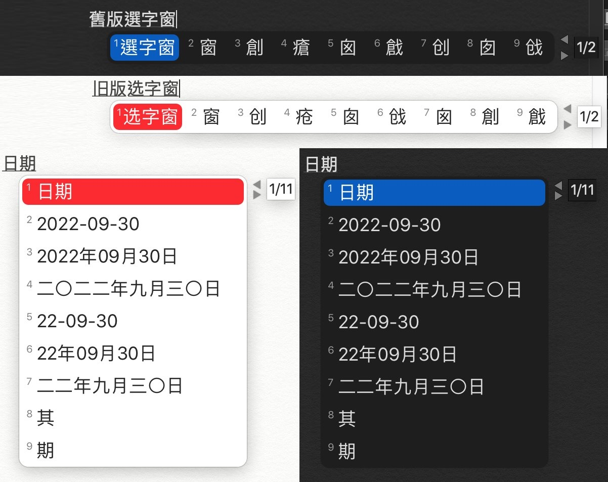
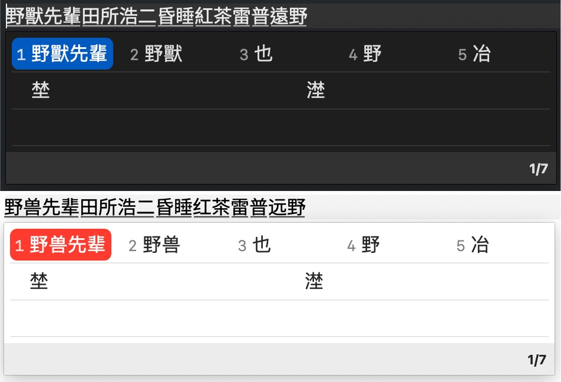
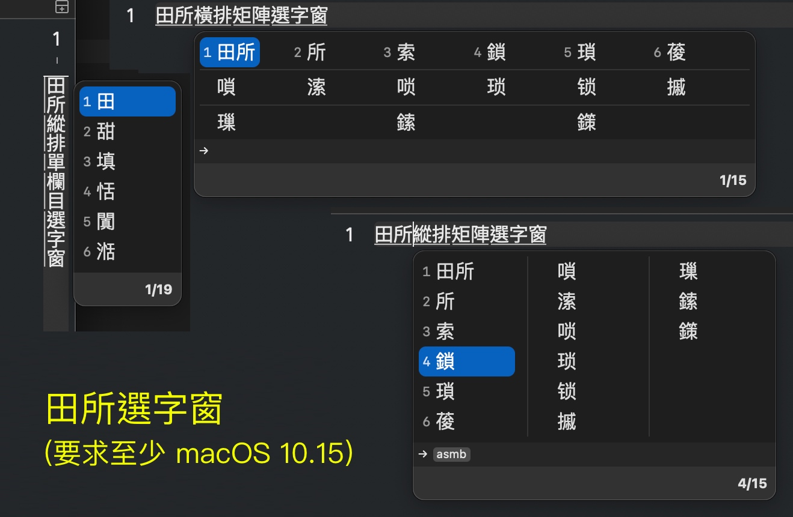
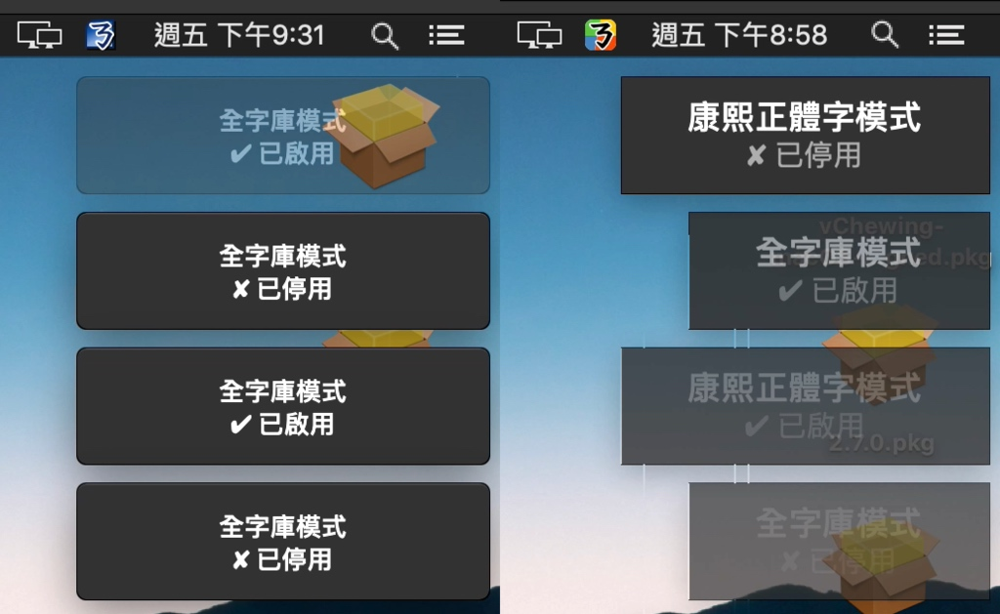
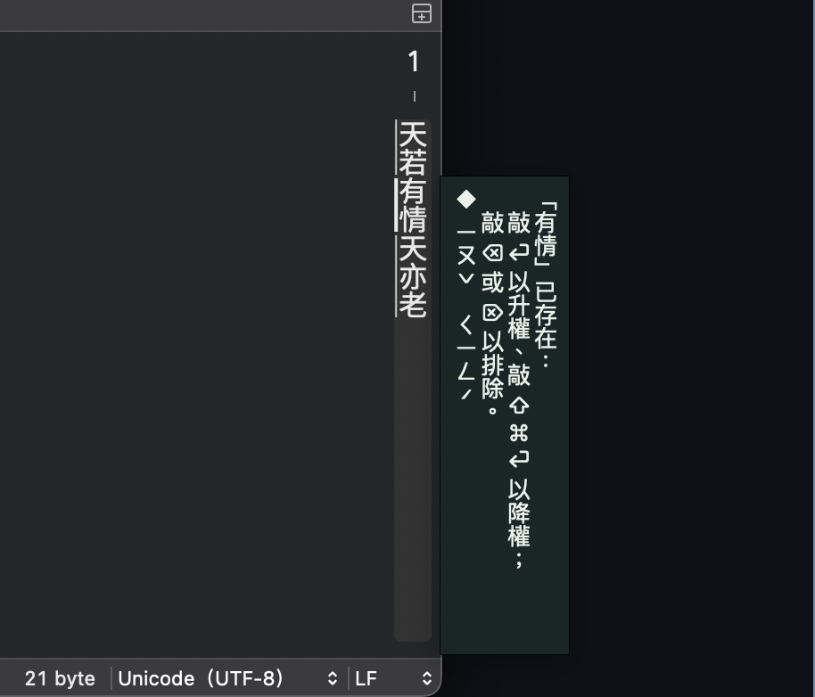

# 技術白皮書-手工稿 (v4.1.0)

> 註：本文提到的 SessionCtl 是 IMKInputController 的派生型別、在小麥注音當中被稱為「InputMethodController」。此前，該型別在威注音當中曾一度被命名為「ctlInputMethod」。自威注音 2.7.5 版開始，ctlInputMethod (ctlIME) 被更名為 SessionCtl，意為「會話控制器」。

## 本文目的與讀者對象

本文件旨在以技術與產品設計層面之客觀差異，回應少部分將「威注音」與「小麥注音」視為「前者抄襲後者」關係的外部討論。本文希望：

1. 為進階使用者 / 開發者提供清晰的模組級與架構級對照。
2. 說明兩個專案在分支來源後所採取的重寫、改良與安全策略。
3. 釐清哪些功能是承襲、哪些屬重構、哪些屬全新設計（例如：單結構態械 IMEState、Tekkon 聲韻並擊引擎、CandidatePool 前後端分離式選字窗、強化型浮動組字窗安全模式等）。
4. 提供後續審視、延伸研究或移植評估時可引用的術語與範例依據。

讀者預期背景：熟悉 macOS 輸入法基本概念、了解 InputMethodKit (IMK) 名詞，或具備一般文字輸入法使用經驗並對內部原理好奇的使用者。

> [消歧義]
> 
> OpenVanilla 團隊有三套產品，但很多 OpenVanilla 早期產品使用者會將這些產品搞混。如果算上團隊骨幹的同期的商業作品的話，則還要加算石磬軟體開發的奇摩輸入法。
> 
> - OpenVanilla 輸入法框架：以 CIN 表格為主的輸入法框架。該框架的早期版本會同捆香草注音（下文會提到），但後來香草注音模組被停止維護、就沒再被同捆入 OpenVanilla。OpenVanilla 旗下的組句型注音輸入法的職責由後來被 MJHsieh 發起的小麥注音專案繼任。
> - 香草注音（SpaceChewing）：新酷音輸入法模組被 Zonble 等人移植到 OpenVanilla 框架上的形態。香草注音身為注音輸入法而言的所有程式碼著作權均屬於新酷音專案，OpenVanilla 團隊僅擁有移植工作的著作權。除了可能會共用相同款式的安裝程式以外，這個專案與小麥注音連一根毛的關係都沒有。
> - 奇摩輸入法：Zonble 與 Lukhnos Liu 二人開設石磬軟體公司，成為了雅虎奇摩的輸入法外包開發商，開發了奇摩輸入法。奇摩輸入法使用由 Sinica Corpus 生成的 Bigram 語料庫。此期間 Lukhnos 完成了 OVMandarin MK1 注拼引擎與 Manjusri（文殊）組句引擎的開發。文殊引擎採貪婪組句算法。後來，Lukhnos 完成了開源的 Gramambular MK1 組句引擎的第一代版本的開發，將該組句引擎與 OVMandarin MK1 合併為 LibFromosa 開發套件。
> - 小麥注音一開始是 MJHsieh 在 2011 年開發的個人作品（Zonble 從這時起就有參與）。該輸入法被視為 LibFormosa 開發套件的典型輸入法開發實踐。後來，小麥注音被併入 OpenVanilla。小麥注音真正開始進入堪用期則是 2022 年，此期間 Lukhnos Liu 為小麥注音完成了 OVMandarin MK2 與 Gramambular MK2 的開發、以享受近代 C++ 版本所帶來的便利。Gramambular MK2 改採 DAG-Vertex Topological 排序鬆弛算法來組句，以因應貪婪組句算法在效能上的先天不足。
> 
> 本文僅討論「小麥注音」與「威注音」的功能模組差異，不涉及下述風馬牛不相及的內容：奇摩輸入法、香草注音、OpenVanilla 輸入法框架。至於為什麼上文將這些內容講這麼細緻，是因為真的有不少糊塗人把這些東西都徹徹底底地搞混了、然後在那裡講豪洨話，非常耽誤交流效率。

## 引文＆專案演進時間軸（精簡）

有人可能對威注音「自何時起從小麥注音 fork 出來」感興趣。雖然倉庫顯示的時間可能比較早，但實際上（拿 1.3.0 版來講）是 fork 自 2022 年 2 月初版本的小麥注音。1.2.x 版只能說是草稿版，自 2021 年底開始（到 2022 年 2 月中旬 1.3.0 版為止）一直在嘗試手動同步來自上游的一些修改，且在此同時試圖實現威注音自己的產品設計意圖。

以下列出威注音自自立分支後至 v4.1.0 之關鍵里程碑（日期以實際開發活動階段為準，非全部為正式發佈日）:

- 2021 Q4：1.2.x 草稿期，嘗試手動同步上游（小麥注音早期版本）並試驗自有功能。
- 2022-02 上旬：以小麥注音 2022 年 2 月初狀態為基準，形成 1.3.0 分支起點。
- 2022-03 末：展開全面 Swift 重寫（InputHandler、後續 Megrez 第一代、逐步淘汰 ObjC++ / C++ 區塊）。
- 2022-05 ～ 06：Tekkon 並擊（聲韻並擊）引擎原型完成。
- 2022-08 初：加入 IMK 矩陣選字窗支援（後續在 3.5.4 移除）。
- 2022-09 ～ 10：SwiftUI 版田所（Tadokoro）選字窗首版（橫排＋縱排矩陣）。
- 2023：CandidatePool 架構穩定，進行多輪 UI 效能重寫（移除 SwiftUI 捲動、改以 Cocoa + CoreGraphics 提升繪製效率）。
- 2024：Megrez 第二代優化、就地加詞 / 刪詞 / 降頻流程與 UTF8 精準範圍計算落地。
- 2025-01（3.9.0 海燈節）：Megrez 第三代採 Dijkstra 路徑評分實作與排序優化。
- 2025-10（4.0.0）：改採 DAG-DP 組字算法、FolderMonitor 行為 Actor 化與 Debounce、直書提示新方案生效。
- 2025-11（4.1.0）：修復 ARC 物件釋放管理設計、引入防抖機制改良能耗、新增羅馬數字輸入模式與候選字朗讀功能。

註：vChewing-macOS 專案歷史於提交 8de659f 之後重新整理（該提交 cherry-pick 自上游，未被上游正式版本收錄）；此前紀錄對應小麥注音至 ddbe363 為止之歷史。

自 2022 年三月底開始，威注音嘗試繼續之前上游的 Swift 化計畫所未完成的內容：用 Swift 將整個專案的 ObjC(++) 與 C++ 的部分用 Swift 徹底重寫。先是重寫了輸入調度模組，之後是組字引擎「Megrez」，最後威注音又有了自己原創的功能更豐富的聲韻並擊引擎「（齊）鐵恨 Tekkon」。此外，威注音當時嘗試用 C# 語言重寫這些模組，但因為 Windows「沒有與 InputMethodKit 一樣方便的輸入法開發套裝體驗」而只能作罷，相關倉庫荒廢至今。在此之後，Megrez 引擎做過一輪技術升級。

然後就是到了 2022 年八月初，威注音實現了 IMK 矩陣選字窗的支援。之後，威注音緊接著開始將輸入法本體的所有「直接從上游繼承來的 Swift 模組」全部淘汰，且用 SwiftUI 完成了威注音自家的全新的田所選字窗：這套選字窗同時實現了（類似 IMK 選字窗的）橫排矩陣佈局與（類似微軟新注音的）縱排矩陣佈局。

然後是 2025 年 1 月，威注音輸入法的 Megrez 組字引擎放棄使用 Lukhnos Liu 的基於 DAG-Relax 組字算法的組字方法，轉而使用經過效能最佳化的 Dijkstra 算法。這套新的組字方法實作在效能上比小麥注音更優，但有著記憶體管理上的難點。於是，威注音輸入法在 v4.0.0 版更換了 DAG-DP 算法。4.1.0 版則進一步針對 ARC 物件釋放管理進行優化，並引入防抖機制改良能耗。

這篇技術白皮書主要是為了讓部分使用者明白小麥注音與威注音至少有哪些技術上與產品功能上的不同。至於 Megrez 組句引擎與 Gramambular 組句引擎的差異，請洽《[Homa vs. MegrezNT vs. Gramambular2 Whitepaper](./WHITEPAPER_Homa_MegrezNT_Gramambular2.md)》一文。

P.S.: IMK 選字窗一度受威注音支援，但因為其利用方式太複雜不利於威注音輸入法長遠發展的原因、而在威注音 3.5.4 版內遭到了移除。

## 總括概述

差異項 | 小麥注音 (2.9.3) | 威注音 (4.1.0) | 補記
-- | -- | -- | --
資料截取日期 | 2025-11-11 | 2025-11-11 | （以下條目為差異項）

### 系統支援與資訊安全

差異項 | 小麥注音 (2.9.3) | 威注音 (4.1.0) | 補記
-- | -- | -- | --
支援作業系統範圍 | macOS 10.15 起算 | 主流發行版 macOS 13 起算<br />Aqua 紀念版 macOS 10.9 起算 | macOS 10.9 是 Swift 5.9 能支援的最早的系統版本。Swift 6 開始將不再支援 macOS 10.9 等任何需要 libArcLite 的系統版本。
強化型組字區安全防護 | 無 | 有（強烈推薦使用） | 會有 App 或網站提前獲取內文組字區的內容給遠端伺服器、來遠端預判使用者的下一步操作。威注音的這個模式會以浮動組字窗取代內文組字區，使得接收文字輸入的客體軟體再也無法擅自利用組字區的內容來觸發使用者不想觸發的事件。您也可以藉由「客體管理器」僅對部分客體 App 啟用這種限制。<br /><br />這個功能所啟用的浮動組字窗也可以變相解決在某些對 InputMethodKit 內文組字區支援不佳的軟體內的文字輸入體驗問題（比如 ChatGPT 的 macOS 桌面端）。
Sandboxing 沙箱 | 無 | 有 | 利用 macOS Sandbox 約束檔案與進程存取範圍，降低未授權腳本執行與資料外洩風險。
允許設定在就地加詞之後自動執行指定腳本 | 允許，且腳本位址存於 UserDefaults Plist 當中 | 不允許 | 一兩道 Defaults write 指令就可以讓小麥注音在每次加詞時自動執行有害腳本。更甚者，小麥注音沒有 Sandbox 設計、無法控制這種情況下的被害目錄範圍。
讀取網路資料 | 僅在新版軟體檢查時才會聯網，且該功能自動啟用、會在安裝完畢後首次執行時主動聯網 | 僅在新版軟體檢查時才會聯網，需使用者手動啟用新版軟體檢查之功能 |  
將本地資料上傳 | 無 | 無 | 威注音另有與此有關的 Sandbox 行為約束。

###  基礎大模組與處理單元

差異項 | 小麥注音 (2.9.3) | 威注音 (4.1.0) | 補記
-- | -- | -- | --
CIN 模組 | 不具備 | 支援 CIN2 標準 | 小麥注音團隊另有 OpenVanilla 輸入法專門使用 CIN 表格工作。 |
內碼輸入 | 具備 | 具備 | 兩者各自對此的實現方式不同；<br />威注音在簡體模式下有支援 GB 內碼輸入。
輸入調度模組 | KeyHandler (Objective-C++) | InputHandler (Swift) | 職能很相似 
按鍵訊號承載單位 | KeyHandlerInput | NSEvent及其私有功能拓展<br />以及其對等克隆體 KBEvent Struct | 威注音利用 NSEvent / KBEvent 的 characters ignoring modifiers 參數塞入狀態上下文情境描述用中繼資料。
組字引擎 | Gramambular 2 (C++)<br />by Lukhnos Liu<br />採 DAG-Relax 組字算法。 | Megrez (Swift)<br />by Shiki Suen<br />採 DAG-DP 算法。 | Megrez 擁有包括對就地加詞功能要用到的標記游標的管理等獨特功能。DAG-DP 算法無須 Vertex Topological 排序。
注音並擊引擎 | OVMandarin (C++)<br />by Lukhnos Liu | Tekkon (Swift)<br />支援更多注音排列與拼音種類 | 均無允許使用者自行設計注音排列之能力 。
詞庫管理模組 | Objective-C++ & C++<br />ParselessLM<br />採 TXT 格式的原廠辭典 | Swift<br />採 SQLite 格式的原廠辭典<br />使用者辭典採 txt 格式 | 
態械引擎 | 多型別狀態策略設計模式<br />無專有內部資料型別 | 單結構狀態策略設計模式<br />有專有內部資料型別 | 雙方的開發習慣不同、導致各自的取捨不同。
資料截取日期 | 2025-11-11 | 2025-11-11 | （以下條目為差異項）

###  選字窗

差異項 | 小麥注音 (2.9.3) | 威注音 (4.1.0) | 補記
-- | -- | -- | --
IMK 選字窗支援 | 無 | 無 | 雙方均在不同的年代曾經分別支援過 IMK 選字窗，但因技術維護方面的各自苦衷而先後放棄支援。
輸入法內建選字窗 | Voltaire MK2 (Swift Cocoa) | Tadokoro 田所選字窗(第三代) | 田所選字窗支援展頁等特性，且完美重現了微軟新注音輸入法（2003 至今）與 macOS 內建注音輸入法（macOS 10.13）對候選字的陳列行為。
內建選字窗是否有支援矩陣佈局 | 否 | 橫排矩陣（類似 IMK）<br />縱排矩陣（類似新注音） | 田所選字窗出於介面繪製效能的考量，移除了原本要加入的選字窗內容捲動支援。
內建選字窗是否有專有內部資料型別 | 否 | 是 | 威注音的設計更易於維護
頁碼支援 | 否 | 否（Voltaire MK3 有支援過） | 田所選字窗另支援對當前選中的候選字的總索引編號顯示
針對簡繁體輸入模式以對應的系統介面字型顯示候選字 | 無 | 僅限田所選字窗（需在偏好設定內的開發道場當中手動啟用） | macOS 11 因為系統 Bug 的原因不支援該特性。
針對簡繁體輸入模式以不同的高亮候選字背景色 | 否 | 僅限田所選字窗（Voltaire MK3 有支援過） |  
CIN 字根反查 | 無（Voltaire 選字窗不支援） | 有<br />僅限田所選字窗 | 該功能自 2.9.4 開始才算成熟。 |  
Unicode 統一碼資訊顯示 | 無（Voltaire 選字窗不支援） | 有<br />僅限田所選字窗 | 該功能自 3.8.1 版開始實裝。
候選字朗讀 | 有（自 v2.9.3 開始）<br />與 VoiceOver 聯動 | 有（自 4.1.0 版開始）<br />僅限田所選字窗 | 小麥注音會在 VoiceOver 啟用時自動朗讀當前選中的候選字，並使用 macOS 系統內建的 SQLite 輔助功能資料庫來說明同音候選字（例：「中國地方的中」）。威注音可設為始終開啟、隨 VoiceOver 啟用或停用、或始終關閉（預設）。若有同音候選，系統會查詢可由使用者自訂的關聯詞語資料庫以嘗試說明各字。
資料截取日期 | 2025-11-11 | 2025-11-11 | （以下條目為差異項）

選字窗畫面控頻/刪詞 | 自 v2.9.3 開始有在選字窗狀態下引入基於熱鍵的升頻交互畫面，但不能降頻 | 右鍵選單控頻刪詞<br />僅限田所選字窗 | 不支援臨時漂浮客體，<br />比如 Spotlight 與 NSMenu 等。
選字窗 VoiceOver 辨識 | 有（自 v2.9.3 開始）| 無 | 小麥注音自 v2.9.3 起修復了 VoiceOver 啟用時縱排選字窗消失的問題，並讓 VoiceOver 在選擇變更時朗讀候選字。威注音不排除今後換一個思路實作該功能的可能性。 |  

###  文字輸入方式

差異項 | 小麥注音 (2.9.3) | 威注音 (4.1.0) | 補記
-- | -- | -- | --
支援注音排列種類 | 大千傳統、倚天傳統、倚天26、許氏、IBM | 大千傳統、倚天傳統、IBM、神通、(偽)精業、倚天26、酷音大千26 、許氏、星光、劉氏 | 下述排列為動態注音排列：倚天26、酷音大千 26 、許氏、星光、劉氏
支援拼音輸入種類 | 僅一種模式，缺乏介紹資料 | 漢語拼音、國音二式、華羅拼音、耶魯拼音、通用拼音、韋氏拼音 | 「趙元任國語羅馬字」無法作為支援對象，因為無法設計「固定的」用以確認聲調的按鍵 
拼音並擊模式 | 無 | 有 | 就是在敲注音的時候在組字區內顯示拼音
字母輸入 | Shift+字母鍵可定義兩種輸入方式，僅允許對大寫字母直接地教 | Shift+字母鍵可定義三種輸入方式，其中允許對小寫字母的直接遞交 
全形數字輸入 | 尚無直接支援 | Alt+Shift+數字鍵 | Alt+數字鍵輸入半形數字
羅馬數字輸入 | 有（自 v2.10.0 開始）<br />Ctrl+\\ 啟動 | 有（自 4.1.0 版開始）<br />Shift+Cmd+R 啟動 | 小麥注音支援三種轉換風格：字母（2025→MMXXV）、Unicode 大寫（2025→ⅯⅯⅩⅩⅤ）、Unicode 小寫（2025→ⅿⅿⅹⅹⅴ）。威注音支援數字範圍 1-3999，提供 Unicode 大寫（Ⅰ、Ⅱ、Ⅲ）與 Unicode 小寫（ⅰ、ⅱ、ⅲ）兩種風格。
大鍵盤數字鍵區支援 | 無法正確處理 | 直接忽略輸入，或者用作選字鍵 | 威注音有針對 JIS 的數字小鍵盤特有的按鍵做過針對處理
Emoji 模式 | 僅原廠 Emoji，無開關<br />自訂 Emoji 到使用者辭典內的話，會與漢字詞搶頻 | 有專門的使用者 Emoji 辭典檔案，有開關
Alt 切換「熱鍵專用鍵盤佈局」 | 有支援（需使用終端機） | 故意放棄支援 | 與該功能有關的 Alt 鍵操作會因為 NSMenu 的按鍵攔截干擾、而無法保證使用體驗
用 Shift + BackSpace 析構游標後方的漢字的讀音 | 不支援 | 支援 |  
用聲調鍵複寫游標後方的漢字的聲調 | 不支援 | 支援 | 
允許以聲調鍵開頭敲字 | 支援 | 不支援 | 後者暫無計畫支援之。
在用選字窗選字時，先鞏固操作範圍上下文 | 不支援 | 支援 | 類似 macOS 內建注音輸入法的體驗。但是，威注音只會在藉由選字窗選字時鞏固上下文。
CIN 表格支援 | 無 | 有 | 藉由威注音特有的磁帶模式來支援。 
漢音符號輸入支援 |  僅特殊符號選單（僅部分符號） |  全部支援。 | 後者包括漢音鍵盤符號模式在內。 
內碼輸入支援 | 有（僅 Big5，要求 2.4.2 之後的版本） | 有 | 後者可連續輸入。
資料截取日期 | 2025-11-11 | 2025-11-11 | （以下條目為差異項）

允許忽略掉 CapsLock 的強制英文輸入 | 無 | 有 | 威注音此舉可照顧到微軟新注音輸入法的使用者的習慣。
聯想詞 | 有，且能在組字區內工作 | 有，但脫離組字區工作 | 威注音此舉看似不便利，但躲開了「拿破音字自動匹配讀音」這種永遠無法正確實作的產品功能需求。

###  就地加詞刪詞

該部分的功能介紹特指不需要叫出選字窗就能完成的功能行為。

差異項 | 小麥注音 (2.9.3) | 威注音 (4.1.0) | 補記
-- | -- | -- | --
就地加詞刪詞功能 | 僅就地加詞 | 就地加詞/刪詞/升頻/降頻 |  
就地加詞操作方式 | Shift+前後方向鍵選取範圍，再敲 Enter 操作 | Shift+前後方向鍵選取範圍，再敲 Enter 加詞 / 升頻、敲 BkSp / Del 就地刪詞、摁 Shift + Command + Enter 降頻 | 該功能與該操作方法的搭配乃微軟新注音 2003 首創、且漢音從未支援過這種操作方法。
對字詞數與讀音數不等的情況的支援 | 無 | 有 |
加詞刪詞範圍運算管理 | 僅位於態械內，以 UTF16 為範圍長度單位，需 NSStringUtils。 | 態械、組字引擎、輸入調度模組同時協作，以 UTF8 為範圍長度單位，不需要 NSStringUtils。 | 威注音的做法更精確，也只有這樣才能實現對字詞數與讀音數不等的情況的支援 |

###  漢字模式支援與審音支援

差異項 | 小麥注音 (2.9.3) | 威注音 (4.1.0) | 補記
-- | -- | -- | --
簡體中文輸入支援 | 轉換 | 原生簡體中文詞庫＋通用規範漢字表支援，与原生繁體中文詞庫分离。 | 繁轉簡也存在失真，比如「著->着」。
簡體中文使用者語彙支援 | （跑題了） | 簡繁模式下就地加詞時會做交叉轉換、確保在某一個模式下加詞時也會讓另一個模式受益。 | 沒有別的好辦法。
漢字轉換引擎 | OpenCC (支援詞組轉換)<br />VXHanConvert (僅支援逐字轉換) | 步天歌 Hotenka(支援詞組轉換) | 步天歌引擎不適合用來做大篇幅的簡繁轉換
全字庫支援 | 有（2011 版） | 有（2022 版） | 宜每年更新一次。
其它漢字支援 | 無 | 繁體轉 JIS 漢字繁體轉康熙 | 轉換準確度有限
組字區與選字窗內的漢字反應當前的簡繁模式或 JIS / 康熙轉換模式 | 否 | 是 |  
審音 | 僅台澎金馬民間讀音 | 兩岸審音與台澎金馬常用讀音均兼顧 |  
大寫漢字數字輸出 | 無 | 有 | 銀行等場合會用到

###  其它功能

差異項 | 小麥注音 (2.9.3) | 威注音 (4.1.0) | 補記
-- | -- | -- | --
对「不認真遵守 IMKTextInput 協定」的軟體的支援 | 無 | 有（需要在客體管理器內針對具體的客體 App 啟用浮動組字窗） | 比如 VSCode 與 Naver Line 等。
使用者辭典格式主動整理 | 無，只會在就地加詞時套用檔案 EOF 檢查修正 | 有，會主動整理 | 
使用者辭典目錄狀況監測 | 有：FSEventStream | 有：Dispatch Source File System Object (DSFSO) | DSFSO 無法監測 App 自身對目錄內的檔案的修改，但這反而使程式行為更加可控。
偏好設定視窗 | 僅 XIB | 採用威注音自己訂製的類似 SwiftUI 的 DSL 語言來通過 AppKit 構建視窗。<br />另外，主流發行版也有採 SwiftUI 實作另一版偏好設定視窗、且預設啟用 SwiftUI 偏好設定視窗。 |  
敲字讀音錯誤提示 | 僅系統蜂鳴生效 | 有專門的SFX，會在啟用偵錯模式時生效。 | 威注音的廉恥模式的開關會影響 SFX，但這個開關只會在愚人節才能看到。
ㄅ半模式支援 | 單獨的輸入法模式副本 | 輸入法功能選單內切換 | 威注音的關聯詞語模式可自訂詞庫
倚天中文 DOS 候選字順序 | 有（僅限傳統注音模式） | 有（僅限逐字選字模式） | 本質上都是ㄅ半注音輸入模式
自訂語彙長度限制 | 八個字 | 十個字 |  
符號選單 | 類似漢音的符號選單 | 類似漢音的符號選單＋類似新酷音的分層符號選單，但內容更豐富 | 後者可藉由自己撰寫 symbols.dat 的方式自訂
使用者語彙置換及過濾 | 有 | 有 | 雙方功能行為一致
使用者打字習慣觀測學習模組的算法 | 半衰期記憶曲線 | 基於野獸常數的偽二次多項式衰減 | 威注音的打字習慣學習模組有對 Gram 數量的不同採用不同的計分方式。 |
使用者打字習慣觀測學習模組資料的可持續利用 | 暫無 | 有 (JSON) | 威注音可在輸入法選單內清空該資料
工具提示視窗的縱排顯示支援 | 無 | 有 | 威注音對此要求至少 macOS 10.13+ |
W3C Ruby 注音讀音標記 | mac 版無，linux 版有；不支援教科書聲調寫法 | 有，且支援教科書聲調寫法 | 威注音也可輸出漢語拼音的 Ruby 標記
介面語言種類 | 僅繁體中文與英文 | 簡體中文/繁體中文/日文/英文 |  
是否容忍橫跨游標的候選字的出現 | 是 | 否 | 無論漢音還是微軟新注音都不會容忍橫跨游標的候選字的出現
輪替候選字 | 僅 (Shift+)Tab | `Shift(+Alt)+Space`<br />`Alt+↑` 或 `Alt+↓`<br />`(Shift+)Tab` | 縱排輸入時為 `Alt+←` 或 `Alt+→`
以組字區內的字詞節點為單位移動游標 | 無 | 有：Alt+前後方向鍵 |  
允許自己卸除自己 | 不允許，必須要求使用者手動操作 | 需摁 Alt 點輸入法選單，才可以看到該功能的入口 |  
使用者語彙編輯器 | 不具備；會依賴外部編輯器 | 內建一套語彙編輯器 |  
GraphViz 輸出支援 | 不支援(以前曾經支援過) | 支援(得先開啟偵錯模式) |  
日期時間便捷輸入 | 不支援 | 支援 |  
Emacs Key | 在輸入調度模組內部處理 | 在水源入口處理：發現 Emacs Key 就直接將原始 KBEvent 換成翻譯後的 KBEvent |  

## 個別詳細介紹

### 組字算法（歷代策略與現行方案）

小麥注音從 2.0 版開始由 Lukhnos Liu 更換了具備全新[DAG-Relax 組字算法](https://mcbopomofo.substack.com/p/dag)的 Gramambular 2 組字引擎。

截至 2024 年底，威注音輸入法也都有在用相同的組字方法。然而，2025 年 1 月底的海燈節更新的 3.9.0 版威注音輸入法的第三代 Megrez 組字引擎改用了全新的基於 Dijkstra 算法的組字方法，同時針對 Sandy Bridge 時代的老電腦做過效能最佳化。這樣一來，在組字組句的速度上，威注音更快。

Dijkstra 算法的實作難免需要一個專門用來排序的機器。Swift Foundation 原生的排序算法並非最高效的方案。所以，第三代 Megrez 組字引擎針對輸入法的使用情景重新訂製了這個排序過程、藉此縮短了 Dijkstra 的運算耗時。

然而，Dijkstra 算法有著記憶體管理上的難點。於是，威注音輸入法在 v4.0.0 版更換了 DAG-DP 算法。這個算法不需要 Vertex Topological 排序。

#### 組字算法對照表（摘要）

項目 | DAG-Relax | Dijkstra（最佳化版） | DAG-DP
-- | -- | -- | --
使用世代 | 威注音早期、小麥注音2.0 | 威注音 3.9.x | 威注音 4.0.0 現行
核心思路 | 對 DAG 中邊進行鬆弛求最優路徑 | 最短路徑優先擴展 | 以 DP 自底向上計分決策
主要資料結構 | DAG（節點=切分位置） | 優先佇列 + 鄰接表 | 線性索引節點陣列
需拓撲排序 | 是 | 否 | 否
時間複雜度（概略） | O(V+E) 鬆弛 + 路徑回溯 | O(E log V)（優先佇列最佳化後） | O(V+E) 線性 DP
空間特性 | 需保存多層鬆弛狀態 | 佇列 + 路徑記錄 | 緊湊，可預測
優點 | 演算法直觀、成熟 | 對長詞串耗時降低 | 緊湊，可預測
局限 / 棄用原因 | 增量輸入時重算成本偏高 | 記憶體佔用與釋放管理複雜 | 需針對多讀音詞再行擴張節點映射

（複雜度為理論近似；實際效能視輸入長度、候選詞數量與剪枝策略而定。）

#### Tekkon 排列與拼音支援一覽

分類 | 內容
-- | --
注音排列 | 大千傳統、倚天傳統、IBM、神通、(偽)精業、倚天26、酷音大千26、許氏、星光、劉氏
動態排列（編碼與位置會根據上下文或模式調整） | 倚天26、酷音大千26、許氏、星光、劉氏
拼音系統 | 漢語拼音、國音二式、華羅拼音、耶魯拼音、通用拼音、韋氏拼音
並擊提示 | 注音輸入時同步顯示對應拼音（可選）
不支援 | 趙元任國語羅馬字（無法定義穩定聲調鍵位）

### 田所選字窗

迄威注音 2.7.5 版為止，這個備選的選字窗都是自上游繼承過來的 Voltaire MK2 (Swift) 選字窗修改來的。威注音在此之上做了介面美工，加上頁碼顯示，變成 MK3 版：



威注音自 2.8.0 版起，對 macOS 11 及之前的系統，僅提供 IMK 選字窗可用。本來威注音是不用再另起爐灶的。然而，IMK 選字窗在未來可能會因為改了某個內部 API 而導致新的故障出現，所以必須得有一個非 IMK 的選字窗作為備選。但如果要把 Voltaire 選字窗重寫成類似 macOS 內建輸入法那種捲動矩陣佈局的話，只用 Cocoa 技術實現的話，技術難度太大。

幸好，SwiftUI 讓事情變得簡單了一些。雖然很多要用到的 SwiftUI API 要求至少 macOS 12 才可以用得上。田所選字窗的工作原理與筆者下文當中提到的 IMEState 差不多：有一個專門處理資料變化的內部型別，且與負責介面顯示的型別徹底分離。這樣一來，負責介面顯示的型別（其實是 SwiftUI 結構）在程式維護方面就會輕鬆不少。

（本文所示田所選字窗擷圖只是示範。其美術設計在後來又經過了一些小調整。）

先看田所選字窗的橫排矩陣佈局：



威注音不滿足於對橫排矩陣選字窗的支援，於是又完成了縱排矩陣選字窗、提供了類似微軟新注音 2003 的體驗：


一開始的田所選字窗是有做得跟 macOS 內建的選字窗幾乎雷同的。但是，SwiftUI 的繪製效能並不好，使得選字窗的操作流暢度欠佳、嚴重影響了ㄅ半輸入模式的體驗。於是，田所選字窗的滑鼠滾動檢視特性就被移除了、且僅顯示三列矩陣。

後來，田所選字窗又經過了幾次徹底重寫，最近的一次重寫利用了 Cocoa 以及 CoreGraphics、極大地提升了介面繪製效率。這也允許田所選字窗在 macOS 10.9 Mavericks 系統下完美運作。



田所選字窗採前後端分離的設計：所有與選字窗的顯示行為控制和資料統整都是藉由後端的 CandidatePool 來完成的，而前端則負責將後端當圖紙依據、由前端自動繪製圖形介面內容。

### 通知飄窗

威注音輸入法用到 2.7.0 為止的通知飄窗，是由小麥注音的通知飄窗修改了 NSWindow 的配色屬性之後而成的。而論及威注音 2.7.5 版引入的新款通知飄窗，則擁有如下新特性：

1. 新通知始終顯示在螢幕右上角、且舊通知會自動變淡＋位置下移。原因：使用了更好的飄窗通知副本管理方法。
2. 飄窗文本排版及動畫動畫效果受到了 Call of Duty: MWII 2022 的影響，但也兼顧了 Cocoa 應用的顯示風格、使之不太出戲。
3. 對 DispatchQueue Async 的相容。之前上游的通知飄窗在 DispatchQueue Async 內呼叫時會讓輸入法直接崩潰掉。

此外，考慮到有使用者在濫用這個功能的情況下出現的記憶體洩漏、CPU 高佔用率的問題，威注音輸入法在 2.8.0 SP3 當中對此做了專門的修正：最多只會殘留四條近期通知。（後來又再縮減到兩條通知。）



### 工具提示視窗

小麥注音與奇摩輸入法的實現只適合橫排輸入時的顯示。一旦縱排輸入，整個文字提示視窗就還是橫排顯示的。威注音 2.5.0 版對該模組做了重寫，引入了 NSAttributedTextView 這個可以縱排顯示文字的 NSView （在 Fuziki 的同款功能的 UIView 的基礎上改來，且得到他本人的准許）。但是呢，因為系統字型的 vert 特性在顯示注音、漢語拼音、英文、阿拉伯數字時的效果非常糟糕，使得筆者決定做出如下處置：

1. 在使用英文介面時，始終使用橫排顯示的工具提示。
2. 在使用中文或日文介面時，允許使用者在偏好設定內啟用「始終使用橫排顯示的工具提示」。
3. 縱排工具提示視窗內的按鍵名稱都使用符號來顯示。
4. 縱排工具提示視窗內以全形空格來分隔每個漢字的讀音。
5. 縱排工具提示視窗內僅顯示注音、而不顯示漢語拼音。

另外，新版工具提示視窗在任何場合都不會遮住使用者正在輸入的文字。



再後來，自威注音輸入法 v4.0.0 起，Fuziki 的方案被換掉，新的方案允許這個直書顯示效果對 macOS 10.13 High Sierra 生效。

### 按鍵訊號載體單位 & 對 EmacsKey 的支援

小麥注音的 KeyHanderInput 是把 NSEvent 讀取且翻譯成這麼一個新的按鍵訊號載體單位類型。該組件在威注音當中被更名為 InputSignal，但與 InputSignalProtocol 是兩碼事情：前者遵循後者這個協議所規定的規範，而 KeyHandler 輸入調度模組當中的函式可以處理任何符合該規範的物件。

威注音在 v2.3.1 當中淘汰了該模組，轉而直接對 NSEvent 做了符合 InputSignalProtocol 的擴展。主要原因在於「IMK 選字窗只能處理 NSEvent」這個客觀事實。更何況，KeyHanderInput 當中的很多實現，對目前的威注音而言並不經濟。

對 NSEvent 做了這種擴展處理之後，就明顯減少了 NSEvent 按鍵訊號流從 SessionCtl 流往 IMKCandidates 的過程當中的任何不必要的類型轉換。在此之上，威注音 v2.4.0 又引入了「讓 NSEvent 迅速改掉自身的其中任意一處屬性」的全新重構函式（Reconstructor）、進一步減少了 SessionCtl 與 ctlCandidateIMK 的篇幅。威注音還藉由 charactersIgnoringModifiers 這個參數，實現了「往 NSEvent 裡面塞入諸如『當前是否是縱排輸入』等資料」這種特性需求。

**不過呢**，威注音從業火五筆輸入法承襲來的「用來判定 Shift 鍵是否有被敲過」的特殊按鍵判定函式要求傳入的 NSEvent 必須是 SessionCtl.handle(event:) 吃到的 raw event 且做過 guard-let 處理、然後直接交給特殊按鍵判定函式。不然的話，判定會失效。這與該判定函式本身所使用的方法有關（涉及到對 NX_DEVICELSHIFTKEYMASK 等 NX Mask 的判定處理），且 NSEvent 不是 Struct 而是 Class、在 Swift 當中就容易出現這方面的鬧鬼情況。

上文有提到威注音利用 NSEvent 作為基礎按鍵訊號單位、且引入了自我重構函式的事情，那麼對 EmacsKey 的判定就簡單了：直接在接收訊號的第一道關口將符合條件的 Emacs Key NSEvent 重構為對應訊號的 NSEvent 即可，省去了之後的一切判斷處理步驟。

後來威注音做了另一個擴展「KBEvent」，算是 NSEvent 的重新實作、且身為 Struct 更易於在輸入法內部拿來處理。再後來，威注音 4.0.0 引入了 Ctrl+N 與 Ctrl+P 這兩套 Emacs 熱鍵的支援。

### InputState 有限態械系統＋NSStringUtils＋就地增刪詞

先提一下：威注音相比小麥注音而言，新增了就地刪詞、就地降頻的功能。

#### 小麥注音 InputState 的設計

`mcbopomofo/Source/InputState.swift` 採用 Objective-C 類別階層來表達狀態：`InputState` 為根類別，`Inputting`、`Marking`、`SelectingFeature` 等十餘種子類別各自封裝 UI 資料與行為。狀態物件一律繼承 `NSObject`、並仰賴 `NSStringUtils` 來換算 UTF-16 字元範圍；在 `Marking` 狀態中，為了對齊選取範圍與注音讀音，需要大量 `NSString` 轉換。候選介面呈現也直接在狀態類別內建立 `NSAttributedString`，導致狀態邏輯與 UI 緊密耦合。這套做法在當年 Objective-C++ 專案內維持了彈性，但面對 Swift 化後的語言特性與 struct value semantics，就顯得偏重。更甚者，這在原理上無法正確處理「某個 Segment 的讀音數量與廣義上的字符數量不相等（Emoji 數量也算）」的情況，因為一切都是在組字引擎之外的推斷操作、且該操作與組字引擎彼此被隔離開了。

#### 威注音 IMEState 的重構

威注音於 `Packages/vChewing_MainAssembly/Sources/MainAssembly/IMEState.swift` 以純 Swift `struct` 重新定義態械，並由 `IMEStateProtocol` / `IMEStateDataProtocol` 將狀態介面與數據載體拆分。`IMEState` 僅承載列舉型別 `StateType`、候選陣列與游標資訊；真正的文字、標記範圍、提示樣式等資料轉移到 `IMEStateData`，集中處理 UTF-8 / UTF-16 對應、候選過濾條件與 Tooltip 顏色狀態等衍生值。

這樣的分層帶來幾個直接效果：

- Swift 原生字串計算即可涵蓋 emoji 等高位字元，`IMEStateData` 僅在需要回饋 IMK 時以 `utf16` 投影，原專案所依賴的 `NSStringUtils` 不再需要。
  - 更甚者，Marking 游標不是計算出來的，而是由 Megrez 組字引擎直接給出的：Megrez 組字引擎同時管理打字游標與 Marking 游標，且提供了專門的 API 來完成與這些內容有關的交互體驗。
- UI 呈現改由 `IMEStateData.attributedString*()` 生成，輸入調度程式 (`InputHandler_HandleStates.swift`) 可以自由組裝 `displayTextSegments`、`tooltip` 再交給狀態結構，候選窗 / 浮動組字窗只需根據資料渲染。
- 新增的 `ofAssociates`、`ofSymbolTable`、`convertedToInputting` 等建構器讓 `SessionCtl` 可以在同一個 value-type 狀態上進行快照切換，並支援就地刪詞、降頻與磁帶模式的特殊流程。
- `tooltipColorState`、`markedTargetIsCurrentlyFiltered` 等欄位被納入標準狀態資料，使得 `handleMarkingState()` 這類函式能夠在切換回輸入狀態時直接展示操作結果，減少跨模組依賴。

#### 整體差異摘要

面向 | 小麥注音 (`InputState`) | 威注音 (`IMEState` + `IMEStateData`)
-- | -- | --
狀態定義 | `NSObject` 子類別樹，每一種狀態一個類別 | 單一 `struct` + `StateType` 列舉，建構器建立不同語境
字串與範圍 | 依賴 `NSStringUtils` / UTF-16 索引 | Swift `String` + `utf16` 投影，預設 UTF-8 游標
UI 維度 | 狀態類別內建 `NSAttributedString` | `IMEStateData` 統一產生，前端僅需繪製
候選處理 | 以 `CandidateProvider` 協議回傳字串 | `[(keyArray, value)]` 保留讀音陣列，方便後續過濾
擴充性 | 新增狀態需建立子類別並處理 KVC | 透過建構器與資料欄位擴充，value semantics 便於複製與比較

整體而言，威注音態械的 value-type 重構使狀態切換更容易測試與推導，也為 Swift Concurrency、Actor 化模組（例如 FolderMonitor）打下基礎，並直接支撐了就地降頻 / 過濾、開發者模式提示等新功能。


### 檔案目錄異動檢查模組

該模組用來監測任何發生在使用者辭典目錄內的變化。上游的這套模組使用了 FSEventStream，但比較麻煩。**更危險的是，這是 Carbon API，沒準哪天就被 Apple 從系統當中徹底割掉**。

威注音 v2.5.0 更換了新的 FolderMonitor 監視模組，利用了 DispatchSourceFileSystemObject。這個方法不會偵測由輸入法本體對目錄做出的修改，所以筆者又在 LMMgr (Language Model Manager) 當中對「使用者手動加詞」的情況又補上了手動重新載入使用者語彙的動作。這也解決了迄今為止 FSEventStreamHelper 與「威注音的使用者辭典格式自動整理模組」彼此的行為衝突問題。

威注音 v4.0.0 對 FolderMonitor 做了改良，使其將觀測響應行為全部放在專有的 Actor 當中完成、且經過 Debouncer 處理。這不至於讓輸入法因為 iCloud 資料同步不順利的情況、而導致所有試圖接收威注音鍵盤事件輸入的軟體全部 hang 到死。


## 附錄 A：W3C Ruby 標記範例

以下示例展示威注音產生的繁體漢字 + 注音（教科書式聲調）與漢語拼音 Ruby 標記（簡化示例）。實際輸出會依偏好設定與模式而異。

1. 注音（教科書式）：
```
<ruby>
  漢<rt>ㄏㄢˋ</rt>
  字<rt>ㄗˋ</rt>
</ruby>
```
2. 漢語拼音（附調號）：
```
<ruby>
  漢<rt>hàn</rt>
  字<rt>zì</rt>
</ruby>
```

## 附錄 B：組字流程（概念示意）

```
[鍵盤事件 NSEvent]
  │  (擴展 + 可能的 KBEvent 克隆)
  ▼
[InputHandler]
  - 解析佈局 / 並擊
  - 更新 IMEState (單結構態械)
  │  (請求路徑評分)
  ▼
[Megrez 組字引擎 (DAG-DP)]
  - 建立 / 更新節點圖 SegmentGraph
  - 動態規劃計分與最佳路徑回溯
  - 支援詞音不等長 / 標記游標
  │  (候選資料集)
  ▼
[CandidatePool]
  - 排序 / 分頁 / 佈局資訊
  │
  ├──> 田所選字窗 (橫/縱排矩陣渲染)
  └──> 浮動組字窗（強化安全模式）
  │
  ▼
[提交/組字結果 -> 客體 App]
```

## 附錄 C：術語速覽

- IMK：InputMethodKit，macOS 輸入法框架。
- 浮動組字窗（強化型）：以獨立視窗暫存尚未提交文字，防客體過度探查 markedText。
- 態械（有限狀態機 FSM）：本文特用「態械」指單一 Struct IMEState 之狀態管理實作。
- 就地加詞 / 刪詞 / 升頻 / 降頻：不喚出選字窗直接操作使用者語彙權重或移除語彙。
- 詞音不等長：字詞字數與其對應讀音（注音單位或拼音音節）數量不一致的情況。
- DAG-Relax / Dijkstra / DAG-DP：不同世代的組字圖路徑求解策略。現行為 DAG-DP。
- Tekkon：威注音自研聲韻並擊引擎，支援多注音排列與多種拼音系統提示。
- CandidatePool：前後端分離模式下的候選資料與佈局中樞。
- FolderMonitor：以 DispatchSourceFileSystemObject 監測使用者辭典目錄變更並 Debounce。
- 教科書式聲調：注音 / 拼音顯示中使用正式的調號標記形式。
- 升頻 / 降頻：調整語彙在語言模型中的相對排序權重。
- Emacs Key 支援：Ctrl+N、Ctrl+P 等對應游標或選字行為的快捷鍵翻譯。
- Unicode 資訊：田所選字窗對候選字提供碼點、區段等元資料顯示。

## 附錄 D：已知限制與後續規劃（摘錄）

- VoiceOver：田所選字窗尚未實作直接可讀取的候選無障礙描述，且目前暫無後續規劃。
- 大篇幅簡繁轉換：Hotenka 適合詞組級互換，非全文批次轉換；建議外部工具處理長文。
- Emacs Key 範圍：目前僅涵蓋常用游標移動；未對全文編輯類（如 Ctrl+K）做語義映射。
- SwiftUI 選字窗版本：為效能取捨已退場；未來若 SwiftUI 繪製效率顯著提升，將再評估回歸混合渲染策略可能性。
- Sandboxing：雖阻斷就地腳本注入，但仍無法防禦使用者層級全域鍵盤側錄工具。

## 附錄 E：安全場景補充

典型風險：
- 客體 App 於組字過程輪詢 markedText，預判輸入以觸發建議或上傳雲端。
- 外掛或代理進程試圖在組字尚未提交前讀取暫存緩衝。 

緩解策略（浮動組字窗 + Sandboxing）：
1. 不向客體回填中間組字（或僅回填最少 placeholder），降低未提交內容被側取概率。
2. Sandbox 限制檔案與進程互動，避免腳本化連鎖操作。
3. Dictionary 目錄監測採 Debounce，防資源抖動造成拒絕服務。

殘餘風險（不屬於威注音輸入法可以控制的範圍）：
- 系統層級輸入監聽（Accessibility / 內核層工具）仍可擷取終端輸入。
- 使用者授權的第三方安全/效率工具若刻意攔截事件，仍可能行為分析。

## 附錄 F：「廉恥模式」註解

本文正文為正式語氣，所謂「廉恥模式」係節日彩蛋開關，僅影響部份音效啟用條件，對核心功能與安全無影響；爰保留於此作為社群文化註腳。

## 附錄 G：性能觀測（由 Codex 設計測量策略之後總結）

量測環境：macOS 14.0（arm64e）實機，`swift test --skip-build`（Apple Swift 5.10 toolchain）。時間一律為秒（s），記憶體以 MiB 換算最大常駐集（RSS）。

指標 | 描述 | 量測方法 | 量測結果（v4.0.0） | 備註
-- | -- | -- | -- | --
候選生成平均延遲 | 從敲擊第 n 個鍵到候選列表渲染完成 | `swift test --skip-build --filter MegrezTestsAdvanced/test08_Compositor_WordSegmentation` | 0.005 s（約 5 ms） | 5 個漢字輸入、含組句＋候選回溯
最大路徑計算耗時 | DAG-DP 求解長句（1,919 鍵） | `test09_Compositor_StressBench`（XCTest log） | 0.0030 s | 測試前置建圖耗時 24.6 s，表格僅列核心計分時間
記憶體峰值 | 組字壓力測試階段的 RSS | `/usr/bin/time -l swift test --skip-build --filter …test09…` | 117 MiB RSS | `maximum resident set size = 123,027,456 bytes`
學習權重更新耗時 | 提交候選後至語言模型寫入完成 | `/usr/bin/time -l swift test --skip-build --filter …test10…` | 0.010 s / 52.7 MiB RSS | `assignNodes(updateExisting:)` 更新單元圖
FolderMonitor 事件抖動率 | 120 次建立＋刪除產生的原始事件數 | Swift 腳本（DispatchSourceFileSystemObject + 250 ms 去抖） | 360 → 1 | 360 筆 raw event 併成 1 次回呼，去抖效率 99.7%
FolderMonitor 事件抖動率 | Debounce 截流比（快速增刪 240 檔） | `swift -e 'DispatchSource.makeFileSystemObjectSource(...)'` | 360 原始事件 → 1 通知（99.7% 抑制） | Debounce 0.25 s；TMP 目錄模擬 iCloud 抖動

*以上測試均於 Apple Silicon (arm64e) macOS 14.0、Swift Package Manager 5.10 工具鏈下執行。*

$ EOF.
