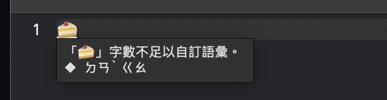

# 技術白皮書 (v3.8.1)

> 註：本文提到的 SessionCtl 是 IMKInputController 的派生型別、在小麥注音當中被稱為「InputMethodController」。此前，該型別在威注音當中曾一度被命名為「ctlInputMethod」。自威注音 2.7.5 版開始，ctlInputMethod (ctlIME) 被更名為 SessionCtl，意為「會話控制器」。

## 引文

有人可能對威注音「自何時起從小麥注音 fork 出來」感興趣。雖然倉庫顯示的時間可能比較早，但實際上（拿 1.3.0 版來講）是 fork 自 2022 年 2 月初版本的小麥注音。1.2.x 版只能說是草稿版，自 2021 年底開始（到 2022 年 2 月中旬 1.3.0 版為止）一直在嘗試手動同步來自上游的一些修改，且在此同時試圖實現威注音自己的產品設計意圖。

自 2022 年三月底開始，威注音嘗試繼續之前上游的 Swift 化計畫所未完成的內容：用 Swift 將整個專案的 ObjC(++) 與 C++ 的部分用 Swift 徹底重寫。先是重寫了輸入調度模組，之後是組字引擎「Megrez」，最後威注音又有了自己原創的功能更豐富的聲韻並擊引擎「（齊）鐵恨 Tekkon」。此外，威注音當時嘗試用 C# 語言重寫這些模組，但因為 Windows「沒有與 InputMethodKit 一樣方便的輸入法開發套裝體驗」而只能作罷，相關倉庫荒廢至今。在此之後，Megrez 引擎做過一輪技術升級。

然後就是到了 2022 年八月初，威注音實現了 IMK 矩陣選字窗的支援。之後，威注音緊接著開始將輸入法本體的所有「直接從上游繼承來的 Swift 模組」全部淘汰，且用 SwiftUI 完成了威注音自家的全新的田所選字窗：這套選字窗同時實現了（類似 IMK 選字窗的）橫排矩陣佈局與（類似微軟新注音的）縱排矩陣佈局。

這篇技術白皮書主要是為了讓部分使用者明白小麥注音與威注音至少有哪些技術上與產品功能上的不同。

P.S.: IMK 選字窗一度受威注音支援，但因為其利用方式太複雜不利於威注音輸入法長遠發展的原因、而在威注音 3.5.4 版內遭到了移除。

## 總括概述

### 系統支援與資訊安全

差異項 | 小麥注音 (2.5) | 威注音 (3.8.1) | 補記
-- | -- | -- | --
支援作業系統範圍 | macOS 10.13 起算 | 主流發行版 macOS 13 起算 Aqua 紀念版 macOS 10.9 起算 | macOS 10.9 是 Swift 5 能支援的最早的系統版本。
強化型組字區安全防護 | 無 | 有（強烈推薦使用） | 會有 App 或網站提前獲取內文組字區的內容給遠端伺服器、來遠端預判使用者的下一步操作。威注音的這個模式會以浮動組字窗取代內文組字區，使得接收文字輸入的客體軟體再也無法擅自利用組字區的內容來觸發使用者不想觸發的事件。您也可以藉由「客體管理器」僅對部分客體 App 啟用這種限制。
Sandboxing 沙箱 | 無 | 有 |  沙箱是最好的謠言粉碎機。
允許設定在就地加詞之後自動執行指定腳本 | 允許，且腳本位址存於 UserDefaults Plist 當中 | 不允許 | 一兩道 Defaults write 指令就可以讓小麥注音在每次加詞時自動執行有害腳本。更甚者，小麥注音沒有 Sandbox 設計、無法控制這種情況下的被害目錄範圍。
讀取網路資料 | 僅在新版軟體檢查時才會聯網，且該功能自動啟用、會在安裝完畢後首次執行時主動聯網 | 僅在新版軟體檢查時才會聯網，需使用者手動啟用新版軟體檢查之功能 |  
將本地資料上傳 | 無 | 無 | 威注音另有與此有關的 Sandbox 行為約束。

###  基礎大模組與處理單元

差異項 | 小麥注音 (2.6) | 威注音 (3.8.1) | 補記
-- | -- | -- | --
CIN 模組 | 不具備 | 支援 CIN2 標準 | 小麥注音團隊另有 OpenVanilla 輸入法專門使用 CIN 表格工作。 |
內碼輸入 | 具備 | 具備 | 兩者各自對此的實現方式不同； 威注音在簡體模式下有支援 GB 內碼輸入。
輸入調度模組 | KeyHandler (Objective-C++) | InputHandler (Swift) | 職能很相似 
按鍵訊號承載單位 | KeyHandlerInput | NSEvent及其私有功能拓展 以及其對等克隆體 KBEvent Struct | 威注音利用 NSEvent / KBEvent 的 characters ignoring modifiers 參數塞入狀態上下文情境描述用中繼資料
組字引擎 | Gramambular 2 (C++) by Lukhnos Liu | Megrez (Swift) 採用與 Gramambular 2 相同的頂點爬軌算法 | Megrez 新增了很多功能擴展，包括對就地加詞功能要用到的標記游標的管理，等
注音並擊引擎 | OVMandarin (C++) by Lukhnos Liu | Tekkon (Swift) 支援更多注音排列與拼音種類 | 均無允許使用者自行設計注音排列之能力 
詞庫管理模組 | Objective-C++ & C++ ParselessLM 採 TXT 格式的原廠辭典 | Swift 採 SQLite 格式的原廠辭典 使用者辭典採 txt 格式 | 
態械引擎 | 多型別狀態策略設計模式 無專有內部資料型別 | 單結構狀態策略設計模式 有專有內部資料型別 | 雙方的開發習慣不同、導致各自的取捨不同。

###  選字窗

差異項 | 小麥注音 (2.6) | 威注音 (3.8.1) | 補記
-- | -- | -- | --
IMK 選字窗支援 | 無 | 無 | 雙方均在不同的年代曾經分別支援過 IMK 選字窗，但因技術維護方面的各自苦衷而先後放棄支援。
輸入法內建選字窗 | Voltaire MK2 (Swift Cocoa) | Tadokoro 田所選字窗(第三代) | 田所選字窗支援展頁等特性
內建選字窗是否有支援矩陣佈局 | 否 | 橫排矩陣（類似 IMK） 縱排矩陣（類似新注音） | 田所選字窗出於介面繪製效能的考量，移除了原本要加入的選字窗內容捲動支援。
內建選字窗是否有專有內部資料型別 | 否 | 是 | 威注音的設計更易於維護
頁碼支援 | 否 | 否（Voltaire MK3 有支援過） | 田所選字窗另支援對當前選中的候選字的總索引編號顯示
針對簡繁體輸入模式以對應的系統介面字型顯示候選字 | 無 | 僅限田所選字窗（需在偏好設定內的開發道場當中手動啟用） | 田所選字窗對此要求至少 macOS 12 (Swift UI)。 如果是 Cocoa 版的話，macOS 11 因為系統 Bug 而不支援該特性。
針對簡繁體輸入模式以不同的高亮候選字背景色 | 否 | 僅限田所選字窗（Voltaire MK3 有支援過） |  
CIN 字根反查 | 無（Voltaire 選字窗不支援） | 有 僅限田所選字窗 | 該功能自 2.9.4 開始才算成熟。
UNICODE 統一碼資訊顯示 | 無（Voltaire 選字窗不支援） | 有 僅限田所選字窗 | 該功能自 3.8.1 版開始實裝。
選字窗右鍵選單控頻/刪詞 | 無（Voltaire 選字窗不支援） | 有 僅限田所選字窗 | 不支援臨時漂浮客體， 比如 Spotlight 與 NSMenu 等。

###  文字輸入方式

差異項 | 小麥注音 (2.5) | 威注音 (3.8.1) | 補記
-- | -- | -- | --
支援注音排列種類 | 大千傳統、倚天傳統、倚天26、許氏、IBM | 大千傳統、倚天傳統、IBM、神通、(偽)精業、倚天26、酷音大千26 、許氏、星光、劉氏 | 下述排列為動態注音排列：倚天26、酷音大千 26 、許氏、星光、劉氏
支援拼音輸入種類 | 僅一種模式，缺乏介紹資料 | 漢語拼音、國音二式、華羅拼音、耶魯拼音、通用拼音、韋氏拼音 | 「趙元任國語羅馬字」無法作為支援對象，因為無法設計「固定的」用以確認聲調的按鍵 
拼音並擊模式 | 無 | 有 | 就是在敲注音的時候在組字區內顯示拼音
字母輸入 | Shift+字母鍵可定義兩種輸入方式，僅允許對大寫字母直接地教 | Shift+字母鍵可定義三種輸入方式，其中允許對小寫字母的直接遞交 
全形數字輸入 | 尚無直接支援 | Alt+Shift+數字鍵 | Alt+數字鍵輸入半形數字
大鍵盤數字鍵區支援 | 無法正確處理，且蠻橫地拒絕任何針對該問題的修正 PR。 | 直接忽略輸入，或者用作選字鍵 | 威注音有針對 JIS 的數字小鍵盤特有的按鍵做過針對處理
Emoji 模式 | 僅原廠 Emoji，無開關 自訂 Emoji 到使用者辭典內的話，會與漢字詞搶頻 | 有專門的使用者 Emoji 辭典檔案，有開關
Alt 切換「熱鍵專用鍵盤佈局」 | 有支援（需使用終端機） | 故意放棄支援 | 與該功能有關的 Alt 鍵操作會因為 NSMenu 的按鍵攔截干擾、而無法保證使用體驗
用 Shift + BackSpace 析構游標後方的漢字的讀音 | 不支援 | 支援 |  
用聲調鍵複寫游標後方的漢字的聲調 | 不支援 | 支援 | 
允許以聲調鍵開頭敲字 | 支援 | 不支援 | 後者暫無計畫支援之。
在用選字窗選字時，先鞏固操作範圍上下文 | 不支援 | 支援 | 類似 macOS 內建注音輸入法的體驗。但是，威注音只會在藉由選字窗選字時鞏固上下文。
CIN 表格支援 | 無 | 有 | 藉由威注音特有的磁帶模式來支援。 
漢音符號輸入支援 |  僅特殊符號選單（僅部分符號） |  全部支援。 | 後者包括漢音鍵盤符號模式在內。 
內碼輸入支援 | 有（僅 Big5，要求 2.4.2 之後的版本） | 有 | 後者可連續輸入。
允許忽略掉 CapsLock 的強制英文輸入 | 無 | 有 | 威注音此舉可照顧到微軟新注音輸入法的使用者的習慣。
聯想詞 | 有，且能在組字區內工作 | 有，但脫離組字區工作 | 威注音此舉看似不便利，但躲開了「拿破音字自動匹配讀音」這種永遠無法正確實作的產品功能需求。

###  就地加詞刪詞

差異項 | 小麥注音 (2.5) | 威注音 (3.8.1) | 補記
-- | -- | -- | --
就地加詞刪詞功能 | 僅就地加詞 | 就地加詞/刪詞/控頻 |  
就地加詞操作方式 | Shift+前後方向鍵選取範圍，再敲 Enter 操作 | Shift+前後方向鍵選取範圍，再敲 Enter 加詞 / 升頻、敲 BkSp / Del 就地刪詞、摁 Shift + Command + Enter 降頻 | 該功能與該操作方法的搭配乃微軟新注音 2003 首創、且漢音從未支援過這種操作方法。
對字詞數與讀音數不等的情況的支援 | 無 | 有 |  
加詞刪詞範圍運算管理 | 僅位於態械內，以 UTF16 為範圍長度單位，需 NSStringUtils。 | 態械、組字引擎、輸入調度模組同時協作，以 UTF8 為範圍長度單位，不需要 NSStringUtils。 | 威注音的做法更精確，也只有這樣才能實現對字詞數與讀音數不等的情況的支援

###  漢字模式支援與審音支援

差異項 | 小麥注音 (2.5) | 威注音 (3.8.1) | 補記
-- | -- | -- | --
簡體中文輸入支援 | 轉換 | 原生簡體中文詞庫＋通用規範漢字表支援，与原生繁體中文詞庫分离。 | 繁轉簡也存在失真，比如「著->着」。
簡體中文使用者語彙支援 | （跑題了） | 簡繁模式下就地加詞時會做交叉轉換、確保在某一個模式下加詞時也會讓另一個模式受益。 | 沒有別的好辦法。
漢字轉換引擎 | OpenCC (支援詞組轉換) VXHanConvert (僅支援逐字轉換) | 步天歌 Hotenka(支援詞組轉換) | 步天歌引擎不適合用來做大篇幅的簡繁轉換
全字庫支援 | 有（2011 版） | 有（2022 版） | 宜每年更新一次。
其它漢字支援 | 無 | 繁體轉 JIS 漢字繁體轉康熙 | 轉換準確度有限
組字區與選字窗內的漢字反應當前的簡繁模式或 JIS / 康熙轉換模式 | 否 | 是 |  
審音 | 僅台澎金馬民間讀音 | 兩岸審音與台澎金馬常用讀音均兼顧 |  
大寫漢字數字輸出 | 無 | 有 | 銀行等場合會用到

###  其它功能

差異項 | 小麥注音 (2.5) | 威注音 (3.8.1) | 補記
-- | -- | -- | --
Valve Steam 支援 | 無 | 有（需要在客體管理器內針對具體的客體 App 啟用浮動組字窗） | 對其它「不認真遵守 IMKTextInput 協定」的軟體也適用，比如 VSCode 與 Naver Line 等。
使用者辭典格式主動整理 | 無，只會在就地加詞時套用檔案 EOF 檢查修正 | 有，會主動整理 |  
使用者辭典目錄狀況監測 | 有：FSEventStream | 有：Dispatch Source File System Object (DSFSO) | DSFSO 無法監測 App 自身對目錄內的檔案的修改，但這反而使程式行為更加可控。
偏好設定視窗 | 僅 XIB | XIB 給 Aqua 紀念版用， SwiftUI 給主流發行版用 |  
敲字讀音錯誤提示 | 僅系統蜂鳴生效 | 有專門的SFX，會在啟用偵錯模式時生效。 | 威注音的廉恥模式的開關會影響 SFX，但這個開關只會在愚人節才能看到。
ㄅ半模式支援 | 單獨的輸入法模式副本 | 輸入法功能選單內切換 | 威注音的關聯詞語模式可自訂詞庫
倚天中文 DOS 候選字順序 | 有（僅限傳統注音模式） | 有（僅限逐字選字模式） | 本質上都是ㄅ半注音輸入模式
自訂語彙長度限制 | 六個字 | 十個字 |  
符號選單 | 類似漢音的符號選單 | 類似漢音的符號選單＋類似新酷音的分層符號選單，但內容更豐富 | 後者可藉由自己撰寫 symbols.dat 的方式自訂
使用者語彙置換及過濾 | 有 | 有 | 雙方功能行為一致
半衰記憶模組資料的可持續利用 | 暫無 | 有 (JSON) | 威注音可在輸入法選單內清空該資料
工具提示視窗的縱排顯示支援 | 無 | 有 |  
通知飄窗對於 GCD Async 的支援 | 無（用了就會 Crash） | 有 |  
W3C Ruby 注音讀音標記 | mac 版無，linux 版有；不支援教科書聲調寫法 | 有，且支援教科書聲調寫法 | 威注音也可輸出漢語拼音的 Ruby 標記
介面語言種類 | 僅繁體中文與英文 | 簡體中文/繁體中文/日文/英文 |  
是否容忍橫跨游標的候選字的出現 | 是 | 否 | 無論漢音還是微軟新注音都不會容忍橫跨游標的候選字的出現
輪替候選字 | 僅 (Shift+)Tab | `Shift(+Alt)+Space` `Alt+↑` 或 `Alt+↓` `(Shift+)Tab` | 縱排輸入時為 `Alt+←` 或 `Alt+→`
以組字區內的字詞節點為單位移動游標 | 無 | 有：Alt+前後方向鍵 |  
允許自己卸除自己 | 不允許，必須要求使用者手動操作 | 需摁 Alt 點輸入法選單，才可以看到該功能的入口 |  
使用者語彙編輯器 | 不具備；會依賴外部編輯器 | 內建一套語彙編輯器 |  
GraphViz 輸出支援 | 不支援(以前曾經支援過) | 支援(得先開啟偵錯模式) |  
日期時間便捷輸入 | 不支援 | 支援 |  
Emacs Key | 在輸入調度模組內部處理 | 在水源入口處理：發現 Emacs Key 就直接將原始 KBEvent 換成翻譯後的 KBEvent |  

## 個別詳細介紹

### 田所選字窗

迄威注音 2.7.5 版為止，這個備選的選字窗都是自上游繼承過來的 Voltaire MK2 (Swift) 選字窗修改來的。威注音在此之上做了介面美工，加上頁碼顯示，變成 MK3 版：

威注音自 2.8.0 版起，對 macOS 11 及之前的系統，僅提供 IMK 選字窗可用。本來威注音是不用再另起爐灶的。然而，IMK 選字窗在未來可能會因為改了某個內部 API 而導致新的故障出現，所以必須得有一個非 IMK 的選字窗作為備選。但如果要把 Voltaire 選字窗重寫成類似 macOS 內建輸入法那種捲動矩陣佈局的話，只用 Cocoa 技術實現的話，技術難度太大。

幸好，SwiftUI 讓事情變得簡單了一些。雖然很多要用到的 SwiftUI API 要求至少 macOS 12 才可以用得上。田所選字窗的工作原理與筆者下文當中提到的 IMEState 差不多：有一個專門處理資料變化的內部型別，且與負責介面顯示的型別徹底分離。這樣一來，負責介面顯示的型別（其實是 SwiftUI 結構）在程式維護方面就會輕鬆不少。

（本文所示田所選字窗擷圖只是示範。其美術設計在後來又經過了一些小調整。）

先看田所選字窗的橫排矩陣佈局：

威注音不滿足於對橫排矩陣選字窗的支援，於是又完成了縱排矩陣選字窗、提供了類似微軟新注音 2003 的體驗：

一開始的田所選字窗是有做得跟 macOS 內建的選字窗幾乎雷同的。但是，SwiftUI 的繪製效能並不好，使得選字窗的操作流暢度欠佳、嚴重影響了ㄅ半輸入模式的體驗。於是，田所選字窗的滑鼠滾動檢視特性就被移除了、且僅顯示三列矩陣。

後來，田所選字窗又經過了幾次徹底重寫，最近的一次重寫利用了 Cocoa 以及 CoreGraphics、極大地提升了介面繪製效率。這也允許田所選字窗在 macOS 10.9 Mavericks 系統下完美運作。

### 通知飄窗

威注音輸入法用到 2.7.0 為止的通知飄窗，是由小麥注音的通知飄窗修改了 NSWindow 的配色屬性之後而成的。而論及威注音 2.7.5 版引入的新款通知飄窗，則擁有如下新特性：

1. 新通知始終顯示在螢幕右上角、且舊通知會自動變淡＋位置下移。原因：使用了更好的飄窗通知副本管理方法。
2. 飄窗文本排版及動畫動畫效果受到了 Call of Duty: MWII 2022 的影響，但也兼顧了 Cocoa 應用的顯示風格、使之不太出戲。
3. 對 DispatchQueue Async 的相容。之前上游的通知飄窗在 DispatchQueue Async 內呼叫時會讓輸入法直接崩潰掉。

此外，考慮到有使用者在濫用這個功能的情況下出現的記憶體洩漏、CPU 高佔用率的問題，威注音輸入法在 2.8.0 SP3 當中對此做了專門的修正：最多只會殘留四條近期通知。（後來又再縮減到兩條通知。）

### 工具提示視窗

小麥注音與奇摩輸入法的實現只適合橫排輸入時的顯示。一旦縱排輸入，整個文字提示視窗就還是橫排顯示的。威注音 2.5.0 版對該模組做了重寫，引入了 NSAttributedTextView 這個可以縱排顯示文字的 NSView （在 Fuziki 的同款功能的 UIView 的基礎上改來，且得到他本人的准許）。但是呢，因為系統字型的 vert 特性在顯示注音、漢語拼音、英文、阿拉伯數字時的效果非常糟糕，使得筆者決定做出如下處置：

1. 在使用英文介面時，始終使用橫排顯示的工具提示。
2. 在使用中文或日文介面時，允許使用者在偏好設定內啟用「始終使用橫排顯示的工具提示」。
3. 縱排工具提示視窗內的按鍵名稱都使用符號來顯示。
4. 縱排工具提示視窗內以全形空格來分隔每個漢字的讀音。
5. 縱排工具提示視窗內僅顯示注音、而不顯示漢語拼音。

另外，新版工具提示視窗在任何場合都不會遮住使用者正在輸入的文字。

### 按鍵訊號載體單位 & 對 EmacsKey 的支援

小麥注音的 KeyHanderInput 是把 NSEvent 讀取且翻譯成這麼一個新的按鍵訊號載體單位類型。該組件在威注音當中被更名為 InputSignal，但與 InputSignalProtocol 是兩碼事情：前者遵循後者這個協議所規定的規範，而 KeyHandler 輸入調度模組當中的函式可以處理任何符合該規範的物件。

威注音在 v2.3.1 當中淘汰了該模組，轉而直接對 NSEvent 做了符合 InputSignalProtocol 的擴展。主要原因在於「IMK 選字窗只能處理 NSEvent」這個客觀事實。更何況，KeyHanderInput 當中的很多實現，對目前的威注音而言並不經濟。

對 NSEvent 做了這種擴展處理之後，就明顯減少了 NSEvent 按鍵訊號流從 SessionCtl 流往 IMKCandidates 的過程當中的任何不必要的類型轉換。在此之上，威注音 v2.4.0 又引入了「讓 NSEvent 迅速改掉自身的其中任意一處屬性」的全新重構函式（Reconstructor）、進一步減少了 SessionCtl 與 ctlCandidateIMK 的篇幅。威注音還藉由 charactersIgnoringModifiers 這個參數，實現了「往 NSEvent 裡面塞入諸如『當前是否是縱排輸入』等資料」這種特性需求。

**不過呢**，威注音從業火五筆輸入法承襲來的「用來判定 Shift 鍵是否有被敲過」的特殊按鍵判定函式要求傳入的 NSEvent 必須是 SessionCtl.handle(event:) 吃到的 raw event 且做過 guard-let 處理、然後直接交給特殊按鍵判定函式。不然的話，判定會失效。這與該判定函式本身所使用的方法有關（涉及到對 NX_DEVICELSHIFTKEYMASK 等 NX Mask 的判定處理），且 NSEvent 不是 Struct 而是 Class、在 Swift 當中就容易出現這方面的鬧鬼情況。

上文有提到威注音利用 NSEvent 作為基礎按鍵訊號單位、且引入了自我重構函式的事情，那麼對 EmacsKey 的判定就簡單了：直接在接收訊號的第一道關口將符合條件的 Emacs Key NSEvent 重構為對應訊號的 NSEvent 即可，省去了之後的一切判斷處理步驟。

### InputState 有限態械系統＋NSStringUtils＋就地增刪詞

先提一下：威注音相比小麥注音而言，新增了就地刪詞、就地降頻的功能。

進入正題。

小麥注音 2.x 版引入的有限態械，很像是參考自 Refactoring.guru 設計模式教學網站的 State Pattern 狀態模式、且在 InputMethodController (小麥注音對 IMKInputController 的實作) 當中採用了與 Strategy Pattern 類似的方法來處理不同的狀態。

但是，這個網站給出的方法（多型別有限態械），真的是唯一解嗎？

答案顯然是「否」，只是我意識到這一點恐怕有點晚了。

威注音在 v2.4.0 當中引入了全新的單結構態械系統「IMEState」，整個態械只用到一個 Struct、賦以針對不同 Struct 切換時的各種專有的建構函式（Constructor）。除去「每次切換狀態都要重新初期化一個狀態來取代舊狀態」以外，這樣的設計滿像一個「管家」：手頭的資料與既定事實都是固定的，但管家的行事模式與狀態則是另一回事。

此外，IMEState 還有一個內部專用的資料型別 StateData，可以理解為管家身上帶著的固定的錢包：裡面有主人要花的錢、主人要用的各種證件，等。但是，管家在不同狀態下，可能會在將具體的物件拿給主人之前，做一些別的事情：錢不夠了，就去銀行取款；在不同的場合，掏出不同的證件。

這種全新的單結構態械系統，比起之前使用的來自上游的多型別態械系統，更容易維護管理。特別是要在 IMK 的內文組字區的顯示形態繪製運算當中使用的各種 NSAttributedString、以及標記模式下的高亮選取範圍運算，都在新的 IMEState 當中得到了明顯的簡化處理。

更甚者，這次的組字引擎也做了升級、可以單獨處理要在標記模式下使用的標記游標。這樣一來，InputHandler 的任務輕鬆了不少，**且威注音終於在原理上實現了在就地加詞刪詞時對詞音不等長的情形的正確應對處理**。這些都使得小麥注音 2.x 的另一個模組「NSStringUtils」不再重要：<u>每次在標記模式當中修改標記範圍時，對新的標記範圍的運算處理都是在組字引擎內產生的、然後被 InputHandler 翻譯出來、變成更新過的標記狀態當中的資料的一部分</u>。**小麥注音 mac 版受制於 Swift 與 C++ 的生殖隔離，僅依賴 Objective-C++ 對兩者的橋接的話，很難做到這些**。

單結構態械系統也減輕了 ctlInputMethod 當中的狀態策略管理函式：不再像以前那樣給每種狀態都制定一個專用的處理函式了，而是用一個函式就夠了：這個函式內直接對傳入的狀態做 Switch Case 處理，且對「需要用到同種處理流程的一些狀態」做了合併處理，減少了程式碼的篇幅。

### 軟體版本更新檢查模組

上游的 VersionUpdateAPI 對威注音而言太複雜，於是筆者使用 NSURLSession 重寫了全新的 UpdateSputnik 模組。這樣一來，威注音也實現了「在檢查新版本時，發現沒有新版本」這個情形下的 NSAlert 彈窗提示。

### 檔案目錄異動檢查模組

該模組用來監測任何發生在使用者辭典目錄內的變化。上游的這套模組使用了 FSEventStream，但比較麻煩。威注音 v2.5.0 更換了新的 FolderMonitor 監視模組，利用了 DispatchSourceFileSystemObject。這個方法不會偵測由輸入法本體對目錄做出的修改，所以筆者又在 mgrLangModels 當中對「使用者手動加詞」的情況又補上了手動重新載入使用者語彙的動作。這也解決了迄今為止 FSEventStreamHelper 與「威注音的使用者辭典格式自動整理模組」彼此的行為衝突問題。

$ EOF.
