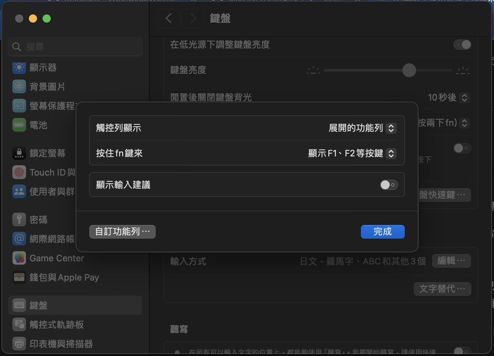

# 故障排除

### 問：為什麼我用系統內建的 Caps Lock 中英文切換時會有明顯的延遲？


該故障並非發生於所有 mac 機種。三點原因可導致該故障：

#### 1. 您的 USB 鍵盤藉由劣質 HUB 連到電腦上，產生了硬體處理延遲。

#### 2. 您沒有停用觸控列的「顯示輸入建議」功能（見下圖）：



> 你或許會想運行 `sudo hidutil property --set '{"CapsLockDelayOverride":0}'`。

#### 3. IMK 層面的 ARC Churn / ObjC-AutoReleasePool 導致的對 MainActor 的硬控延遲。

   此問題在唯音輸入法歷經數次版本迭代之後被逐步解決：

   - **v4.3.1**：首次引入 per-client 的 `InputSession` 複用機制——同一個接收文字輸入的客體物件盡可能共用同一個打字會話副本，避免每次 CapsLock 切換都重新建構全套輸入管線。
   - **v4.5.4**：將複用快取從 `NSMapTable` 改為純 Swift 的 LRU Table（`sessionsByClient`），解決了 Chrome / Electron 等頻繁變更 client proxy 的場景下的相容性問題。
   - **v4.5.5**：全專案停用 Objective-C ARC 編譯標誌，並將 `SessionCtl`（IMKInputController 子類別）與 `InputSession` 之間的所有物件參照改為純記憶體位址（`UInt`）傳遞——徹底移除 IMK 與輸入法之間的任何 `retain`/`release` 呼叫。經受災使用者之實測，CapsLock 高頻切換的遲滯現象已不復存在、且實際表現（CapsLock 中英文輸入法切換）之迅速可與（同樣沒在用 Objective-C ARC 的）奇摩輸入法匹敵；如有殘留，則為 IMK 自身的設計瓶頸，超出第三方輸入法可解決的範圍。
   - **v4.5.6**：將打字會話副本管理邏輯與 `IMKInputController` 的生命週期管理徹底逐出 Swift ARC 的可觸及範圍——所有 controller 實例的 `alloc`／`dealloc`／`retain`／`release` 均在 ObjC MRC 層完成，Swift 端僅透過 raw 記憶體位址與之互動；並配套實裝了「Controller 世代戳記與主動清理」「極性雙緩衝 Session 池」與殘留 XPC 連線清理。
   - **v4.5.7**：更進一步——Swift 端的 `InputSession` 在輸入法實際運行時已不再對 `IMKTextInput` client 物件有任何直接碰觸：改由擴充 `IMKInputSessionController` 的 ObjC API、使其充當兩者之間的代理介面，且該 controller 的生命週期完全可控（`deactivateServer` 之後三秒主動凋亡，除非期間再次 `activateServer`）；另對 IMK 橋接層的全部 ObjC 方法做了 autorelease pool 審計（MRC 下 `@autoreleasepool` 的成本僅是兩次函式呼叫），確保 Swift 橋接與 client 呼叫產生的 autorelease 暫存都在每個方法返回時即刻清空。

   時至今日，Swift 端的輸入法程式碼在實際運行期間已經完全不再接觸任何 client object（`IMKTextInput`）；IMK 層面的 ARC churn／autorelease 積累對 MainActor 的硬控延遲隱患，已被從架構層面根除。

   > v4.5.5 的這個改動會略微增加輸入法的記憶體佔用（大約 50MB ~ 100MB 不等），因為 IMKServer 對 IMKInputController 孤棄副本的回收變得被動、不激進了，乃至於同時存在的 IMKInputController 副本數量可能會在短時間內多達 6 個。但這是一筆非常划算的付出，因為使用者的中英文混合打字體驗得到了保證。

   另見本站的[發行版本履歷](../ReleaseNotes.md)。

### 問：為什麼有的軟體內一旦開啟唯音輸入法、則 CMD+Z/X/C/V 等熱鍵就失效？


有個方法可以避開該故障：就是開啟輸入法偏好設定當中的鍵盤設定畫面，將基礎鍵盤佈局改成 ABC。

> 如果您的系統版本不滿 macOS 10.13 的話，系統內沒有 ABC 佈局，此時輸入法會允許您啟用 US 美規鍵盤佈局。

然而，這個故障無解。其背後的原因在於：諸如 SmartGit 這樣用 Java 等第三方方案寫的跨平台軟體，往往無法正確處理藉由 macOS 內建的「非英數類」鍵盤佈局傳入的 CMD+Z/X/C/V 組合熱鍵。打比方說 macOS 內建的大千注音鍵盤佈局，就會被這類軟體認成「CMD+ㄈ/ㄌ/ㄏ/ㄒ」。Apple 又沒有任何官方開發指引明令訓誡第三方軟體研發者「得做出針對這種情況的相容處理」，就很讓人既憤怒又無奈。

### 問：我在用 Shift 鍵或者 JIS 英數鍵切換英文輸入的時候，為什麼會在每次敲兩下空格的時候出現全形中文句號？


對於任何副廠輸入法，在遇到這個問題的時候，都請聯絡 Apple Support。這是「macOS 剛剛安裝完畢之後在 OOBE 開箱階段選擇了（包括中文在內的）某些介面語言之後、會自動開啟的某個特性」所致，但他們沒有想到「應該對第三方輸入法禁用該特性」，所以只能讓 Apple 的服務專員手把手教您怎樣關掉該特性。

唯音鼓勵每一位受此困擾的人向 Apple Support 求助，或者帶著您的電腦去 Apple Store 直營店求助。求助的人越多，Apple 也就越知道：這個預設啟用的選項給使用者帶來的更可能是困擾、而不是他們最開始的良性目的。

> 另外，開發者找到了方法：將「敲兩下空格」取代成的字符由「一個全形空格」變成「兩個半形空格」，從而讓 macOS 的這一處綁架設計對唯音徒勞。是說 Apple 應該在 Xcode Documentation 當中將一款輸入法的 info.plist 的參數涵義盡數解釋出來、而不是什麼都不寫。如果有其它第三方輸入法也想實作這種對策的話，請將輸入法的 info.plist 當中的 `TISDoubleSpaceSubstitution` 這一項參數值直接刪掉。

### 問：像 Steam 這種應用在敲字時看不到組字區，怎麼辦？


唯音 2.6.0 版開始，對這種不遵守 IMKTextInput 協定的應用，會啟用獨立的浮動組字窗（讀音數量上限 20）。

唯音會預設對 Steam 啟用該措施。如果想對其它應用採取該措施的話，請在輸入法選單當中的「管理客體應用」內添入這些應用（的唯一標幟「bundle identifier」）。

### 問：怎樣抓到輸入法的閃退故障的重現場合？


請洽[《故障提報與用儀器捉蟲》](../BUGREPORT.md)一文。

### 問：我想延續自己在 Windows 平台習慣了的「用 Shift 切換中英文」的習慣，該怎辦？需要額外開放 macOS 系統的進階輔助使用權限嗎？


唯音輸入法允許偵測「Shift 按鍵單次敲擊」得以實作與此有關的中英模式切換功能。該

- 該模組要求至少 macOS 10.15+ 才可以正常運作。
- 自威注音輸入法 v1.8.8 版開始截至唯音輸入法 v4.2.1 為止，該敲擊偵測模組承襲自 Qwertyyb 的[業火五筆輸入法](https://github.com/qwertyyb/Fire/)（MIT 授權）。
- 該模組在唯音輸入法 4.2.2 版換成了唯音輸入法自己重寫的版本。

上述兩代模組均不依賴任何 macOS 系統進階權限，也就不會有對系統全局鍵盤事件的監聽行為與需求，請各大公司的資安主管們放心：反正你們也可以自己拿唯音的原始碼倉庫自行 build 自己的 binary 給自己公司員工的電腦使用。能對這個功能提出這種資安質疑的人往往都是那種給 macOS 寫輸入法都不敢開 Sandbox 的人士。

### 問：用 CapsLock 在英數輸入法（US / ABC, etc.）與唯音來回切換的場合，切換回唯音立刻敲字的話，第一個對唯音的按鍵行為偶爾會不組字。


有些 macOS 使用者的系統可能會有 CapsLock 反應遲鈍的問題，哪怕他們並沒有在系統偏好設定內的輔助選項當中啟用慢速按鍵。此時有兩個選擇：

- 如果您想保留 macOS 系統用 CapsLock 切換輸入法的特性的話，請考慮安裝使用「[CapsLockNoDelay](https://github.com/gkpln3/CapsLockNoDelay)」這款開源小軟體。
- 如果您不介意犧牲上述系統特性的話，請在系統偏好設定內停用「鍵盤->輸入方式->使用大寫鎖定鍵或中英鍵來切換「ABC/英文(美國)」及目前的輸入方式」這個勾選。這樣的話，唯音會在 CapsLock 亮燈時使用自身的半形英數模式。

### 問：在使用 JetBrains 家的 Rider / PHPStorm 等 IDE 的時候，如果關掉了系統內建的「CapsLock / 中英鍵切換輸入法」的功能的話，唯音會變得跟小麥注音一樣、在程式碼編輯器內敲不了小寫字母。請問這是何故？


根本原因是 JetBrains 的眾多 IDE 的設計使然（可能與他們對 JDK 的使用有關，我不懂 Java 就是了）。

至於為什麼 macOS 系統內建的注音輸入法不會誘發該問題，則是因為他們用了 Apple 自家的基礎鍵盤佈局（有著對應的螢幕鍵盤注音顯示支援）。與小麥注音不同的是，**唯音可以藉由將輸入法偏好設定內的基礎鍵盤佈局改為「Apple 大千注音」「Apple 倚天傳統」來規避這個問題**。

如果您在用許氏鍵盤等動態注音排列、導致您不得不使用 ABC 鍵盤佈局的話，唯有啟用系統偏好設定內「CapsLock / 中英鍵切換輸入法」的功能。如果你的電腦在使用「CapsLock / 中英鍵切換輸入法」的功能時出現時效延遲的話，請考慮安裝使用「[CapsLockNoDelay](https://github.com/gkpln3/CapsLockNoDelay)」這款開源小軟體。

### 問：Rayon 這款終端應用內，如果關掉了系統內建的「CapsLock / 中英鍵切換輸入法」的功能的話，唯音敲小寫字母完全沒反應。


這與 Rayon 終端機應用內所用的終端機功能模組 xtermjs 有關、波及多款中文輸入法。該問題無解，唯有啟用系統偏好設定內「CapsLock / 中英鍵切換輸入法」的功能。如果你的電腦在使用「CapsLock / 中英鍵切換輸入法」的功能時出現時效延遲的話，請考慮安裝使用「[CapsLockNoDelay](https://github.com/gkpln3/CapsLockNoDelay)」這款開源小軟體。

### 問：為什麼我在藉由選字窗選字之後、選了的字詞前後方的字會亂動？macOS 內建輸入法沒這個問題欸。


請確認唯音輸入法偏好設定的辭典頁面當中是否有與上下文鞏固有關的內容被關掉。

### 幹：卸載太麻煩。


請帶著《[如何卸除唯音輸入法](https://vchewing.github.io/UNINSTALL.html)》這篇文章向 [Apple Support](https://support.apple.com/zh-tw) 求助、由他們的專員幫您遠端操作。或者如果您很懂 mac 的話，也可以自己操作。

### 問：要如何提升資料品質？我發現有用不到的爛詞出來干擾選字欸。產品 bug 該怎麼提報？


請參照**[這篇文章的指引](../BUGREPORT.md)**用電郵聯絡研發方。至於 GitHub 倉庫工單，則可能無法得到第一時間的受理。至於爛詞，雖然可以使用就地刪詞的功能屏蔽掉，但也歡迎提報。

### 問：我在 macOS 14 Sonoma 開始的系統內發現內文組字區的分段下劃線的功能失效了。請問我該怎麼辦才能還原 macOS 13 為止的內文組字區體驗？


> 此處給出的方法對 macOS 27 開始的系統無效。

欲關閉此系統功能，可輸入如下終端指令並運行：

```
sudo defaults write /Library/Preferences/FeatureFlags/Domain/UIKit.plist redesigned_text_cursor -dict-add Enabled -bool NO
```

要再重新啟用此功能，可輸入如下終端指令並運行：

```
sudo defaults delete /Library/Preferences/FeatureFlags/Domain/UIKit.plist redesigned_text_cursor
```

以上方法由 Goston 藉由[其 HackMD 網站](https://hackmd.io/@Goston/SJJjkIzvyx)公開分享。
