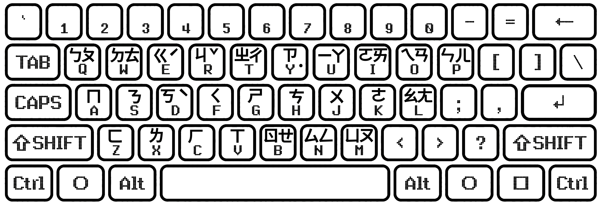

# 注音鍵盤排列參考清單

本文部分解說內容取自 Wikipedia。

- [注音鍵盤排列參考清單](#注音鍵盤排列參考清單)
  - [大千傳統 (微軟標準 / 王安 / 零壹 / 仲鼎 / 國喬) (Dachen Standard)](#大千傳統-微軟標準--王安--零壹--仲鼎--國喬-dachen-standard)
  - [倚天傳統 (ETen Traditional)](#倚天傳統-eten-traditional)
  - [神通 (MiTAC)](#神通-mitac)
  - [IBM](#ibm)
  - [精業 (JINYEI / SEIGYOU)](#精業-jinyei--seigyou)
  - [偽精業 (Fake-Seigyou)](#偽精業-fake-seigyou)
  - [倚天忘形二十六鍵 (ETen26)](#倚天忘形二十六鍵-eten26)
  - [許氏國音自然排列 (Hsu)](#許氏國音自然排列-hsu)
  - [星光排列 (Starlight)](#星光排列-starlight)
  - [酷音大千二十六鍵 (LibChewing Dachen-CP26)](#酷音大千二十六鍵-libchewing-dachen-cp26)
  - [怎樣取捨？(How to choose?)](#怎樣取捨how-to-choose)

威注音輸入法原廠提供下述注音排列支援：

| 排列性質 | 排列清單 |
| - | - |
| 普通注音排列 | <u>大千傳統 (微軟標準/王安/零壹/仲鼎/國喬)</u> / 倚天傳統 / IBM / 神通 / 精業 / 偽精業 |
| 複合注音排列 | 倚天忘形二十六鍵 / 許氏國音自然排列 / 星光排列 / 酷音大千二十六鍵 |

注意：
1. 精業排列的有效性不受威注音固定支援，也就是說威注音只是嘗試對其做半吊子支援。原因在於該排列相比偽精業等排列而言浪費了三個數字按鍵、且對右手符號鍵區的過多佔用反而會帶來不便。出於研發功能矛盾等難處，威注音不對精業排列提供螢幕鍵盤顯示支援。
2. 1.8.5 版（及在此之前版本的）威注音輸入法不支援星光排列。

威注音僅推薦注音輸入法的初學者學習大千傳統佈局，因其左右手分工最為科學。對於從小學習漢語拼音（而非注音）的人群而言，可以藉由下圖迅速上手大千傳統排列（這張圖故意用簡體中文來說明）：

以下是對各大注音排列的介紹。

## 大千傳統 (微軟標準 / 王安 / 零壹 / 仲鼎 / 國喬) (Dachen Standard)

大千傳統佈局乃 macOS 與 Windows 內建注音輸入法的預設標準佈局。你買的每一台印有注音鍵帽的 mac 筆電或（Apple 原廠）鍵盤，都會印有大千傳統佈局的注音序列。這也是四列傳統注音鍵盤排列當中左右手分工效率最明確的注音排列。八十年代末期「電腦大王」王安的電腦產品的中文系統也採用此排列。

> 在台澎金馬以外的地區購買 Apple 電腦時，需要客製化繁體中文鍵盤、才會有注音鍵帽印刷。但如果您已經學會盲打（大概要花一個月）的話，用美規鍵盤或簡體中文鍵盤也都不要緊。另外，Apple 官方的電腦維修渠道是不會受理筆電鍵盤語種類型更換的服務的，更顯客製化之重要性。

簡言之，大千式是直接將注音符號表放在鍵盤上，由上至下、由左而右把注音符號依序排列。由於注音符號一定按照「聲母→介母→韻母」的順序出現，注音符號表也有如此的順序。故使用大千式鍵盤時，一定是從左邊向右邊輸入（除聲調外）。另外，初學者學習的時候，也比較有跡可循找到注音的位置，不需要大海摸針。

例如輸入「碼」（ㄇㄚˇ）字，先按A字鍵代表ㄇ，再按8字鍵代表ㄚ，再按3字鍵以代表三聲，便可輸入「碼」字或以「ㄇㄚˇ」發音的用字。

大千的排列方式同零壹注音、王安等中文系統。

**大千式鍵盤的優點：**

- 佔有率極高。
- 初學者僅需熟習注音符號即可了解鍵盤分配位置，且一般中文鍵盤皆附有大千式鍵盤排列。
- 一般雙拼（即一聲母一韻母）情形多為左右手輪流輸入，可以節省敲字的精力與時間。
- 左右手**聲韻分離**，可以**聲韻並撃加快輸入速度**。
    - 習慣於大千式鍵盤的人，在使用「聲韻不分離」的倚天26、許氏拼音以及拼音輸入法中的全拼、雙拼時，常常會因爲這些輸入法不支援並撃輸入，而感到無比難用。
- 左右手分工的設計亦平衡了左右手工作的分配。
- 聲母常用的「ㄐㄑㄒ(j q x)、ㄓㄔㄕ(zh ch sh)」位於鍵盤中央，使較有力的食指分配到較多的工作份量；反之，無力的無名指小指則被分配到使用頻次較少的按鍵。
    - 介母（可用於韻母雙拼的韻母）ㄧㄨㄩ同理。
    - 有說法是「相對韻母常用的ㄢㄣㄤㄥ位於最外側小指工作範圍，使右手輸入較為吃力」，其實右手的無名指與小指經常敲 Enter 與 BackSpace，不存在吃力的說法。

**大千式鍵盤的缺點：**

- 聲調鍵位於離手指最遠的最上排，對手指短的人而言反而降低了敲字的效率。
- 占用了數字鍵和部分的符號鍵，使得輸入數字和符號的方法必須額外制訂。

| 聲母 |    |    |    | 介母 |    | 韻母 |    | 調號    |     |
|----|----|----|----|----|----|----|----|-------|-----|
| ㄅ  | 1  | ㄐ  | r  | ㄧ  | u  | ㄚ  | 8  | 一聲    | 空格鍵 |
| ㄆ  | q  | ㄑ  | f  | ㄨ  | j  | ㄛ  | i  | 二聲(ˊ) | 6   |
| ㄇ  | a  | ㄒ  | v  | ㄩ  | m  | ㄜ  | k  | 三聲(ˇ) | 3   |
| ㄈ  | z  | ㄓ  | 5  |    |    | ㄝ  | ,  | 四聲(ˋ) | 4   |
| ㄉ  | 2  | ㄔ  | t  |    |    | ㄞ  | 9  | 輕聲(˙) | 7   |
| ㄊ  | w  | ㄕ  | g  |    |    | ㄟ  | o  |       |     |
| ㄋ  | s  | ㄖ  | b  |    |    | ㄠ  | l  |       |     |
| ㄌ  | x  | ㄗ  | y  |    |    | ㄡ  | .  |       |     |
| ㄍ  | e  | ㄘ  | h  |    |    | ㄢ  | 0  |       |     |
| ㄎ  | d  | ㄙ  | n  |    |    | ㄣ  | p  |       |     |
| ㄏ  | c  |    |    |    |    | ㄤ  | ;  |       |     |
|    |    |    |    |    |    | ㄥ  | /  |       |     |
|    |    |    |    |    |    | ㄦ  | -  |       |     |

## 倚天傳統 (ETen Traditional)

倚天中文 DOS 系統與 80 年代的倚天電腦所採用的四列注音排列方案，其字鍵排列大多是以威妥瑪拼音（其實有的是大寫字母與注音符號形狀相似，例如ㄨ對應X以及ㄩ對應U，或者是發音相似，例如ㄞ對應I以及ㄒ對應C）排列，為當時習慣英打的中文使用者帶來對應的便利性。

| 聲母 |    |    |    | 介母 |    | 韻母 |    | 調號    |     |
|----|----|----|----|----|----|----|----|-------|-----|
| ㄅ  | b  | ㄐ  | g  | ㄧ  | e  | ㄚ  | a  | 一聲    | 空格鍵 |
| ㄆ  | p  | ㄑ  | 7  | ㄨ  | x  | ㄛ  | o  | 二聲(ˊ) | 2   |
| ㄇ  | m  | ㄒ  | c  | ㄩ  | u  | ㄜ  | r  | 三聲(ˇ) | 3   |
| ㄈ  | f  | ㄓ  | ,  |    |    | ㄝ  | w  | 四聲(ˋ) | 4   |
| ㄉ  | d  | ㄔ  | .  |    |    | ㄞ  | i  | 輕聲(˙) | 1   |
| ㄊ  | t  | ㄕ  | /  |    |    | ㄟ  | q  |       |     |
| ㄋ  | n  | ㄖ  | j  |    |    | ㄠ  | z  |       |     |
| ㄌ  | l  | ㄗ  | ;  |    |    | ㄡ  | y  |       |     |
| ㄍ  | v  | ㄘ  | '  |    |    | ㄢ  | 8  |       |     |
| ㄎ  | k  | ㄙ  | s  |    |    | ㄣ  | 9  |       |     |
| ㄏ  | h  |    |    |    |    | ㄤ  | 0  |       |     |
|    |    |    |    |    |    | ㄥ  | -  |       |     |
|    |    |    |    |    |    | ㄦ  | =  |       |     |

## 神通 (MiTAC)

源自神通電腦的四列注音排列方案，採漢語拼音。

> 倚天跟許氏大部分的注音都是以拼音排列，但是仍然有少部分的注音是大寫字母與注音符號的形狀很像（例如ㄨ對應X）或者是發音一樣（例如ㄧ對應E），但**神通則不然**：神通完全都是以漢語拼音排列的，因此最方便漢語拼音的使用者盲打。

| 聲母 |    |    |    | 介母 |    | 韻母 |    | 調號    |     |
|----|----|----|----|----|----|----|----|-------|-----|
| ㄅ  | b  | ㄐ  | j  | ㄧ  | y  | ㄚ  | a  | 一聲    | 空格鍵 |
| ㄆ  | p  | ㄑ  | q  | ㄨ  | w  | ㄛ  | o  | 二聲(ˊ) | 2   |
| ㄇ  | m  | ㄒ  | x  | ㄩ  | v  | ㄜ  | e  | 三聲(ˇ) | 3   |
| ㄈ  | f  | ㄓ  | ,  |    |    | ㄝ  | ;  | 四聲(ˋ) | 4   |
| ㄉ  | d  | ㄔ  | .  |    |    | ㄞ  | 5  | 輕聲(˙) | 1   |
| ㄊ  | t  | ㄕ  | /  |    |    | ㄟ  | i  |       |     |
| ㄋ  | n  | ㄖ  | r  |    |    | ㄠ  | 6  |       |     |
| ㄌ  | l  | ㄗ  | z  |    |    | ㄡ  | u  |       |     |
| ㄍ  | g  | ㄘ  | c  |    |    | ㄢ  | 7  |       |     |
| ㄎ  | k  | ㄙ  | s  |    |    | ㄣ  | 8  |       |     |
| ㄏ  | h  |    |    |    |    | ㄤ  | 9  |       |     |
|    |    |    |    |    |    | ㄥ  | 0  |       |     |
|    |    |    |    |    |    | ㄦ  | -  |       |     |

## IBM

源自 IBM 中文電腦的四列注音排列方案。

| 聲母 |    |    |    | 介母 |    | 韻母 |    | 調號    |     |
|----|----|----|----|----|----|----|----|-------|-----|
| ㄅ  | 1  | ㄐ  | q  | ㄧ  | a  | ㄚ  | f  | 一聲    | 空格鍵 |
| ㄆ  | 2  | ㄑ  | w  | ㄨ  | s  | ㄛ  | g  | 二聲(ˊ) | m   |
| ㄇ  | 3  | ㄒ  | e  | ㄩ  | d  | ㄜ  | h  | 三聲(ˇ) | ,   |
| ㄈ  | 4  | ㄓ  | r  |    |    | ㄝ  | j  | 四聲(ˋ) | .   |
| ㄉ  | 5  | ㄔ  | t  |    |    | ㄞ  | k  | 輕聲(˙) | /   |
| ㄊ  | 6  | ㄕ  | y  |    |    | ㄟ  | l  |       |     |
| ㄋ  | 7  | ㄖ  | u  |    |    | ㄠ  | ;  |       |     |
| ㄌ  | 8  | ㄗ  | i  |    |    | ㄡ  | z  |       |     |
| ㄍ  | 9  | ㄘ  | o  |    |    | ㄢ  | x  |       |     |
| ㄎ  | 0  | ㄙ  | p  |    |    | ㄣ  | c  |       |     |
| ㄏ  | -  |    |    |    |    | ㄤ  | v  |       |     |
|    |    |    |    |    |    | ㄥ  | b  |       |     |
|    |    |    |    |    |    | ㄦ  | n  |       |     |

## 精業 (JINYEI / SEIGYOU)

源自精業中文電腦的四列注音排列方案，是大千傳統排列的小改款：將整體鍵盤區域往右挪一個單位，然後將聲調鍵放到左手第一縱列。但這樣並沒有讓注音鍵盤變得更好用，反而開了倒車。由於對符號鍵佔用過多、且對按鍵利用效率低的原因，之後又有了偽精業鍵盤佈局（見下文）。

> 精業電腦的英文品牌名是 JINYEI，沒敲錯，因為原文就是寫錯成 YEI 而不是 YIEH。但威注音實在受不了這個錯誤拼寫，所以在程式源碼與輸入法英文介面內一律命名為 Seigyou。

| 聲母 |    |    |    | 介母 |    | 韻母 |    | 調號    |     |
|----|----|----|----|----|----|----|----|-------|-----|
| ㄅ  | 2  | ㄐ  | t  | ㄧ  | -  | ㄚ  | 8  | 一聲    | 空格鍵 |
| ㄆ  | w  | ㄑ  | g  | ㄨ  | [  | ㄛ  | i  | 二聲(ˊ) | q   |
| ㄇ  | s  | ㄒ  | b  | ㄩ  | '  | ㄜ  | k  | 三聲(ˇ) | a   |
| ㄈ  | x  | ㄓ  | 6  |    |    | ㄝ  | ,  | 四聲(ˋ) | z   |
| ㄉ  | 3  | ㄔ  | y  |    |    | ㄞ  | 9  | 輕聲(˙) | 1   |
| ㄊ  | e  | ㄕ  | h  |    |    | ㄟ  | o  |       |     |
| ㄋ  | d  | ㄖ  | n  |    |    | ㄠ  | l  |       |     |
| ㄌ  | c  | ㄗ  | u  |    |    | ㄡ  | .  |       |     |
| ㄍ  | r  | ㄘ  | j  |    |    | ㄢ  | 0  |       |     |
| ㄎ  | f  | ㄙ  | m  |    |    | ㄣ  | p  |       |     |
| ㄏ  | v  |    |    |    |    | ㄤ  | ;  |       |     |
|    |    |    |    |    |    | ㄥ  | /  |       |     |
|    |    |    |    |    |    | ㄦ  | =  |       |     |

## 偽精業 (Fake-Seigyou)

精業鍵盤的改版，將右手的「ㄦ」改回至其大千鍵位，且將介母塞到頂排尚未使用的數字鍵內。

| 聲母 |    |    |    | 介母 |    | 韻母 |    | 調號    |     |
|----|----|----|----|----|----|----|----|-------|-----|
| ㄅ  | 2  | ㄐ  | t  | ㄧ  | 4  | ㄚ  | 8  | 一聲    | 空格鍵 |
| ㄆ  | w  | ㄑ  | g  | ㄨ  | 5  | ㄛ  | i  | 二聲(ˊ) | q   |
| ㄇ  | s  | ㄒ  | b  | ㄩ  | 7  | ㄜ  | k  | 三聲(ˇ) | a   |
| ㄈ  | x  | ㄓ  | 6  |    |    | ㄝ  | ,  | 四聲(ˋ) | z   |
| ㄉ  | 3  | ㄔ  | y  |    |    | ㄞ  | 9  | 輕聲(˙) | 1   |
| ㄊ  | e  | ㄕ  | h  |    |    | ㄟ  | o  |       |     |
| ㄋ  | d  | ㄖ  | n  |    |    | ㄠ  | l  |       |     |
| ㄌ  | c  | ㄗ  | u  |    |    | ㄡ  | .  |       |     |
| ㄍ  | r  | ㄘ  | j  |    |    | ㄢ  | 0  |       |     |
| ㄎ  | f  | ㄙ  | m  |    |    | ㄣ  | p  |       |     |
| ㄏ  | v  |    |    |    |    | ㄤ  | ;  |       |     |
|    |    |    |    |    |    | ㄥ  | /  |       |     |
|    |    |    |    |    |    | ㄦ  | -  |       |     |

---

接下來介紹動態注音鍵盤佈局，會出現單個按鍵對應超過一個注音符號（且可能還兼具聲調）的情況。

## 倚天忘形二十六鍵 (ETen26)

由倚天41鍵鍵盤改良而成，將一些不會混淆的按鍵整合（如ㄍㄎㄏ對應ㄐㄑㄒ）、以達到26鍵輸入中文的效果，其與許氏鍵盤的共同缺點是「左右手聲韻不分離」。

| 聲母 |    |    |    | 介母 |    | 韻母 |    | 調號    |     |
|----|----|----|----|----|----|----|----|-------|-----|
| ㄅ  | b  | ㄐ  | g  | ㄧ  | e  | ㄚ  | a  | 一聲    | 空格鍵 |
| ㄆ  | p  | ㄑ  | v  | ㄨ  | x  | ㄛ  | o  | 二聲(ˊ) | f   |
| ㄇ  | m  | ㄒ  | c  | ㄩ  | u  | ㄜ  | r  | 三聲(ˇ) | j   |
| ㄈ  | f  | ㄓ  | g  |    |    | ㄝ  | w  | 四聲(ˋ) | k   |
| ㄉ  | d  | ㄔ  | y  |    |    | ㄞ  | i  | 輕聲(˙) | d   |
| ㄊ  | t  | ㄕ  | c  |    |    | ㄟ  | q  |       |     |
| ㄋ  | n  | ㄖ  | j  |    |    | ㄠ  | z  |       |     |
| ㄌ  | l  | ㄗ  | q  |    |    | ㄡ  | p  |       |     |
| ㄍ  | v  | ㄘ  | w  |    |    | ㄢ  | m  |       |     |
| ㄎ  | k  | ㄙ  | s  |    |    | ㄣ  | n  |       |     |
| ㄏ  | h  |    |    |    |    | ㄤ  | t  |       |     |
|    |    |    |    |    |    | ㄥ  | l  |       |     |
|    |    |    |    |    |    | ㄦ  | h  |       |     |

## 許氏國音自然排列 (Hsu)

發明者為（自然輸入法的設計者）許聞廉教授。「許氏鍵盤」只用了25個鍵，且保留了「Q」鍵可作為輸入模式切換之使用。「許氏鍵盤」的排列方式適合對英文鍵盤熟悉的人使用，也易於在英打思維角度的盲打。缺點是（和拼音的雙拼方案一樣）聲韻不分離，難以（和大千式鍵盤排列一樣）使用聲韻並撃來加快輸入速度。

| 聲母 |    |    |    | 介母 |    | 韻母 |    | 調號    |     |
|----|----|----|----|----|----|----|----|-------|-----|
| ㄅ  | b  | ㄐ  | j  | ㄧ  | e  | ㄚ  | y  | 一聲    | 空格鍵 |
| ㄆ  | p  | ㄑ  | v  | ㄨ  | x  | ㄛ  | h  | 二聲(ˊ) | d   |
| ㄇ  | m  | ㄒ  | c  | ㄩ  | u  | ㄜ  | g  | 三聲(ˇ) | f   |
| ㄈ  | f  | ㄓ  | j  |    |    | ㄝ  | e  | 四聲(ˋ) | j   |
| ㄉ  | d  | ㄔ  | v  |    |    | ㄞ  | i  | 輕聲(˙) | s   |
| ㄊ  | t  | ㄕ  | c  |    |    | ㄟ  | a  |       |     |
| ㄋ  | n  | ㄖ  | r  |    |    | ㄠ  | w  |       |     |
| ㄌ  | l  | ㄗ  | z  |    |    | ㄡ  | o  |       |     |
| ㄍ  | g  | ㄘ  | a  |    |    | ㄢ  | m  |       |     |
| ㄎ  | k  | ㄙ  | s  |    |    | ㄣ  | n  |       |     |
| ㄏ  | h  |    |    |    |    | ㄤ  | k  |       |     |
|    |    |    |    |    |    | ㄥ  | l  |       |     |
|    |    |    |    |    |    | ㄦ  | l  |       |     |

## 星光排列 (Starlight)

星光注音排列是北京網友「聽雨客」發明的複合注音排列，也是繼倚天忘形、許氏排列、酷音大千二十六鍵之後業界第四款複合注音排列。這套注音排列在台澎金馬地區幾乎沒人聽說過。與依照威妥瑪拼音習慣設計的許氏排列與倚天二十六鍵排列不同，星光排列更符合漢語拼音熟習者的思考方式。

| 聲母 |    |    |    | 介母 |    | 韻母 |    | 調號    |    |
|----|----|----|----|----|----|----|----|-------|----|
| ㄅ  | b  | ㄐ  | j  | ㄧ  | i  | ㄚ  | a  | 一聲    | 6 或空格鍵  |
| ㄆ  | p  | ㄑ  | q  | ㄨ  | u  | ㄛ  | o  | 二聲(ˊ) | 7  |
| ㄇ  | m  | ㄒ  | x  | ㄩ  | v  | ㄜ  | e  | 三聲(ˇ) | 8  |
| ㄈ  | f  | ㄓ  | j  |    |    | ㄝ  | e  | 四聲(ˋ) | 9  |
| ㄉ  | d  | ㄔ  | q  |    |    | ㄞ  | y  | 輕聲(˙) | 0  |
| ㄊ  | t  | ㄕ  | x  |    |    | ㄟ  | t  |       |    |
| ㄋ  | n  | ㄖ  | r  |    |    | ㄠ  | f  |       |    |
| ㄌ  | l  | ㄗ  | z  |    |    | ㄡ  | w  |       |    |
| ㄍ  | g  | ㄘ  | c  |    |    | ㄢ  | m  |       |    |
| ㄎ  | k  | ㄙ  | s  |    |    | ㄣ  | n  |       |    |
| ㄏ  | h  |    |    |    |    | ㄤ  | k  |       |    |
|    |    |    |    |    |    | ㄥ  | g  |       |    |
|    |    |    |    |    |    | ㄦ  | l  |       |    |

## 酷音大千二十六鍵 (LibChewing Dachen-CP26)

新酷音輸入法引擎（libChewing）內建的一種動態注音排列方案，對傳統大千注音排列進行改版、僅用三排按鍵。然而，該按鍵**為了盡量不犧牲左右手分工的特性，在只用三列按鍵的情況下，反而導致了某些注音需要多次敲擊某個按鍵才能敲出來、導致整體擊鍵次數明顯增加**。這樣一來，就談不了並擊了，也就很難談普遍使用價值，只能說是**為天生手指短小的人群而設計**的注音鍵盤排列方案。

| 聲母 |    |    |    | 介母 |    | 韻母 |    | 調號    |     |
|----|----|----|----|----|----|----|----|-------|-----|
| ㄅ  | q  | ㄐ  | r  | ㄧ  | u  | ㄚ  | u  | 一聲    | 空格鍵 |
| ㄆ  | q  | ㄑ  | f  | ㄨ  | j  | ㄛ  | i  | 二聲(ˊ) | y   |
| ㄇ  | a  | ㄒ  | v  | ㄩ  | m  | ㄜ  | k  | 三聲(ˇ) | e   |
| ㄈ  | z  | ㄓ  | t  |    |    | ㄝ  | b  | 四聲(ˋ) | r   |
| ㄉ  | w  | ㄔ  | t  |    |    | ㄞ  | i  | 輕聲(˙) | d   |
| ㄊ  | w  | ㄕ  | g  |    |    | ㄟ  | o  |       |     |
| ㄋ  | s  | ㄖ  | b  |    |    | ㄠ  | l  |       |     |
| ㄌ  | x  | ㄗ  | y  |    |    | ㄡ  | m  |       |     |
| ㄍ  | e  | ㄘ  | h  |    |    | ㄢ  | o  |       |     |
| ㄎ  | d  | ㄙ  | n  |    |    | ㄣ  | p  |       |     |
| ㄏ  | c  |    |    |    |    | ㄤ  | l  |       |     |
|    |    |    |    |    |    | ㄥ  | n  |       |     |
|    |    |    |    |    |    | ㄦ  | p  |       |     |

## 怎樣取捨？(How to choose?)

與輸入風格緊密相關的注音排列，總是會有蘿蔔青菜各有所愛的情況。每種注音排列，都有各自方向的優勢所在、抑或是針對特殊需求而生。這裡有一張圖（靈感來自「電丸科技 AK」的某期節目），方便對此有困惑的人們做出快速取捨（先不考慮傷手的追音輸入法）：

$ EOF.