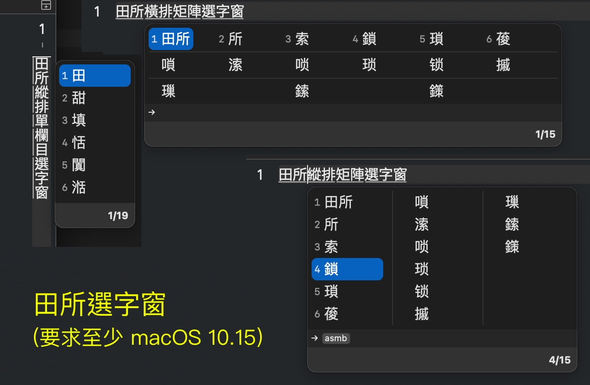
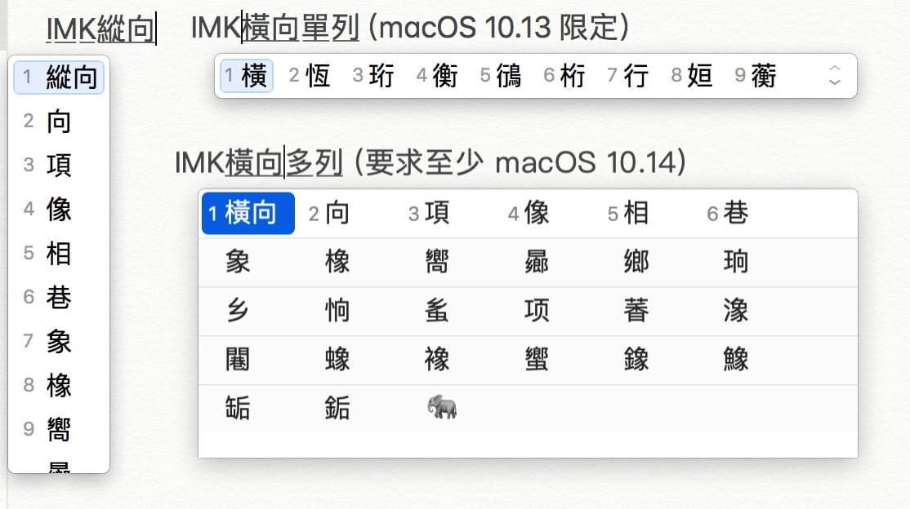

# 使用者介面

- [使用者介面](#使用者介面)
	- [組字區 \& 組筆區/組音區(注拼槽)](#組字區--組筆區組音區注拼槽)
	- [選字窗](#選字窗)
		- [1. 田所選字窗](#1-田所選字窗)
		- [2. IMK 選字窗](#2-imk-選字窗)

## 組字區 & 組筆區/組音區(注拼槽)

**組字區**分為「內文組字區」或者「組字窗」這兩種。後者有內容數量限制（20字或20個讀音）。

你在某個 App 內敲字的時候，只可能出現某一種組字區。如果當前正在接受文字輸入的軟體被登記在唯音輸入法的客體管理器當中的話，則「組字窗」會被啟用。

至於**組筆區/組音區(注拼槽)**，則用來統整使用者針對單個漢字輸入的注音/拼音/字根。一旦滿足可以組字的條件，則會將對應的讀音資訊插入組字引擎的軌格內、將組字任務交給組字引擎來處理。

## 選字窗

選字窗**不接受文字輸入**，只能用來選取候選字詞。目前只有「田所」一種款式（IMK 選字窗已自 3.5.4 版起停止支援），下文會詳述。

無論何種選字窗，您都可以根據螢幕的提示來選字。如果田所選字窗的左下角出現特殊的「⇧」記號的話，證明目前是關聯詞語模式、需要摁住 Shift 鍵的同時敲選字鍵來選關聯詞語。

### 1. 田所選字窗

田所浩二選字窗自唯音 2.8.0 開始引入初代版本（第二代引入自 2.9.0 版，第三代引入自 3.3.8 版，第四代「我修院」引入自 4.5.1 SP1 版）。本文重點介紹自唯音 4.5.1 SP1 版開始的第四代田所選字窗。

田所選字窗在不同的 macOS 版本內有不同的特性：

1. macOS 10.13 至今：可以使用田所選字窗預設的標準 Cocoa 介面，擁有全部特性；自第四代「我修院」（4.5.1 SP1 版）起、更支援滑鼠滾輪與滾動條捲動。
2. 早於 macOS 10.13 的系統：先前的版本改用「效能模式」因應（多行或多列模式會改用單個 NSAttributedString 來顯示選字窗介面的全部元素，藉此保障操作響應速度，但會喪失滑鼠點擊支援）；該模式現已不再存在。另：SwiftUI 渲染模式曾於 macOS 10.15 起提供，已於 3.6.0 版移除。

田所選字窗自第四代「我修院」（4.5.1 SP1 版）起、原生支援帶有滾動條的捲動體驗。

因為 macOS 11 Big Sur 與 macOS 12 Monterey 的內部 API 故障，田所選字窗在這兩版系統下不支援「根據當前輸入法的簡繁體模式、使用對應區域的系統字型來顯示候選字」的特性。macOS 10.15 Catalina 為止的系統、以及自 macOS 13 Ventura 開始的系統不受影響。

> macOS 10.12 Monterey 系統下，唯音會啟用另外一套自從該版系統開始可用的 API，來保證該功能仍舊生效。

田所選字窗有這四種佈局形態：

1. **縱向單列選字窗**：只會顯示一筆磁帶模式的字根反查結果。
2. **橫向單列選字窗**：只會顯示一筆磁帶模式的字根反查結果。
3. **縱向矩陣選字窗**：看上去類似微軟新注音的縱向矩陣選字窗，僅同時顯示四列；自第四代「我修院」（4.5.1 SP1 版）起支援捲動。有支援磁帶模式的字根反查結果的顯示。
4. **橫向矩陣選字窗**：看上去類似 macOS 內建注音輸入法的橫向矩陣選字窗，僅同時顯示四列；自第四代「我修院」（4.5.1 SP1 版）起支援捲動。有支援磁帶模式的字根反查結果的顯示。
   - 注：與搜狗拼音輸入法的選字窗不同的是，**田所橫向矩陣選字窗不會因為個別候選字詞的過長的長度而撐壞整個選字窗的尺寸**。

田所選字窗自 2.9.7 SP1 開始，允許使用者針對候選字詞使用滑鼠右鍵選單指令來升頻/降頻/排除。其原理與《[狀態＆就地加詞/刪詞/控頻](./markingMode.md)》一文當中所述的內容相同。然而，因為 NSMenu 不會因為宿主視窗的消解而隨之消解，所以唯音現已對 Spotlight、Raycast 這類客體停用選字窗的滑鼠右鍵選單。

### 2. IMK 選字窗（已停止支援）

> 唯音輸入法已經自 3.5.4 版開始已經移除對 IMK 選字窗的支援。

IMK 選字窗是 Apple 官方藉由 InputMethodKit 提供的選字窗模組（系統內建的注音輸入法用的是 IMK 選字窗的 Apple 私有版本）。是唯音輸入法自 2.8.0 版開始在 macOS 10.13 - 10.14 系統下的唯一可用選字窗套裝，且在 macOS 10.14 系統下沒有縱向選字窗可用、在 macOS 10.13 系統下的橫向選字窗也只有單列。

由於 InputMethodKit 的 IMK 選字窗型別（IMKCandidates）的很多功能 API 都是無效的（甚至還有[空殼實作](https://openradar.appspot.com/34911503)），所以無法支援下述功能：

* 顯示反查結果註記（因為其所依賴的 Annotation API 是空殼實作）。
* 無法自訂選字鍵，只可能是 123456789。因為 API 故障，自訂了選字鍵會讓選字鍵消失。
* 在 macOS 10.13 系統下的橫向多列矩陣選字窗無法支援選字鍵（只好換單列了）。
* 不支援滑鼠右鍵選單功能擴充功能的開發。

IMK 選字窗有這三種佈局形態：

1. **縱向單列選字窗**：會在縱排輸入文字時強制出現，但橫排輸入時則依賴使用者的輸入法偏好設定意願來決定是否出現。不支援對字根反查結果的顯示（原因見上文）。該選字窗在 macOS 10.14 系統下不對第三方輸入法開發者開放，所以在 macOS 10.14 系統下只能使用橫向矩陣選字窗。
2. **橫向單列選字窗**：是 macOS 內建五筆/倉頡輸入法所用的橫向單列選字窗，不支援對字根反查結果的顯示（原因見上文）。唯音輸入法在 macOS 10.13 系統下將橫向 IMK 選字窗以此方式顯示。
3. **橫向矩陣選字窗**：是 macOS 內建注音輸入法所用的橫向矩陣選字窗（的對第三方開發者開放的閹割版本，要求作業系統版本至少 macOS 10.14），不支援對字根反查結果的顯示（原因見上文）。唯音輸入法在 macOS 10.14 開始將橫向 IMK 選字窗以此方式顯示。與搜狗拼音輸入法的選字窗不同的是，**IMK 橫向矩陣選字窗不會因為個別候選字詞的過長的長度而撐壞整個選字窗的尺寸**。

$ EOF.
