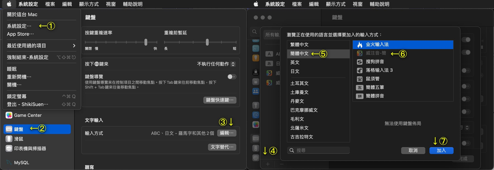
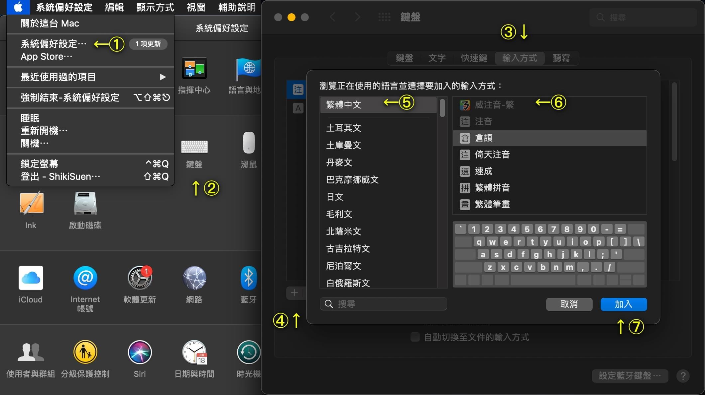

# 安裝/啟用/切換/停用/卸除

- [安裝/啟用/切換/停用/卸除](#安裝啟用切換停用卸除)
	- [A. 安裝唯音](#a-安裝唯音)
	- [B. 啟用唯音](#b-啟用唯音)
		- [如果您使用的是 macOS 13 Ventura 開始的系統的話](#如果您使用的是-macos-13-ventura-開始的系統的話)
		- [如果您使用的是 macOS 12 Monterey 為止的系統的話](#如果您使用的是-macos-12-monterey-為止的系統的話)
	- [C. 切換使用唯音](#c-切換使用唯音)
	- [D. 停用唯音](#d-停用唯音)
	- [E. 卸除唯音](#e-卸除唯音)

## A. 安裝唯音

> ⚠️ 如果您是首次安裝唯音輸入法，或者剛剛完成了版本跨度很大的降級或升級操作的話，則請在安裝完畢之後重新登入系統。否則，唯音輸入法可能無法正常啟用。

唯音輸入法提供兩種安裝方式：PKG 與 APP。

- PKG 安裝包下載來的檔案會以「.pkg」結尾，按照螢幕提示安裝即可。PKG 安裝程式方便資安管理業者們藉由終端機進行部署。由於仍舊只會安裝至使用者目錄內，所以同一台電腦不同使用者需要分別安裝一遍。
	- **請注意 macOS 10 & 11 的所有系統版本均有一處行為故障**：pkg 安裝包指定僅裝在使用者目錄下的話，在 macOS 10 & 11 內執行時，仍舊會往總根目錄下安裝，除非你**手動點「更改安裝位置」再將那唯一的「安裝只供我使用」再點一遍才可以**。終端部署可以用這道指令：

	```bash
	installer -pkg ~/Downloads/vChewing-macOS-?.?.?-unsigned.pkg -target CurrentUserHomeDirectory
	```
- APP 安裝包下載來的檔案會以「.zip」結尾、且解包後會是「.app」，按照螢幕提示安裝即可。該方式也只能安裝到當前使用者的目錄內，所以同一台電腦不同使用者需要分別安裝一遍。

唯音推薦使用 PKG 安裝包。但**如果你遇到了需要降級安裝唯音的場合，請使用 APP 安裝包**。否則，PKG 安裝包恐怕需要「安裝一遍→重新登入→再安裝一遍」或者乾脆罷工，就非常麻煩。

## B. 啟用唯音

對這一章節有疑問者，請洽 Apple Support。

> macOS 13 開始，「(系統)偏好設定」已更名為「(系統)設定」，對應英文稱謂由「Preferences」變更為「Settings」。由於唯音輸入法支援的 macOS 系統版本帶比較廣，所以敝說明書採舊式稱謂。

若要啟用唯音輸入法，請點一下螢幕最左上角的「``」蘋果選單，且點選「系統偏好設定…」。

### 如果您使用的是 macOS 13 Ventura 開始的系統的話

請在系統設定介面左側點「鍵盤」，再在系統設定介面右側的「文字輸入」章節當中的「輸入方式」這一行的右側點按「編輯…」按鈕。此時會顯示當前系統已經啟用的輸入方式。在畫面左下角會有「＋」號，點一下之後就會出現可以啟用（加入）的其它輸入方式。請根據需要在「繁體中文」「簡體中文」區域分類內分別選擇「唯音-繁」「唯音-簡」，然後點按「加入」按鈕、來完成啟用過程。

> ⚠️ 如果您在點按「繁體中文」「簡體中文」區域分類之後、畫面右側僅顯示「無法使用鍵盤佈局」而不顯示任何輸入方式清單的話，**你可能遇到了 macOS 13 Ventura 的從 Developer Beta 開始就有的某個系統故障**。在 Apple 解決這個問題之前，你可以先點一下螢幕左側的「你尚未啟用過的」其它區域分類、然後再點「繁體中文」「簡體中文」區域分類，這樣就可以使視窗右側顯示輸入方式清單。




### 如果您使用的是 macOS 12 Monterey 為止的系統的話

請在系統設定介面總分類畫面點「鍵盤」，再在接下來的鍵盤設定畫面當中點按「輸入方式」頁籤。此時會顯示當前系統已經啟用的輸入方式。在畫面左側清單下方會有「＋」號，點一下之後就會出現可以啟用（加入）的其它輸入方式。請根據需要在「繁體中文」「簡體中文」區域分類內分別選擇「唯音-繁」「唯音-簡」，然後點按「加入」按鈕、來完成啟用過程。



## C. 切換使用唯音

請洽 Apple 官方《[在 Mac 上以另一種語言撰寫](https://support.apple.com/zh-tw/guide/mac-help/mchlp1406/mac)》一文。對這篇文章有疑問者，請洽 Apple Support。

## D. 停用唯音

停用與啟用的步驟差不多，只不過你需要點按的不是「＋」按鈕、而是「—」按鈕。先選中唯音，再點按「—」按鈕。有疑問者，請洽 Apple Support。

## E. 卸除唯音

請參見《[如何卸除唯音輸入法](../UNINSTALL.md)》一文。如果自己看不懂的話，請帶著這篇文章求助 Apple Support，因為他們的專員能看懂。

$ EOF.