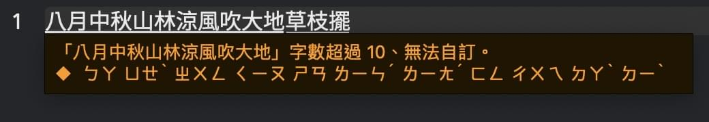

# 狀態＆就地加詞/刪詞/控頻

本文講解威注音輸入法的「就地加詞」、「就地刪詞」、「就地升頻」、「就地降頻」功能。

- [狀態＆就地加詞/刪詞/控頻](#狀態就地加詞刪詞控頻)
  - [「狀態」簡述](#狀態簡述)
  - [標記狀態＆就地加詞/刪詞/控頻](#標記狀態就地加詞刪詞控頻)

## 「狀態」簡述

雖然對一般使用者詳講威注音的態械系統（finite-state machine）的話有些過於複雜，但在這裡還是得介紹一下。不求一般使用者徹底看懂這一小節，只不過你看了之後多少會更方便理解接下來的「就地加詞/刪詞/控頻」章節的內容。

macOS 系統內建的 InputMethodKit 輸入法框架會讓輸入法給每個客體應用開一個 IMK 控制會話副本。威注音輸入法的每個 IMK 控制會話副本都持有一個「狀態」、會處於下述狀態的某一種：

> 自 2.4.0 版開始，威注音輸入法更換了自有的全新的單結構態械系統，導致「.ofNotEmpty()」狀態名存實亡。但「.ofNotEmpty()」狀態直到 2.9.4 SP2 才被移除。

- **失活狀態 .ofDeactivated**: 使用者沒在使用輸入法、或者使用者已經切換到另一個客體應用來敲字。
- **空狀態 .ofEmpty**: 使用者剛剛切換至該輸入法、卻還沒有任何輸入行為。抑或是剛剛敲字遞交給客體應用、準備新的輸入行為。威注音輸入法在「組字區與組音區/組筆區同時為空」、且客體軟體正在準備接收使用者文字輸入行為的時候，會處於空狀態。有時，威注音會利用呼叫空狀態的方式，讓組字區內已經顯示出來的內容遞交出去。
- **關聯詞語狀態 .ofAssociates**: 逐字選字模式內的關聯詞語輸入狀態。
- **中絕狀態 .ofAbortion**: 與 Empty 類似，但會扔掉上一個狀態的內容、不將這些內容遞交給客體應用。該狀態在處理完畢之後會被立刻切換至 .ofEmpty()。
- **遞交狀態 .ofCommitting**: 該狀態會承載要遞交出去的內容，讓輸入法控制器處理時代為遞交。該狀態在處理完畢之後會被立刻切換至 .ofEmpty()。如果直接呼叫處理該狀態的話，在呼叫處理之前的組字區的內容會消失，除非你事先呼叫處理過 .ofEmpty()。
- **輸入狀態 .ofInputting**: 使用者輸入了內容。此時會出現組字區（Compositor）。
- **標記狀態 .ofMarking**: 使用者在組字區內標記某段範圍，可以決定是添入新詞、還是將這個範圍的詞音組合放入語彙濾除清單。
- **選字狀態 .ofCandidates**: 叫出選字窗、允許使用者選字。
- **分類分層符號表狀態 .ofSymbolTable**: 分類分層符號表選單專用的狀態，有自身的特殊處理。

## 標記狀態＆就地加詞/刪詞/控頻

要想就地加詞、刪詞、升頻、降頻，輸入法的當前控制會話副本必須處於標記狀態。而切換至標記狀態的唯一的方法，就是在輸入法處於輸入狀態的時候用「Shift+前後方向鍵」的方式就地標注標記範圍。

此時會有這兩種螢幕顯示特徵：

1. 如果是浮動組字窗的話，會以紅色高亮底色來顯示當前的標記範圍。
2. 如果是內文組字區的話，會（像下圖那樣）以**下畫線段**的粗細分節來顯示當前的標記範圍。但在某些不遵守 IMKTextInput 協定的客體軟體內，可能無法正確顯示這種分段下畫線。此時的應對方法就是：將該客體軟體登記到威注音輸入法的客體管理器內。這樣就會出現浮動組字窗（見上圖）。
3. 螢幕會出現工具提示，會在適當的條件下告訴你怎樣就地加詞/刪詞/升頻/降頻。

    
    

再解釋一下就地升頻、就地降頻、就地刪詞的原理。這一部分請結合《[使用者語彙資料夾](./userPhrases.md)》一文來理解。

- **就地升頻**：在使用者語彙檔案的最末尾重複新增當前選中的範圍的詞音配對，利用其「使用者語彙預設詞頻為最高值 0」的特性、使其優先權變成最高。如果覺得優先權變得太高的話，可以再編輯使用者辭典檔案、給相關的記錄追加合理的權重（位於 [-9.5, 0] 這個全閉區間內）。
- **就地降頻**：在使用者語彙檔案的最末尾重複新增當前選中的範圍的詞音配對、且賦以懲戒權重，這樣可以讓組字引擎在爬軌時完全忽視這個詞音配對。
- **就地刪詞（排除）**：直接將當前的詞音配對塞入語彙濾除表。

標記範圍最短為 2 個字或者 2 個讀音，但可以在輸入法偏好設定的辭典設定頁面內藉由「將可以就地升權/排除的候選字詞的最短詞長設為單個漢字」這個勾選項來實現對單個漢字的操作。**標記範圍最長為 10 個漢字或 10 個讀音**：

$ EOF.
