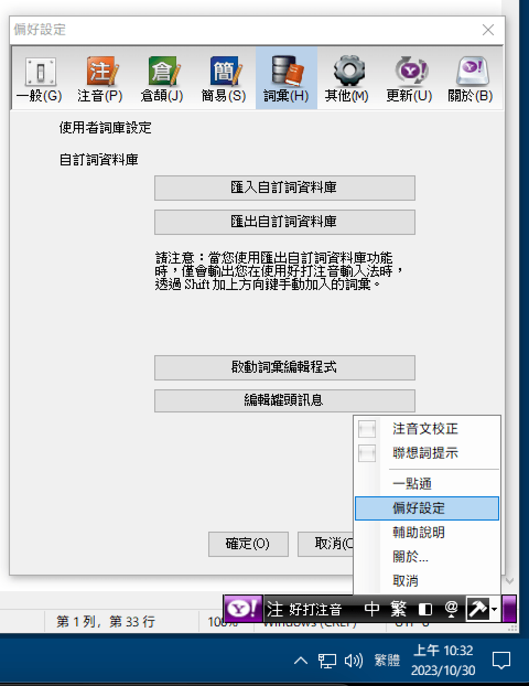

# 寫給雅虎奇摩輸入法的使用者

> 本文已過期，過期時間戳是 2025 年 12 月 9 日。唯音輸入法 4.1.6 版起已經支援對奇摩輸入法的 SmartMandarinUserData.db 的直接讀取、不再需要 NSConnection 跨程通訊。本文的方法仍有效，只是不再是最有效的方法。

雅虎奇摩輸入法 macOS 版的輸入法本體對 `__objc_empty_cache` 有強制依賴。然而，Apple 自 macOS 14.2 Beta 1 開始移除了這個 API、導致了兩個問題：

1. 奇摩輸入法本體徹底罷工。
2. 因為奇摩輸入法本體徹底罷工，導致無法藉由 XPC 通訊手段從輸入法本體匯出使用者自訂詞庫。（奇摩輸入法的偏好設定是一個獨立的 App、與輸入法本體之間採 XPC 通訊。）


很多人使用雅虎奇摩輸入法十幾年了，各自的使用者語彙資料積累無法輕易捨棄。然而，奇摩輸入法的原廠辭典是經過 CEROD 加密的。這個加密模組早在 2012 年底就變成了收費套件，是奇摩輸入法專案結案的主要原因。

本文介紹一些可行的辭典遷移方案。

## 方案 1: 系統降級

就地降級 macOS 到 macOS 14.1。相關方法請洽 Apple Support 求助。

該方法只是紙上談兵。如果您的電腦系統已經是 macOS 15.x 或之後的版本的話，則不適用。

降級之後，您也只能藉由 Zonble 維護的奇摩輸入法分支安裝包來匯出辭典資料，否則您根本無法點開輸入法偏好設定。

## 方案 2: 遷移使用者辭典檔案到 Windows 再操作

本文以 Windows 7 為例。

首先，請前往下述目錄取得 `SmartMandarinUserData.db`：

```
/Users/使用者名稱/Library/Application Support/Yahoo! KeyKey/SmartMandarinUserData.db
```


然後用這個檔案取代 Windows 系統下的奇摩輸入法的同名檔案（注意將舊檔案備份喔，除非用不到）：
```
C:\Users\使用者名稱\AppData\Roaming\Yahoo! KeyKey\SmartMandarinUserData.db
```


之後請藉由 Windows 的語言列/輸入法圖示來開啟奇摩輸入法的偏好設定、完成資料匯出：



以上。

## 該怎樣將這些資料用到唯音內？

＊＊忠告：從奇摩輸入法匯出的 TXT 檔案不要刪除，請務必保留備份。＊＊

### 1. 自動匯入

目前的自動匯入功能不會去處理原始 TXT 檔案當中的 Database 部分的資料，原因見下文。

#### a. 如果您的系統版本不低於 macOS 10.13 的話

從唯音輸入法 3.6.1 SP2 開始，「唯音偏好設定->辭典設定」頁面的右下角會有「匯入奇摩輸入法自訂詞資料庫」按鈕。點擊該按鈕之後，會指引您選取藉由奇摩輸入法匯出的 TXT 檔案（所謂「原始 TXT 檔案」），然後自動匯入那些在唯音輸入法內缺失的詞語。

#### b. 如果您的系統版本低於 macOS 10.13 的話

低於 macOS 10.13 的系統下，輸入法在叫出 NSOpenPanel 檔案讀取視窗時，會觸發系統本身的故障缺陷、導致整個桌面徹底失去響應。從唯音 3.8.0 版開始，使用者可以按照下圖所示的方法使用終端機匯入從奇摩輸入法匯出的 TXT 辭典檔案。

> P.S.: 唯音輸入法 3.8.1 版開始會改良與此功能有關的圖形介面操作交互方式。屆時，使用者可以直接從 Finder 將檔案拽入到輸入法偏好設定視窗的指定位置、完成資料匯入。


### 2. 手動匯入

奇摩輸入法匯出的 TXT 檔可以將西文半形逗號「,」換成西文半形減號「-」，
然後用 Excel （或任何試算表軟體）僅保留前兩個 Column 即可。

將這樣處理過的前兩個 Column 的內容直接寫入唯音的使用者語彙檔案內，就可以直接繼承使用。**唯音另可以在第三個 Column 指定詞頻權重：最高頻是 0 ，最低頻是 -9.6，低於 -9.5 的話不會被爬軌函式（Walking Algorithm）主動讀取**。

如果是要從試算表軟體**匯出 CSV 的話，匯出時 delimiter 分隔符號得是空格或 Tab**。

至於奇摩輸入法匯出的 TXT 檔當中的 Database 部分的資料，屬於機器學習資料，僅包含經過 SEE 二次加密的 Bigram 詞頻資料（以及 UserOverride 資料），是唯音輸入法暫時無法利用的資料。
但未來也許會有利用方法也說不定。

$ EOF.
