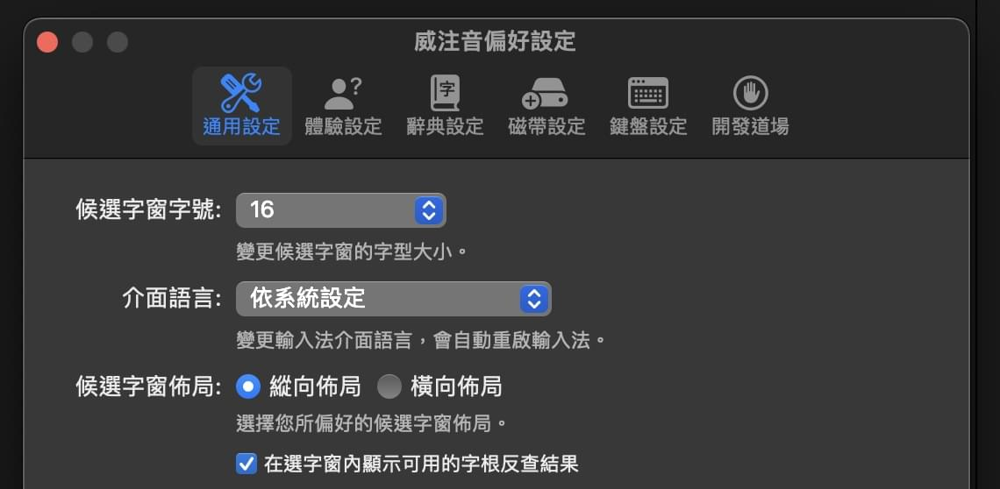

# 寫給 OpenVanilla 的使用者

> 本文提及的 OpenVanilla 最新版本為 1.6.4 版（2022-04-25）。

威注音輸入法自 2.9.0 版開始搭載 CIN 表格支援，且將其對應的模式稱為「磁帶模式」。

磁帶模式支援 CIN 與 [CIN2](../CIN_EVOLUTION.md) 格式，可以用這種方式給威注音掛接一個字根輸入法來使用（比如五筆、快倉六、嘸蝦米，等）。該模式並不推薦用於音韻類輸入的需求場合：如有相關需求者，既然威注音輸入法的注音輸入都無法滿足你了，那麼 RIME 勢必能提供更好的體驗。

該模式在設計的時候完全沒有參照 OpenVanilla（也沒想過要完全取代之），而是徹底從零考量而生的產物，故其使用體驗與 OpenVanilla 以及其衍生輸入法（行易官方 macOS 版嘸蝦米 X1、X2，等）相比有很明顯的不同。這些不同之處，有些是為了不犧牲威注音輸入法在注音輸入方面的特性、而做出的遷就之舉，而有些則是特色功能設計、卻可能會挑戰到 OpenVanilla 既有使用者群體的敲字習慣（特別是嘸蝦米輸入法的老用戶）。

## 1. 磁帶

CIN 表格檔案在威注音當中被稱為「磁帶檔案」。威注音輸入法的磁帶模式要求的 CIN 表格檔案得符合[相關標準](../CIN_EVOLUTION.md)，否則可能會在讀取的時候失效。在威注音輸入法的偏好設定介面內，有專門的磁帶模式選項。根據介面提示操作即可。

當輸入法的磁帶模式已經被指定讀取一個可以正常使用的 CIN 磁帶檔案的時候，可以用 `Ctrl+Command+Shift+I` 熱鍵來切換磁帶模式的開關。該熱鍵可以在鍵盤設定內停用。**一旦開啟磁帶模式，便無法正常輸入注音，直至你關掉磁帶模式為止**。

那麼該怎樣快速切換磁帶檔案呢？出於對該功能的實用性的存疑，威注音目前並未設計這種功能。但威注音歡迎與該功能有關的 PR。

## 2. 相對於 OpenVanilla 而言的功能差異點

### 1. 字根反查

OpenVanilla 在早期搭載新酷音引擎的時候是[有支援字根反查](http://osxchat.blogspot.com/2006/01/openvanilla_23.html)的，但相關版本的軟體無論 Windows 版還是 macOS 版都已經絕版、或無法使用於近年來的電腦系統版本。而 OpenVanilla 現在也只剩 macOS 版本、且閹割掉了包括酷音模組在內的非常多的功能。字根反查這個功能也被閹割了。

於是乎，macOS 在長達約十年的時間內缺乏一款可以實現字根反查的 CIN 輸入法：

- RIME 有反查功能，但目前不支援 CIN 表格。
- 哪怕奇摩輸入法有同時支援 CIN 與反查，其反查資料源也無法設定為 CIN 表格。
- macOS 內建的 CIN 表格輸入法功能也無法將 CIN 表格設為反查資料源。

威注音輸入法的磁帶模式自 2.9.2 版開始提供字根反查支援、且在 2.9.3 及其 SP1 版當中對此功能做了使用體驗改良。該模式只能搭配田所選字窗來工作，可以在輸入法偏好設定內停用。

> 由於 macOS 內建的 InputMethodKit 輸入法開發框架的 showAnnotation 函式自從 macOS 10.13 （或更舊版）開始就變成了[空殼實作（函式裡面是空的）](https://openradar.appspot.com/34911503)的緣故，威注音的字根反查無法搭配 IMK 選字窗來工作。

威注音輸入法 2.9.3 SP1 版開始，所有的字根反查結果的排序有講究：先按照每個反查結果能敲出的候選字的數量來做從少到多的排序，然後根據每個反查結果的字串長度由短到長排序，最後依照 CIN 磁帶檔案內的行順序來排序。

無論你是否有切換到磁帶模式，只要輸入法的磁帶設定內有配置可以正常使用的磁帶資料檔案的路徑，則輸入法會自動載入磁帶、使其服務於字根反查功能。哪怕你在符號選單內，也可以實時瀏覽對應符號的可用的 CIN 字根查詢結果。

### 2. 最大碼長

OpenVanilla 只允許你**手動指定**一個 CIN 表格輸入方案的最大碼長（字根長度）。

而威注音會在讀取 CIN 磁帶檔案的時候自動判定該磁帶的最大碼長。

### 3. 花牌鍵（萬用字元）

可能早期版本 OpenVanilla 有支援過萬用字元的功能，但至少我沒有在目前最新版的 OpenVanilla 當中見過這個功能。

威注音的磁帶格式採用的 CIN2 標準允許藉由 `%wildcardkey ` 字段來指定花牌鍵（萬用字元）。該功能方便輸入「你只記得前幾個字根」的字。花牌鍵不能作為第一個字根來輸入，且只能作為最後一個字根來輸入。一旦敲了花牌鍵，那就會自動組字。

五筆輸入法的使用者們可以用這個方法給自己的 CIN 磁帶檔案擴充「萬能 Z 鍵」。嘸蝦米輸入法的 CIN 表格也可以藉此利用閒置的分號鍵「；」。

值得一提的是：哪怕沒有指定花牌鍵，威注音輸入法的磁帶模組也會在讀取 CIN 磁帶時自動生成花牌辭典，因為該辭典還有另一個用途：方便威注音判斷自動組字的時機。下文會細述。

### 4. 自動組字的時機

可能各位注意到上圖當中還有「打滿最大組字（或字根）長度就組字」。然而，OpenVanilla 的該功能**僅在組筆區內的筆畫數量達到當前輸入法設定的最大碼長的時候**才會自動組字。

威注音輸入法則不同：只要你當前已經輸入的字根已經是最長可能碼，就自動組字。舉例說「窗」的嘸蝦米字根為「nbpc」。OpenVanilla 在你敲完「nbpc」之後，還得手動敲空格鍵才會組字。威注音的話，則會在你敲完最後一個「c」的那一刻就自動組字。**但這反而會挑戰到某些嘸蝦米老用戶的習慣，所以他們可以在輸入法偏好設定內關掉這個特性**。至於「贏」的嘸蝦米字根「xv」為什麼沒能觸發自動組字，是因為「xv」並非最長可能碼，也就是「還有其它的字的字根以 xv 開頭」。

### 5. 內文組字區帶來的使用習慣差異

威注音輸入法在使用磁帶模式時，使用者可以自己決定是否啟用「像ㄅ半注音輸入法那樣的逐字選字模式」以及「逐字選字模式下的聯想詞功能」。對於已經習慣微軟新注音或威注音這樣的依賴內文組字區的注音輸入法的使用者而言，在使用磁帶模式時，可能不太會想啟用逐字選字模式；然而，對於嘸蝦米的老用戶而言，逐字選字模式及其聯想詞模式反而是**建議與磁帶模式一同開啟**的模式。

另外，為了不犧牲威注音輸入法的注音輸入的體驗，威注音輸入法的磁帶模式無法在一個漢字完成組字之前「實時顯示含有可用的候選字結果的選字窗」。這一點有異於常見的五筆輸入法、以及 OpenVanilla、還有官方 macOS 版嘸蝦米，也可能是目前威注音的磁帶輸入模式唯一無法照顧 OpenVanilla 老用戶的使用習慣的地方。

$ EOF.
