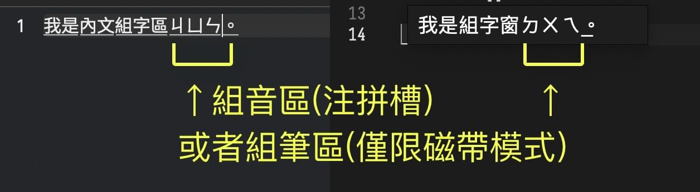

# 名詞說明

本文對應至少威注音輸入法 2.9.4。

## 組字區 & 組筆區/組音區(注拼槽)

**組字區**分為「內文組字區」或者「組字窗」這兩種。後者有內容數量限制（20字或20個讀音）。

你在某個 App 內敲字的時候，只可能出現某一種組字區。如果當前正在接受文字輸入的軟體被登記在威注音輸入法的客體管理器當中的話，則「組字窗」會被啟用。

至於**組筆區/組音區(注拼槽)**，則用來統整使用者針對單個漢字輸入的注音/拼音/字根。一旦滿足可以組字的條件，則會將對應的讀音資訊插入組字引擎的軌格內、將組字任務交給組字引擎來處理。

## 選字窗

選字窗**不接受文字輸入**，只能用來選取候選字詞。目前有「田所」與「IMK」兩種。

### 1. 田所選字窗

田所選字窗自威注音 2.8.0 開始引入。因為採 SwiftUI 構建的緣故，所以要求 macOS 版本至少 10.15 才可以用。因為 macOS 10.15 - 11 與 macOS 12 開始的 SwiftUI 框架的差異，所以田所選字窗在這兩個版本帶的系統內的顯示效果（主要是配色、以及選字鍵的字型）會有差異。因為 SwiftUI 介面繪製效能低下的緣故，田所選字窗不得已取消了選字窗內容的可捲動的特性，且最多只會顯示三列內容。

因為 macOS 11 Big Sur 與 macOS 12 Monterey 的內部 API 故障，田所選字窗在 macOS 11 Big Sur 系統下不支援「根據當前輸入法的簡繁體模式、使用對應區域的系統字型來顯示候選字」的特性。在 macOS 10.12 系統下的話，則需在開發道場內啟用 .langIdentifier 才可以啟用該特性。macOS 10.15 Catalina 與 macOS 13 Ventura 不受影響。

田所選字窗只會用到前六個選字鍵，且有這三種佈局形態：

1. **縱向單列選字窗**：只會在縱排輸入文字時才會出現，且不顯示磁帶模式的字根反查結果。
2. **縱向矩陣選字窗**：看上去類似微軟新注音的縱向矩陣選字窗，但僅同時顯示三列、且不支援捲動。有支援磁帶模式的字根反查結果的顯示。
3. **橫向矩陣選字窗**：看上去類似 macOS 內建注音輸入法的橫向矩陣選字窗，但僅同時顯示三列、且不支援捲動。有支援磁帶模式的字根反查結果的顯示。與搜狗拼音輸入法的選字窗不同的是，**田所橫向矩陣選字窗不會因為個別候選字詞的過長的長度而撐壞整個選字窗的尺寸**。

### 2. IMK 選字窗

IMK 選字窗是 Apple 官方藉由 InputMethodKit 提供的選字窗模組（系統內建的注音輸入法用的是 IMK 選字窗的 Apple 私有版本）。是威注音輸入法自 2.8.0 版開始在 macOS 10.13 - 10.14 系統下的唯一可用選字窗套裝，且在 macOS 10.14 系統下沒有縱向選字窗可用、在 macOS 10.13 系統下的橫向選字窗也只有單列。然而，對於已經習慣 IMK 選字窗的人士而言，在 macOS 10.15 開始的系統下，可以藉由開發道場啟用 IMK 選字窗、直至 Apple 將來對相關 API 改動到 IMK 選字窗不能用為止。

由於 InputMethodKit 的 IMK 選字窗型別（IMKCandidates）的很多功能 API 都是無效的（甚至還有[空殼實作](https://openradar.appspot.com/34911503)），所以無法支援下述功能：

* 顯示反查結果註記（因為其所依賴的 Annotation API 是空殼實作）。
* 無法自訂選字鍵，只可能是 123456789。因為 API 故障，自訂了選字鍵會讓選字鍵消失。
* 在 macOS 10.13 系統下的橫向多列矩陣選字窗無法支援選字鍵（只好換單列了）。

IMK 選字窗有這三種佈局形態：

1. **縱向單列選字窗**：會在縱排輸入文字時強制出現，但橫排輸入時則依賴使用者的輸入法偏好設定意願來決定是否出現。不支援對字根反查結果的顯示（原因見上文）。該選字窗在 macOS 10.14 系統下不對第三方輸入法開發者開放，所以在 macOS 10.l4 系統下只能使用橫向矩陣選字窗。
2. **橫向單列選字窗**：是 macOS 內建五筆/倉頡輸入法所用的橫向單列選字窗，不支援對字根反查結果的顯示（原因見上文）。威注音輸入法在 macOS 10.13 系統下將橫向 IMK 選字窗以此方式顯示。
3. **橫向矩陣選字窗**：是 macOS 內建注音輸入法所用的橫向矩陣選字窗（的對第三方開發者開放的閹割版本，要求作業系統版本至少 macOS 10.14），不支援對字根反查結果的顯示（原因見上文）。威注音輸入法在 macOS 10.14 開始將橫向 IMK 選字窗以此方式顯示。與搜狗拼音輸入法的選字窗不同的是，**IMK 橫向矩陣選字窗不會因為個別候選字詞的過長的長度而撐壞整個選字窗的尺寸**。

## 客體管理器

有些諸如 Steam 這樣的軟體不嚴格遵循 IMKTextInput 規範，導致輸入法無法正常顯示內文組字區、或者無法正確指定內文組字區的顯示樣式與格式（包括標記模式要用到的分段下畫線等顯示特性）。更或者，有些接收使用者打字行為的軟體（特別是聊天軟體或聊天網站）可能會濫用內文組字區的內容，藉此窺探使用者的某些私隱。威注音提供了「管理客體應用」的功能，允許使用者藉由輸入法選單開啟客體管理器、將有問題的軟體登記在其中。

## 磁帶模式

參見《[寫給 OpenVanilla 的使用者](./onboarding_ov.md)》一文。

$ EOF.