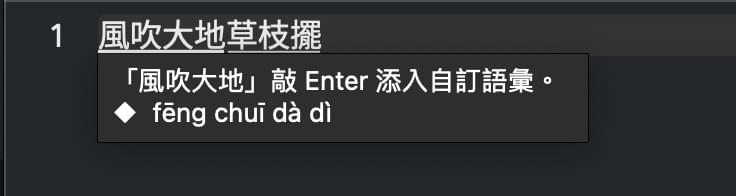
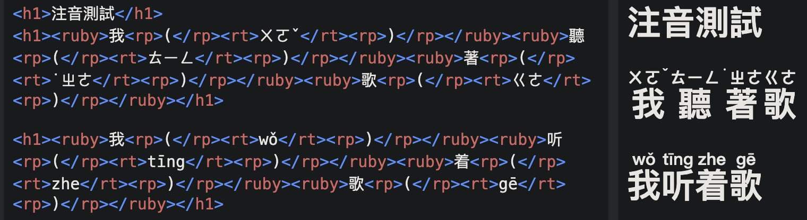

# 輸入文字

- [輸入文字](#輸入文字)
  - [A. 兩種組字模式](#a-兩種組字模式)
    - [1. 在兩種組字模式之間切換](#1-在兩種組字模式之間切換)
    - [2. 使用組字模式輸入](#2-使用組字模式輸入)
    - [3. 使用逐字選字模式輸入](#3-使用逐字選字模式輸入)
  - [B. 拼音並擊](#b-拼音並擊)
  - [C. 注音/拼音輸出](#c-注音拼音輸出)
  - [D. 輸入英文](#d-輸入英文)
  - [E. 輸入符號](#e-輸入符號)
  - [F. 挑選候選字](#f-挑選候選字)
  - [G. 取消輸入](#g-取消輸入)
  - [H. 刪字](#h-刪字)
  - [I. 插字](#i-插字)
  - [J. 在組字區內快速移動游標](#j-在組字區內快速移動游標)
  - [K. 便捷輸入顏文字、日期、時間](#k-便捷輸入顏文字日期時間)

## A. 兩種組字模式

威注音擁有「組字模式」與「逐字選字模式」：

- 組字模式會根據句子本身前後文的關係（以及您最近一天內常用的個別字詞）自動為您所輸入的注音轉換成適當的字詞、且通常無需再從長串的字詞中手動挑選同音字。
- 逐字選字模式類似於 Windows 的「ㄅ半」傳統注音模式：每敲一個字，都要選字。選字完畢之後，選中的字就會立刻被遞交到**客體軟體（接收文字輸入的軟體）**內。

### 1. 在兩種組字模式之間切換

威注音輸入法一開始使用時是設定為組字模式。論及在「組字模式」與「逐字選字模式」之間切換的方法，有兩種：
- 用熱鍵 `Command+Shift+Ctrl+P` 切換。該熱鍵可在輸入法偏好設定內停用。
- 藉由輸入法偏好設定內的「體驗設定」頁籤當中的「模擬 90 年代前期注音逐字選字輸入風格」勾選項來切換。

### 2. 使用組字模式輸入

在組字模式下，您只需直接輸入注音，威注音輸入法就會根據您輸入的字及其前後文的關係自動調整正確的字詞。該模式的啟用/停用方法請參見上文。

一般情況下，威注音輸入法的組字模式會使用內文組字區、且其容量不受輸入法之限制。如果客體軟體（當前正在接收文字輸入的軟體）被列入輸入法的客體管理清單的話（比如 Valve Steam），威注音會使用浮動組字窗。浮動組字窗可以自動調整的前後最長距離是二十個字或二十個讀音，超過這個距離限制之後，輸入法會自動將最開始輸入的內容逐字遞交出去，就像工廠的流水線那樣。

您可以使用 Enter 鍵來完成輸入，而在完成輸入之前若有任何字詞需要修改，請參閱下文的「挑選候選字」章節。

完成輸入之後的字，若需要修改：

- 如果已經遞交出去的話，請手動刪除後重新輸入。
- 如果還在組字區內、且沒有啟動 CIN 磁帶模式的話，您雖然也可以手動刪除後重新輸入，但也還還可以用聲調鍵覆寫掉緊隨游標身後的字的聲調。可以在輸入法偏好設定內的「體驗設定」頁籤內調整聲調鍵的覆寫行為。

### 3. 使用逐字選字模式輸入

逐字選字模式的使用方法跟ㄅ半注音輸入法大致相同，每輸入一字您就要自己從選字窗內的候選字清單當中選字。與 Windows 的ㄅ半注音輸入法不同的是，在敲完字準備選字的時候，按鍵輸入訊號會被優先認定為選字鍵、而非注音/字根鍵。該模式的啟用/停用方法請參見上文。

需要使用聯想詞（相關字詞）功能的話，請在輸入法選單內使用選單切換「逐字選字聯想模式」。您也可以使用 `Command+Shift+Ctrl+O` 熱鍵切換。該熱鍵可以在輸入法偏好設定內停用。您還可以在**摁著 Option 鍵不放**的同時點開輸入法選單，藉由其中的「編輯聯想詞…」來自訂聯想詞的內容。

您可以設定反查字根及相關字詞功能。需要查詢組字字根的話，有下述要求：

- 作業系統版本不低於 macOS 10.15 Catalina。
- 輸入法已經讀取了一份有效的 CIN 磁帶。
- 輸入法偏好設定的「通用設定」頁籤當中有勾選「在選字窗內顯示可用的字根反查結果」。
- 輸入法偏好設定的「通用設定」頁籤當中的「啟用與 macOS 內建輸入法相同的 IMK 選字窗」處於取消勾選的狀態。

這樣就會在選字窗內顯示當前高亮候選字的反查結果。以嘸蝦米為例：


> ⚠️ 如果您手頭的嘸蝦米的 CIN 磁帶檔案包含行易官方的輸入法表格當中的資料（及其直接改編資料）的話，請勿擅自（在尚未被行易官方允許的情況下）公開散播，否則可能會觸犯與著作權有關的在地法律。

## B. 拼音並擊

為了照顧對注音符號不熟悉的使用者群體，威注音輸入法提供了拼音並擊模式。該模式可在輸入法偏好設定的「通用設定」頁籤內開啟。在拼音並擊模式下，你敲的大千注音會以漢語拼音的形式實時顯示在組字區內的組音區當中：


如果您當前的文字輸入是橫排輸入的話，拼音並擊模式也會影響到標記模式的工具提示當中的漢字讀音的顯示方式、會用拼音來顯示：



## C. 注音/拼音輸出

該功能會將當前組字區的內容以注音/拼音的形式遞交出去。熱鍵是「Ctrl(+Option)+Command+Enter」，您可以在輸入法偏好設定的「通用設定」頁籤內指定該功能是輸出漢語拼音還是注音。

- 如果您在敲熱鍵時**有摁 Option 鍵**的話，則遞交出去的內容會是網頁 HTML 漢字讀音標記組合源碼、且按照教科書的格式來排版。

    > 小麥注音 fcitx 版雖然也支援該功能，但 Zonble 使用了另一套實現方式，僅支援注音，且不支援教科書格式的注音（也就是輕聲的標記位置）。

    
- 如果您在敲熱鍵時**沒有摁 Option 鍵**的話，則遞交出去的內容會是注音或者拼音本身，且不採用教科書標調。也就是說：拼音的話，會使用 12345 數字標調；注音的話，哪怕是輕聲，也是「先寫注音，再寫聲調」。輸出效果範例：
  ```
  ㄨㄛˇ ㄊㄧㄥ ㄓㄜ˙ ㄍㄜ
  wo3 ting zhe5 ge1
  ```

## D. 輸入英文

除了如《[文字切換](./toggles.md)》一文所述的那樣切換中英文輸入模式以外，您還可以用 Shift+英文字母的方式輸入英文。在輸入法偏好設定的「體驗設定」頁籤當中的「Shift+字母鍵」選項內可以指定其具體的英文字母輸入方式。

> 威注音輸入法推薦將其設定為「直接遞交小寫字母」，因為這樣可以用「Option+Shift+字母鍵」的方式直接遞交大寫字母。**然而，這要求輸入法偏好設定的「鍵盤設定」頁籤當中的「基礎鍵盤佈局」得是「Apple 標準注音/倚天注音鍵盤佈局」或者任何以「vChewing」開頭的鍵盤佈局才可以**。

## E. 輸入符號

一般情況下，直接輸入標點符號即可。很多標點符號鍵可以藉由選字窗實現更多種類的標點輸入，歡迎自行多多摸索。有些標點符號，因為大千注音鍵盤佈局的佔位限制，需要講究一下輸入方法：

- 分號、逗號、句號：`Shift+'` & `Shift+,` & `Shift+.`。
- 書名號：`Ctrl+Option+,` & `Ctrl+Option+.` & `Shift+\`(候選清單內)。
- 全形彎引號（簡體中文公文常用）：`Option+[` & `Option+]`

另外，**「波浪鍵」（或者 JIS 鍵盤的右手 Shift 一側的「下畫線鍵」）是威注音的「符號鍵」**，提供兩種符號選單：

- 直接敲符號鍵，會出現類於似新酷音那樣的分類符號選單。該選單的內容可以藉由使用者辭典目錄內的 `symbols.dat` 檔案自訂，且其格式與新酷音輸入法雷同。如果該檔案不存在的話，則會啟用威注音預設的分類符號選單。威注音的分類符號選單允許您摁 Esc 返回上一層選單。
- Option+符號鍵：
    - 至威注音 2.9.4 SP1 為止，會出現類似於漢音輸入法「Ctrl+3」那樣的符號選單。
    - **自威注音 2.9.4 SP2 開始，威注音不再隨贈漢音符號選單的內容**。該選單在預設情況下會是空的，需要在使用者辭典擴充記錄（行數越高，候選符號排序越優先）。**擴充方法參見《[使用者語彙資料夾](./userPhrases.md)》一文**。

## F. 挑選候選字

請先藉由《[使用者介面](./FNG_basicUI.md)》一文了解田所選字窗與 IMK 選字窗的各自的特性。

在您完成輸入之前，若發現字詞有不正確時，可以利用手動方式挑選候選字詞。

1. 雖然無法使用滑鼠，但您可以在組字區內使用方向鍵中的「前後鍵（請依文字輸入方向來理解）」鍵將游標移動至該錯字。若您要修改的是一個詞，可以將游標移至該詞第一個字的前方或者後方（依輸入法偏好設定當中的「體驗設定」頁籤內的「選字游標」設定所影響）。
2. 按一下「空格鍵」或「PageUp」或「PageDown」或「左右手鍵（橫排輸入時是上下鍵，縱排輸入時是左右鍵）」叫出選字窗。如果是輸入的最後或最前方的一個字需要修改，只要直接按上述按鍵叫出選字窗即可、而不需要移動游標。
    > 注意：「空格鍵」呼叫選字窗的特性可以在輸入法偏好設定當中的「體驗設定」頁籤內停用。一旦停用，則空格鍵在組字區有內容時的行為會變成「插入半形空格」。
3. 利用滑鼠左鍵點擊或選字鍵選擇正確的字或詞。或者，也可以使用方向鍵在候選字窗中選字，再按「Enter」將字送出。
4. 若未發現您要選擇字詞，請按與選字窗的行列方向呈直角偏轉的兩個方向鍵在行之間切換、或使用「PageUp」或「PageDown」鍵翻頁。
5. 與選字窗有關的其它熱鍵使用說明，請洽《[鍵盤熱鍵使用手冊](./shortcuts.md)》。

您還可以使用下述熱鍵來就地輪替候選字、而無須叫出選字窗：

- `Shift(+Command)+Space` 可以單手輪替候選字。
- `Option+左右手方向鍵`：橫排輸入時是 `Option+↑↓`，縱排輸入時是 `Option+←→`。
- `(Shift+)Tab`：承襲小麥注音的熱鍵習慣，但無法在臉書網頁內正常使用。

## G. 取消輸入

在輸入的過程中，您可以使用 Esc 鍵取消目前的輸入。以下是三種取消輸入的狀態：

- 正在輸入注音符號時，按下 ESC 即取消剛剛輸入的注音符號或字根，此時組音區/組筆區會被清空。
- 輸入字串未確認時，按下 ESC 即取消正在輸入的字句。該特性可以在輸入法偏好設定當中的「體驗設定」頁籤內停用。
- 候選字窗存在時，按下 ESC 即關閉候選字窗。

## H. 刪字

> 請先閱讀《[鍵盤熱鍵使用手冊](./shortcuts.md)》一文中關於 BackSpace 與 Delete 鍵的定義。
  > - ⌫ : Bksp (BackSpace，被 Apple 稱為 Delete)
  > - ⌦ : Del (這才是真的 Delete)

若要刪除多餘的字，請使用下列任何一種方式 (注意：有些應用程式並不支援滑鼠動作。)：

- 利用方向鍵中的前後鍵將游標移動至您想要刪除的字之前，按一下 ⌦。
- 利用方向鍵中的前後鍵將游標移動至您想要刪除的字之後，按一下 ⌫。

## I. 插字

若要在句子中插入字詞，只需利用方向鍵或滑鼠將游標移動至想要插入字詞的位置，再直接輸入注音即可。

除非您有在輸入法偏好設定當中的「體驗設定」頁籤內停用「空格鍵呼叫選字窗」的特性，否則：當您需要在兩字之間插入空格的話，請在輸入完成後再回到插入處。

## J. 在組字區內快速移動游標

除了使用前後方向鍵逐字移動游標以外，您還可以使用 `Option+前後方向鍵` 以字詞節點為單位來迅速移動游標。如果是 `Ctrl+Option+前後方向鍵` 的話，其作用類似於 `End` 和 `Home` 鍵。

## K. 便捷輸入顏文字、日期、時間

在磁帶模式處於關閉狀態時，輸入「ㄏㄨㄟˋ ㄨㄣˊ ㄗˋ」、「ㄖˋ ㄑㄧˊ」、「ㄖˋ ㄑㄧ」、「ㄕˊ ㄐㄧㄢ」可以讓選字窗內自動出現各種顏文字、日期、時間候選詞組。

$ EOF.
